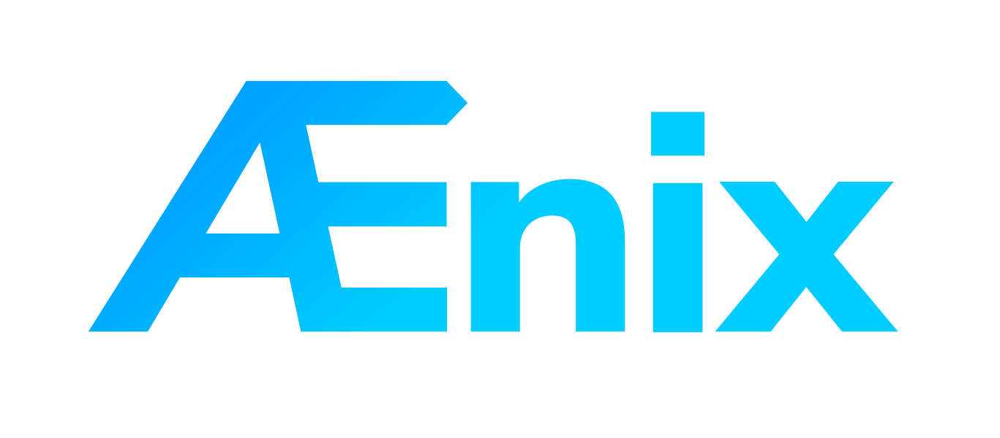
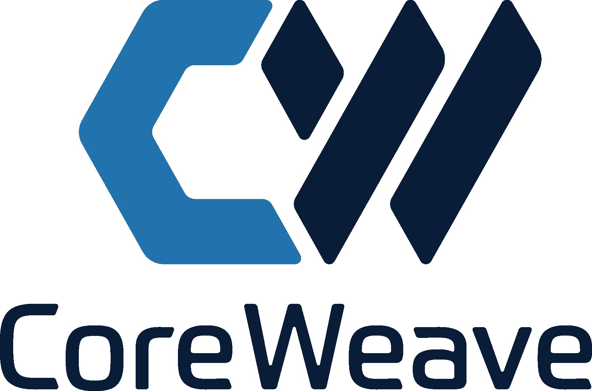
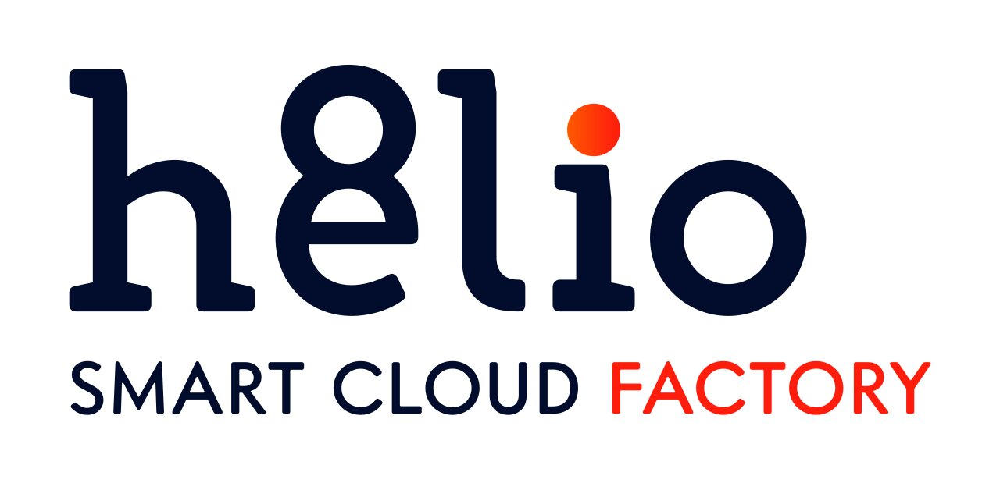
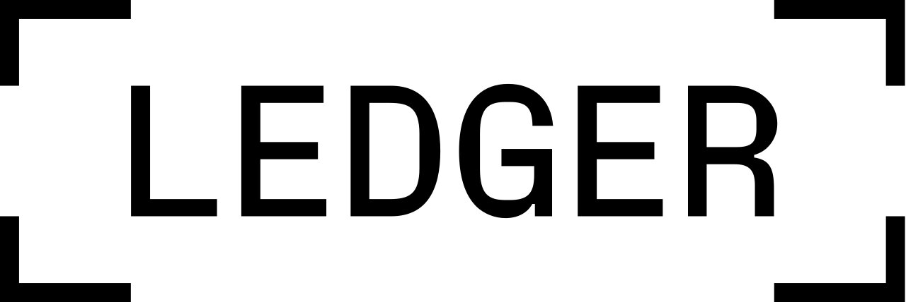
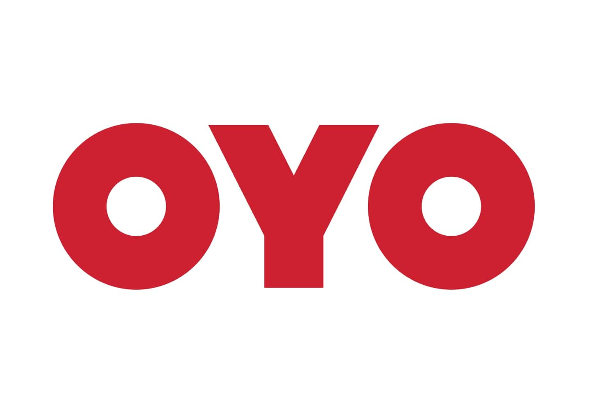

# Kubeapps Adopters

If you're using Kubeapps and want to add your organization to this list, follow [these directions](#adding-your-organization-to-the-list-of-adopters)!

## Organizations using Kubeapps

## Success Stories

Below is a list of adopters of Kubeapps that have publicly shared the details of how they use it (in alphabetical order).

**[Ænix](https://aenix.io)**

Ænix provides consulting services for cloud providers and uses Kubeapps in combination with FluxCD as the dashboard for free PaaS platform [Cozystack](https://cozystack.io) to run virtual machines, Databases and Kubernetes-as-a-Service.

**[CoreWeave](https://www.coreweave.com/)**

CoreWeave is a specialized cloud provider, built for GPU-accelerated use cases. Our infrastructure is Kubetnetes-native, and we invest in a wide range of open-source Kubernetes projects making it easy for engineers to benefit from bare metal performance without the infrastructure overhead. Kubeapps hosts our suite of 1-click deploy applications, enabling our clients to quickly and easily consume the scale of compute they need.

**[h8lio](https://h8l.io/)**

h8lio is an open source Smart Cloud Factory for software companies, allowing them to focus on their code & business. We've integrated Kubeapps in our automated DevOps chain to help our users to simply install, configure and manage onto our managed Kubernetes the applications their business rely on. Both from public catalog such as Bitnami or from their own Helm charts.

**[Ledger](https://www.ledger.com/)**

Kubeapps eases the deployment of our internal Helm charts for everybody, including those that are not familiar with Kubernetes. The ability to seamlessly integrate the Helm values with the web page (basic form support) is an essential feature for us.

**[Otomi](https://otomi.io/)**

As part of their PaaS offering, Otomi has integrated KubeApps with their Harbor chart museum repository. It also comes preconfigured with both Bitnami's extensive app catalog, as well as [OperatorHub's](https://operatorhub.io) extensive offering of kubernetes operators.

**[OYO](https://www.oyorooms.com/)**

We use KubeApps to manage our production workloads which are deployed using Helm. All the configurations like environment variables or resource requirements are handled via Kubeapps. We have a few webhooks in place so that if any change is made via Kubeapps, we'll have a log of it.

**[SAP](https://www.sap.com/)** - Teapots team

We are Team Teapots (reference to the HTTP 418 code). We manage the infrastructure of an internal Pipelines-as-a-Service offering for other development teams here at SAP. We use the wonderful Kubeapps project to help our customers deploy cloud-native applications (Jenkins, etc.) with an easy-to-use UI.

**[Data Intelligence Hub (by T-Systems)](https://dih.telekom.com/en/products/#space)**

We use KubeApps in our Space LivingLab product. Space LivingLab offers a sandbox environment for an experimental dataspace that is managed by us, so that the customer can fully concentrate on the development of new use cases & applications using data space technology. We use KubeApps to manage and deploy applications in a Kubernetes cluster and deploy custom Helm charts.

**[Terasky](https://www.terasky.com/)**

TeraSky is a Global Advanced Technology Solutions Provider. We utilize Kubeapps in many of our customers environments to provide a clean and simple UI for deploying and managing applications on kubernetes. we heavily use the multi cluster support in Kubeapps. We also heavily utilize the Carvel Packaging support in kubeapps, in order to provide a great solution for our customers in airgapped environments as well.

## Adding your organization to the list of adopters

If you are using Kubeapps and would like to include your organization/use case in the list of Kubeapps Adopters it is possible through the following options:

- **Send a PR**: add an jpg/PNG version of your logo to the [img/adopters directory](./site/content/docs/latest/img/adopters/) in this repo and submit a pull request with your change including 1-2 sentences describing how your organization use Kubeapps. Name the image file something that reflects your company (e.g., if your company is called Acme, name the image acme.jpg).
- **Slack**: Open a new thread in the [Kubeapps slack channel](https://kubernetes.slack.com/messages/kubeapps) with the request and the information described above.
- **Email**: Directly contact through [email](mailto:tanzu-kubeapps-team@vmware.com) to Kubeapps maintainers DL.

Project maintainers will help and assess to include your organization as a Kubeapps adopter. Please feel free to send a message in [#kubeapps](https://kubernetes.slack.com/messages/kubeapps) with any questions you may have.
