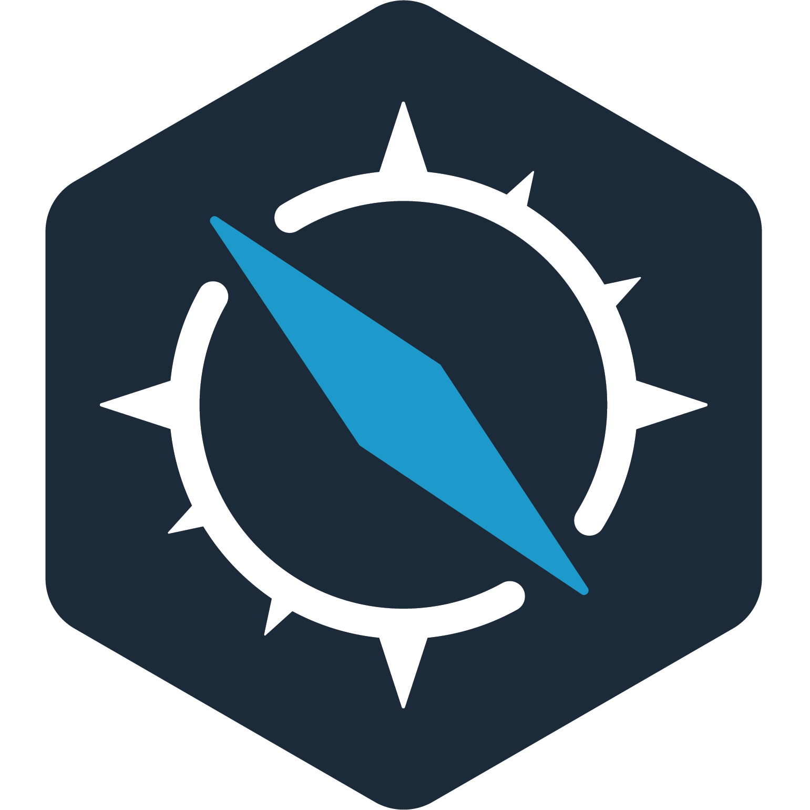
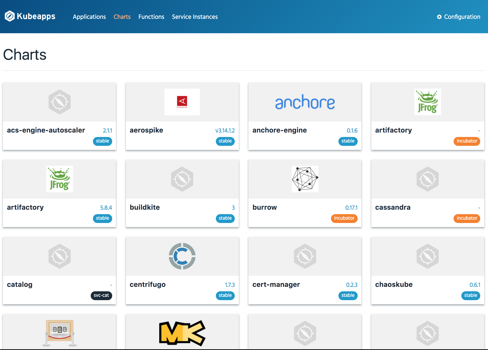

#  Kubeapps

[](https://travis-ci.org/kubeapps/kubeapps)

Kubeapps is a set of tools written by [Bitnami](https://bitnami.com) to super-charge your Kubernetes cluster with:

* Your own application [dashboard](https://kubeapps.com/), allowing you to deploy Kubernetes-ready applications into your cluster with a single click.
* [Kubeless](http://kubeless.io/), a Kubernetes-native Serverless Framework, compatible with [serverless.com](https://serverless.com).
* [SealedSecrets](https://github.com/bitnami/sealed-secrets), a way to encrypt a Secret into a SealedSecret, which is safe to store...even for a public repository.

## Quickstart

Kubeapps assumes a working Kubernetes cluster (v1.8+) and [`kubectl`](https://kubernetes.io/docs/tasks/tools/install-kubectl/) installed and configured to talk to your Kubernetes cluster. Kubeapps binaries are available for Linux, OS X and Windows, and Kubeapps has been tested with Azure Kubernetes Service (AKS), Google Kubernetes Engine (GKE), `minikube` and Docker for Desktop Kubernetes. Kubeapps works on RBAC-enabled clusters and this configuration is encouraged for a more secure install.

> On GKE, you must either be an "Owner" or have the "Container Engine Admin" role in order to install Kubeapps.

The simplest way to try Kubeapps is to deploy it with the Kubeapps Installer on [minikube](https://github.com/kubernetes/minikube). Assuming you are using Linux or OS X, run the following commands to download and install the Kubeapps Installer binary:

```bash
curl -s https://api.github.com/repos/kubeapps/kubeapps/releases/latest | grep -i $(uname -s) | grep browser_download_url | cut -d '"' -f 4 | wget -i -
sudo mv kubeapps-$(uname -s| tr '[:upper:]' '[:lower:]')-amd64 /usr/local/bin/kubeapps
sudo chmod +x /usr/local/bin/kubeapps
kubeapps up
kubeapps dashboard
```

These commands will deploy Kubeapps in your cluster and launch a browser with the Kubeapps dashboard.


Access to the dashboard requires a Kubernetes API token to authenticate with the Kubernetes API server. Read the [Access Control](docs/user/access-control.md) documentation for more information on configuring users for Kubeapps.

The following commands create a ServiceAccount and ClusterRoleBinding named `kubeapps-operator` which will enable the dashboard to authenticate and manage resources on the Kubernetes cluster:

```bash
kubectl create serviceaccount kubeapps-operator
kubectl create clusterrolebinding kubeapps-operator --clusterrole=cluster-admin --serviceaccount=default:kubeapps-operator
```

Use the following command to reveal the authorization token that should be used to authenticate the Kubeapps dashboard with the Kubernetes API:

```bash
kubectl get secret $(kubectl get serviceaccount kubeapps-operator -o jsonpath='{.secrets[].name}') -o jsonpath='{.data.token}' | base64 --decode
```

**NOTE**: It's not recommended to create cluster-admin users for Kubeapps. Please refer to the [Access Control](docs/user/access-control.md) documentation to configure more fine-grained access.



To remove Kubeapps from your cluster, simply run:

```bash
kubeapps down
```

To delete the `kubeapps-operator` ServiceAccount and ClusterRoleBinding,

```bash
kubectl delete clusterrolebinding kubeapps-operator
kubectl delete serviceaccount kubeapps-operator
```

## Installation

Get the latest release of the Kubeapps installer for for platform from the [releases](https://github.com/kubeapps/kubeapps/releases) page, add it to your `PATH` and you're ready to go.

## Build from Source

Please refer to the [Kubeapps Build Guide](docs/developer/build.md) for instructions on setting up the build environment and building Kubeapps from source.

## Developer Documentation

Please refer to the [Kubeapps Developer Documentation](docs/developer/overview.md) for instructions on setting up the developer environment for developing Kubeapps components.

## Next Steps

[Use the Kubeapps Dashboard](docs/user/dashboard.md) to easily manage the deployments created by Helm in your cluster and to manage your Kubeless functions, or [look under the hood to see what's included in Kubeapps](docs/architecture/overview.md).

In case of difficulties installing Kubeapps, find [more detailed installation instructions](docs/user/install.md).

For a more detailed and step-by-step introduction to Kubeapps, read our [introductory walkthrough](docs/user/getting-started.md).

## Useful Resources

* [Walkthrough for first-time users](docs/user/getting-started.md)
* [Detailed installation instructions](docs/user/install.md)
* [Kubeapps Dashboard documentation](docs/user/dashboard.md)
* [Kubeapps components](docs/architecture/overview.md)
