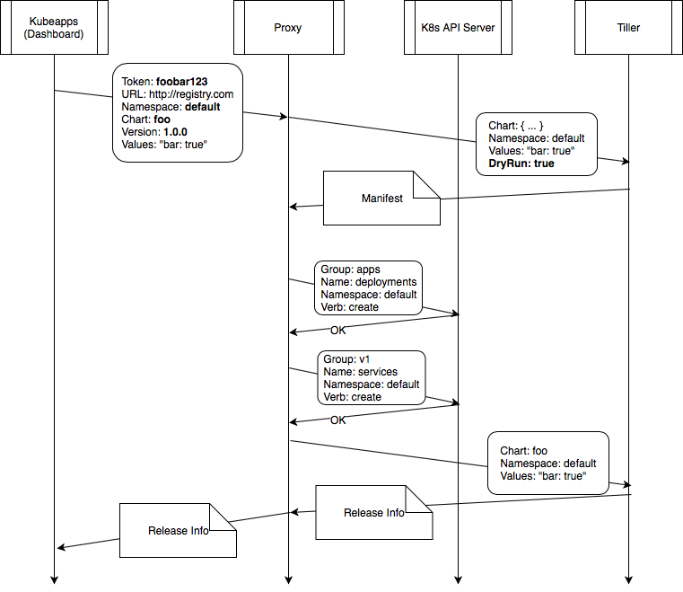

# Tiller Proxy

This proxy is a service for Kubeapps that connects the Dashboard with Tiller. The goal of this Proxy is to provide a secure proxy for authenticated users to deploy, upgrade and delete charts in different namespaces.

Part of the logic of this tool has been extracted from [helm-CRD](https://github.com/bitnami-labs/helm-crd). That tool has been deprecated in Kubeapps to avoid having to synchronize the state of a release in two different places (Tiller and the CRD object).

The client should provide the header `Authorization: Bearer TOKEN` being TOKEN the Kubernetes API Token in order to perform any action.

# Configuration

It is possible to configure this proxy with the following flags:

```
      --debug                           enable verbose output
      --disable-auth                    Disable authorization check
      --home string                     location of your Helm config. Overrides $HELM_HOME (default "/root/.helm")
      --host string                     address of Tiller. Overrides $HELM_HOST
      --kube-context string             name of the kubeconfig context to use
      --list-max int                    maximum number of releases to fetch (default 256)
      --tiller-connection-timeout int   the duration (in seconds) Helm will wait to establish a connection to tiller (default 300)
      --tiller-namespace string         namespace of Tiller (default "kube-system")
      --tls                             enable TLS for request
      --tls-ca-cert string              path to TLS CA certificate file (default "/ca.crt")
      --tls-cert string                 path to TLS certificate file (default "/tls.crt")
      --tls-key string                  path to TLS key file (default "/tls.key")
      --tls-verify                      enable TLS for request and verify remote
```

# Routes

This proxy provides 6 different routes:

 - `GET` `/v1/releases`: List all the releases of the Tiller
 - `GET` `/v1/namespaces/{namespace}/releases`: List all the releases within a namespace
 - `POST` `/v1/namespaces/{namespace}/releases`: Create a new release
 - `GET` `/v1/namespaces/{namespace}/releases/{release}`: Get release info
 - `PUT` `/v1/namespaces/{namespace}/releases/{release}`: Update release info
 - `DELETE` `/v1/namespaces/{namespace}/releases/{release}`: Delete a release

# Enabling authorization

By default, authorization for any request is enabled (it can be disabled using the flag --disable-auth). If enabled, the client should have permissions to:

 - "Read" access to all the release resources in a release when doing a HTTP GET over a specific release.
 - "Create" access to all the release resources in a release when doing a when doing an HTTP POST.
 - "Create", "Update" and "Delete" permissions to all the release resources when doing an HTTP PUT to upgrade a release.
 - "Delete" permissions to all the release resources when doing an HTTP PUT.

Note that the user only needs a valid token in order to list releases.

Right now, the only supported method for authentication is using a bearer token.

# Workflow

Each request should contain at least:

 - The required action: "get", "create", "upgrade" or "delete".
 - The URL of the chart repository.
 - The ID of the chart within the chart repository.
 - The version and values to use.

With that information the proxy will resolve the complete manifest of the application. Then it will gather the different API groups that are included in the manifest to validate that the user identified by the bearer token can perform the requested action.

This is an example diagram of the communication between Kubeapps (the dashboard), the proxy, Tiller and the K8s API for deploying an application "foo" that is composed of a `Deployment` and a `Service`:


