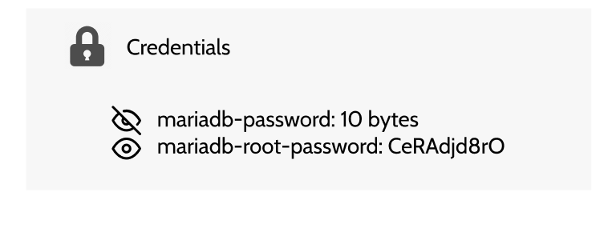
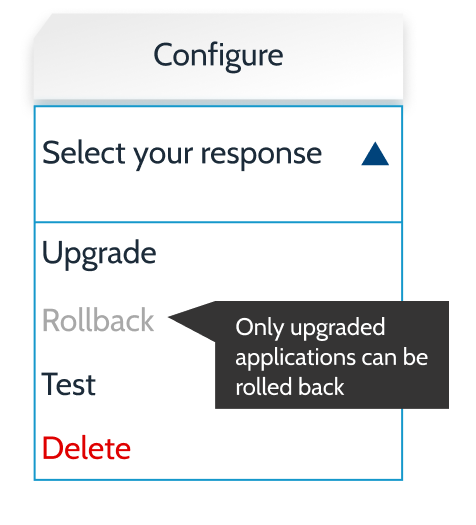
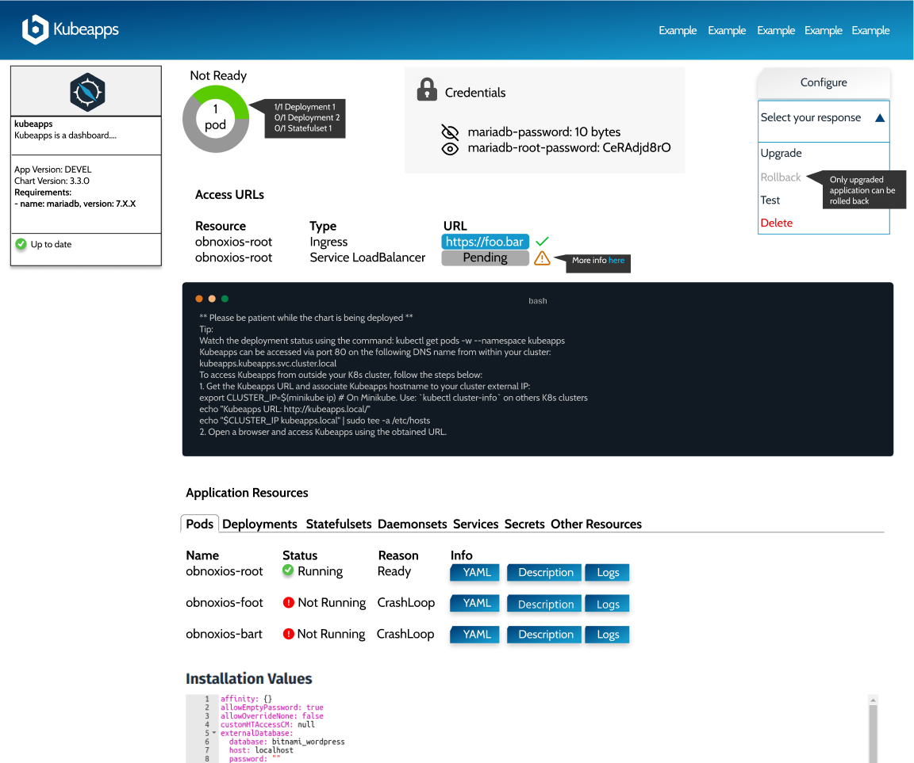

# Application View Revamp

The goal of this document is to define in detail the actions planned to improve the current user experience when working with applications.

Parent issue: https://github.com/kubeapps/kubeapps/issues/1524

## Goal

The goal of this revamp is to improve the Application View, which is one of the core views of the project so it gives a better user experience in different areas:

 - Discoverability. It should be possible to obtain information about the application dependencies. For example, the application should show that MariaDB is a dependency of WordPress. Details at https://github.com/kubeapps/kubeapps/issues/529
 - Error Detection. Make an easy to understand view that can point the user to the piece(s) of the Chart that are failing.
 - Usability. Make it easier, if possible, the way to modify/upgrade/rollback/test/delete an application.
 - Debugging. When something fails while working with a release, it should be possible to detect the cause of the issue and fix it without the need of a terminal. This means being able to report kubernetes events/errors to the user and being able to read logs.

## Action Items

### Show Application Dependencies

Application information already contains the file requirements.yaml. This is the file used by Helm to define the application dependencies. That file is encoded in base64 and it's available under the path `app.chart.files[2].value`. Once that information is properly parsed, we should be able to render that as part of the chart information.

The raw information included in the file is this:

```
dependencies:
- name: mariadb
  version: 7.x.x
  repository: https://kubernetes-charts.storage.googleapis.com/
  condition: mariadb.enabled
  tags:
    - wordpress-database
```

From that information, if the user has permissions to request AppRepositories, we should be able to map https://kubernetes-charts.storage.googleapis.com/ to `stable` (name given in the AppRepository) and generate a link for the MariaDB chart:


### Improve Application Status Report

Right now we only show a Ready/Not Ready status depending on the Application workloads. We take into account deployments, statefulsets and daemonsets. Only if all of those are Ready, we show the ready status. Since we already have that information, we can show it to the user in order to identify what can go wrong or what it's missing:


### Highlight Application Credentials

In the current view, application credentials can be found either reading the Notes and executing the commands that the Notes describe, or clicking on the icon to reveal the secrets below. Those secrets usually are of the type "Opaque" (rather than `kubernetes.io/tls` or `kubernetes.io/service-account-token`). We can extract those credentials and show them in a more prominent place. That way the user can easily discover the application credentials without the need of a terminal:



Note that we will still be showing the different application Secrets along with all the other resources in its own table.

### Compress Application Actions

The current approach is to show one button per action (Upgrade, Delete, Rollback). This list is growing over time (for example, the backend endpoint for running tests is ready to be used). It can also be confusing to show a different list of buttons depending on the release state. For example, the Rollback button is only rendered if the application has been upgraded. In order to avoid these issues, we can show a clickable menu with the different options, graying out the options not available (potentially showing a tooltip):



### Include Additional Information for Access URLs

The current list of URLs can be improved with two small changes:

- If the browser can access the URL, we could show an icon so the user knows if the URL is working.
- If the URL is not working and it can be caused for a known issue, we could show additional information to the user so it can be debuged (e.g. Pending IPs when using LoadBalancers in Minikube [link](https://github.com/kubeapps/kubeapps/issues/953)).

 

### Render an Extended Resources Table

Finally, we can show a single resource table with all the resources so users can inspect in detail the different resources of the application without adding too much noise to the view. Apart from the list of resources we are currently showing, we can add the list of pods related to the application (the ones that are related to a Deployment/Statefulset/Daemonset).

Apart from the basic information of the resource, we could add a summary (human-friendly) to know the status of the resource if possible. 

We can also show different buttons in order to show the resource YAML or description (and logs in the case of pods):


When clicking in any of the buttons we could render either a modal or display the information below the item. It's pending to evaluate if we could follow logs opening a websocket connection.

Now, let's discuss in detail what information can be helpful as columns for users in the different tabs of the table:

- Pods:
  - Status: Value of status.phase. Example: Running. It allows the user to know if the Pod is ready.
  - Deployment: Parent deployment.
  - QoS Class: Value of status.qosClass. It allows the user to know the reliability of the Pod.
  - Age: Age of the pod.
- Deployments:
  - Status: Read/Not Ready if the number of readyReplicas is equal to the number of readyReplicas.
  - Replicas: Current/Ready pods available for the Deployment.
  - Age: Age of the deployment.
  - Images: Images contained in the deployment.
- Statefulset (same as Deployments)
- Daemonset (same as Deployments)
- Services (same as today)
  - Type: Service Type.
  - Cluster-IP
  - External-IP
  - Port(s)
- Secrets:
  - Type
  - Data: Number of entries.
  - Age: Age of the Secret.
- Other resources:
  - Kind: Object Kind.
  - Age: Age of the resource.

## Summary

This is a general view of the changes planed in this document. Specific implementation details will be discussed in their respective PRs:



