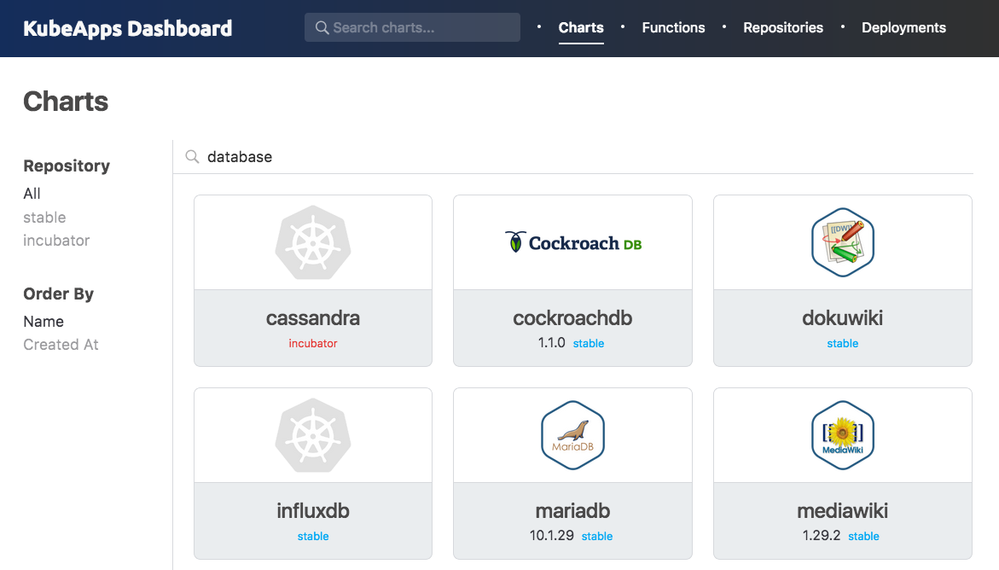
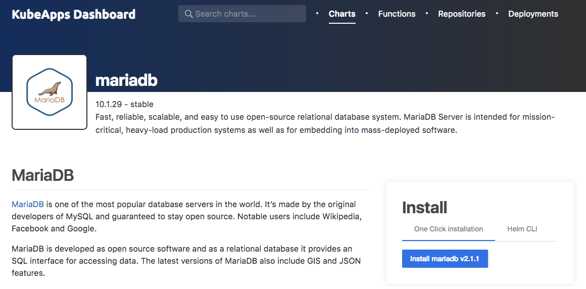
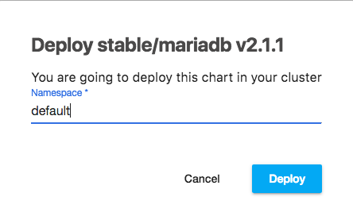
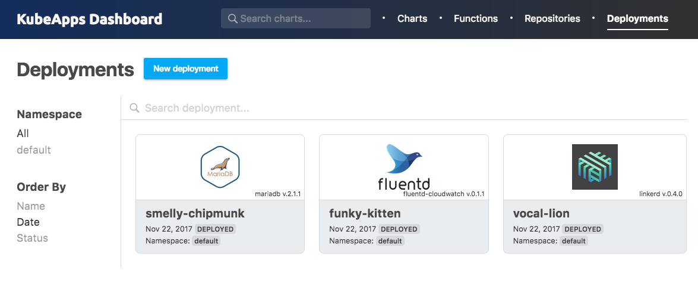
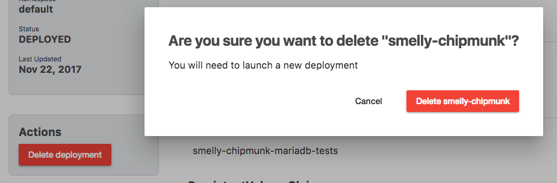
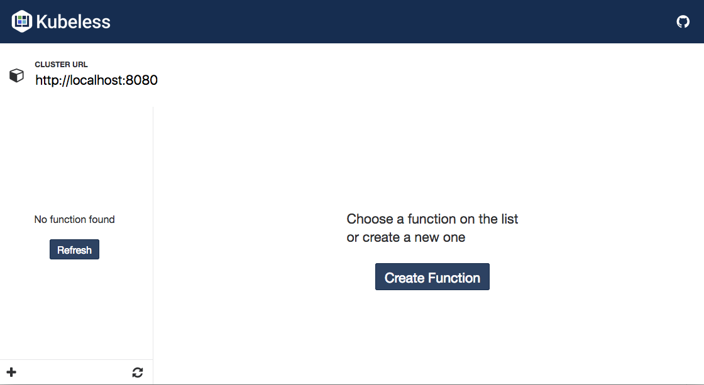

# Kubeapps Dashboard

Kubeapps comes with an in-cluster dashboard that offers a web UI to easily manage the deployments created by Helm in your cluster and to manage your Kubeless functions.

## Start the Dashboard

You can easily safely access the dashboard from your system by running:

```
kubeapps dashboard
```

This will run a HTTP proxy to access the dashboard safely and will open your default browser to it.

## Managing Charts
### Deploying new applications using the Dashboard

Once you have the Dashboard up and running, you can start deploying applications into your cluster.



Select one application for the list of charts in the official Kubernetes chart repository. In this example we will be deploying MariaDB.



Once you click on "Install mariadb" you will be able to select which namespace of your cluster you want this to be deployed:



Now click on "Deploy" and you will be able to track your new Kubernetes Deployment directly from your browser.


### Listing all the deployments managed by Helm

On the "Deployments" menu you can get a list of the deployments in your cluster that are managed by Helm.



### Removing existing deployments

You can remove any of the deployments that are managed by Helm, by clicking on the Remove button:



### Adding addition charts repositories

By default, Kubeapps comes with the official Kubernetes chart repositories enabled. You can see the list of enabled chart repositories in the "Repositories" link:


You can add new repositories (i.e. a special repository for your organization) by clicking on "Add repository":


- For ```Name``` you can add any identifier, as long as it is unique. Right now only alpha characters are accepted.
- For ```URL``` you should add the URL where the ```index.yaml``` file of your repository is available.
- For ```Source``` you can add the URL of the source code for your charts. This field is optional.

## Functions Dashboard

The Kubeapps Dashboard includes a [Kubeless](https://kubeless.io) UI to be able to create, edit and run your Kubeless functions directly from your browser.

To access the Kubeless UI click on "Functions" in the Dashboard menu.



### Create a new function

To create a new Kubeless function from the web ui click on "Create Function". On the modal window that opens, select the runtime for your function, the name of the function object and the handler of your function:


After clicking on create, Kubeless UI will fill for you the basics of your function, so you can easily modify it for your needs:


Clicking on "Run Function" will run your function using the selected runtime and will display the response of it.

### Beyond Hello World

You can find many function examples for the different runtimes in the [examples folder in the Kubeless repository](https://github.com/kubeless/kubeless/tree/master/examples).