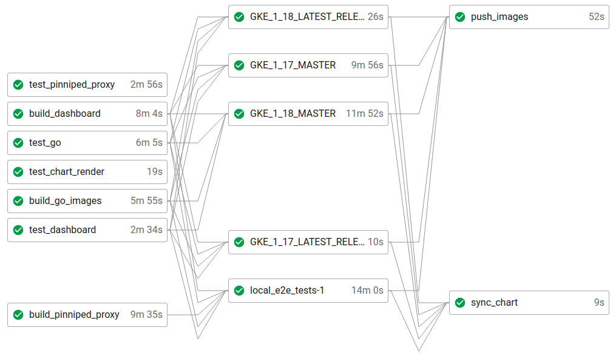

# Understanding the CircleCI configuration

Kubeapps leverages CircleCI for running the tests (both unit and integration tests), pushing the images and syncing the chart with the official [Bitnami chart](https://github.com/bitnami/charts/tree/master/bitnami/kubeapps). The following image depicts how a successful workflow looks like (after a push to the main branch).



The main configuration is located at this [CircleCI config file](../../.circleci/config.yml)). At a glance, it contains:

- **Build conditions**: `build_always`, `build_on_master` and `build_on_tag`. They will be added to each job to determine whether or not it should be executed. Whereas some should always be run, others only make sense when pushing to master or when a new tag has been created.
- **Workflows**: we only use a single workflow named `kubeapps` with multiple jobs.
- **Jobs**: the actual commands that are executed depending on the build conditions.
  - `test_go` (always): it runs every unit test for those projects written in Golang (that is, it runs `make test`) as well as it runs some DB-dependent tests.
  - `test_dashboard` (always): it runs the dashboard linter and unit tests (`yarn lint` and `yarn test`)
  - `test_pinniped_proxy` (always): it runs the Rust unit tests of the pinniped-proxy project (`cargo test`).
  - `test_chart_render` (always): it runs the chart template test defined in the script [`chart-template-test.sh](../../script/chart-template-test.sh).
  - `build_go_images` (always): it builds the CI golang images for `kubeops`, `apprepository-controller`, `asset-syncer` and `assetsvc`.
  - `build_dashboard` (always): it builds the CI node image for `dashboard`.
  - `build_pinniped_proxy` (always): it builds the CI rust image for `pinniped-proxy`.
  - `local_e2e_tests` (always): it runs locally (i.e., inside the CircleCI environment) the e2e tests. Please refer to the [e2e tests documentation](./end-to-end-tests.md) for further information. In this job, before executing the script [`script/e2e-test.sh](../../script/e2e-test.sh), the proper environment is created. Namely:
    - Install the required binaries (kind, kubectl, mkcert, helm).
    - Spin up two Kind clusters.
    - Load the CI images into the cluster.
    - Run the integration tests.
  - `sync_chart_from_bitnami` (on master): each time a new commit is pushed to the main branch, it brings the current changes in the upstream [bitnami/charts repository](https://github.com/bitnami/charts/tree/master/bitnami/kubeapps) and merge the changes. This step involves:
    - Checking if the chart versions differ.
    - Deleting the local `chart/kubeapps` folder.may the 4th
    - Pulling the latest version of the chart provided by Bitnami.
    - Renaming the production images (`bitnami/kubeapps-xxx`) by the development ones (`kubeapps/xxx`) with the `latest` tag.
    - Using `DEVEL` as the `appVersion`.
    - Sending a PR in the Kubeapps repository with these changes.
  - `GKE_X_XX_MASTER` and `GKE_X_XX_LATEST_RELEASE` (on master): there is a job for each [Kubernetes version supported by Google Kubernetes Engine](https://cloud.google.com/kubernetes-engine/docs/release-notes) (GKE). It will run the e2e tests in a GKE cluster (version X.XX) using either the code in `master` or in the latest released version. If a change affecting the UI is pushed to the main branch, the e2e test might fail here. Use a try/catch block to temporarily work around this.
  - `push_images` (on master): the CI images (which have already been built) get re-tagged and pushed to the `kubeapps` account.
  - `sync_chart_to_bitnami` (on tag): when releasing, it will synchronize our development chart with the [bitnami/charts repository](https://github.com/bitnami/charts/tree/master/bitnami/kubeapps) and merge the changes. This step involves:
    - Deleting the local `bitnami/kubeapps` folder.
    - Pulling the latest version of the chart provided by Kubeapps.
    - Renaming the development images (`kubeapps/xxx`) by the production ones (`bitnami/kubeapps-xxx`) with the `vX.X.X` tag.
    - Using `vX.X.X` as the `appVersion`.
    - Sending a PR in the Bitnami Charts repository with these changes.
  - `release` (on tag): it creates a GitHub release based on the current tag by executing the script [script/create_release.sh](../../script/create_release.sh).

Note that this process is independent of the release of the official Bitnami images and chart. These Bitnami images will be created according to their internal process (so the Golang, Node or Rust versions we define here are not used by them. Manual coordination is expected here if a major version bump happens to occur).

Also note it is the Kubeapps team that is responsible for sending a PR to the [chart repository](https://github.com/bitnami/charts/tree/master/bitnami/kubeapps) each time a new chart version is pushed to the main branch. Even this process is automatic (using the `sync_chart_to_bitnami` workflow), Kubeapps maintainers may decide to send a manual PR early.

# Credentials

Besides other usual credentials or secrets passed through environment variables via the CircleCI user interface, it is important to highlight how we grant commit and PR access to our robot account `kubernetes-bitnami <kubernetes@bitnami.com>`. The process is twofold:

- Create a [personal access token](https://docs.github.com/en/github/authenticating-to-github/creating-a-personal-access-token) with the robot account, granted, at least, with: `repo:status`, `public_repo` and `read:org`.
  - That will allow the GitHub CLI to create PRs from the command line on behalf of our robot account.
- Add deployment keys to the repositories in which the CI will commit. Currently, they are `kubeapps/kubeapps` and `bitnami/charts`.
  - This step allows pushing branches to the target repositories, otherwise, we would have to create a private fork under the robot account. However, the CI never pushes to the main branch as it tries to create a pull request.

## Generating and configuring the deployment keys

This step is only run once, and it is very unlikely to change. However, it is important to know it in case of secret rotations or further events.

```bash
# COPY THIS CONTENT TO GITHUB (with write access):
## https://github.com/kubeapps/kubeapps/settings/keys
ssh-keygen -t ed25519 -C "user@example.com" -q -N "" -f circleci-kubeapps-deploymentkey
echo "Kubeapps deployment key (public)"
cat circleci-kubeapps-deploymentkey.pub

# COPY THIS CONTENT TO GITHUB (with write access):
## https://github.com/bitnami/charts/settings/keys
ssh-keygen -t ed25519 -C "user@example.com" -q -N "" -f circleci-charts-deploymentkey
echo "Charts deployment key (public)"
cat circleci-charts-deploymentkey.pub

# COPY THIS CONTENT TO CIRCLECI (hostname: github.com):
## https://app.circleci.com/settings/project/github/kubeapps/kubeapps/ssh
echo "Kubeapps deployment key (private)"
cat circleci-kubeapps-deploymentkey

echo "Charts deployment key (private)"
cat circleci-charts-deploymentkey

# COPY THE FINGERPRINTS TO ".circleci/config.yml"
## sync_chart_from_bitnami
echo "Charts deployment key (fingerprint) - edit 'sync_chart_from_bitnami'"
ssh-keygen -l -E md5 -f circleci-kubeapps-deploymentkey.pub

## sync_chart_to_bitnami
echo "Charts deployment key (fingerprint) - edit 'sync_chart_to_bitnami'"
ssh-keygen -l -E md5 -f circleci-charts-deploymentkey.pub
```
