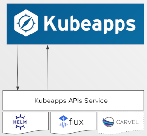
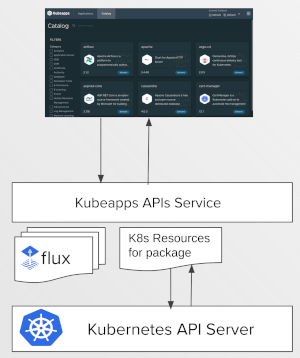

# Kubeapps APIs service

The Kubeapps APIs service provides a plugable, gRPC-based API service enabling the Kubeapps UI (or other clients) to interact with different Kubernetes packaging formats in a consistent, extensible way.

The Kubeapps APIs service is bundled with three packaging plugins providing support for the Helm, Carvel and Flux packaging formats, enabling users to browse and install packages of different formats.



In addition to these three packaging plugins, the Kubeapps APIs service is also bundled with a Kubernetes resources plugin that removes the long-standing requirement for the Kubeapps UI to talk directly with the Kubernetes API server. With this change, a user with the required RBAC can request, for example, Kubernetes resources for a specific installed package only:



## Architectural overview

### A gRPC-based API server

We chose to use [gRPC/protobuf](https://grpc.io/) to manage our API definitions and implementations together with the [buf.build](https://buf.build/) tool for lint and other niceties. In that regard, it's a pretty standard stack using:

- [grpc-gateway](https://grpc-ecosystem.github.io/grpc-gateway/) to enable an RESTful JSON version of our API (we don't use this in our client, but not everyone uses gRPC either, so wanted to ensure the API was accessible to others who wanted to use it)
- Improbable's [grpc-web](https://github.com/improbable-eng/grpc-web) to enable TypeScript gRPC client generation as well as translating gRPC-web requests into plain gRPC calls in the backend (rather than requiring something heavier like [Envoy](https://grpc.io/docs/platforms/web/basics/#configure-the-envoy-proxy) to do the translation),
- We multiplex on a single port to serve gRPC, gRPC-web as well as JSON HTTP requests.

### An plugable API server - loading plugins dynamically

A plugin for the Kubeapps APIs service is just a standard [Go plugin](https://pkg.go.dev/plugin) that exports two specific functions with the signatures:

```golang
func RegisterWithGRPCServer(GRPCPluginRegistrationOptions) (interface{}, error)

func RegisterHTTPHandlerFromEndpoint(context.Context, *runtime.ServeMux, string, []grpc.DialOption) error
```

This allows the main `kubeapps-apis` service to load dynamically any plugins found in the specified plugin directories when the service starts. The startup process creates a gRPC server and then calls each plugin's `RegisterWithGRPCServer` function to ensure their functionality is served as part of the gRPC API and the `RegisterHTTPHandlerFromEndpoint` function to ensure that the same functionality is available via the gRPC-Gateway.

So for example, as you might expect, we have a `helm/v1alpha1` plugin that provides a helm catalog and the ability to install helm packages, as well as a `resources/v1alpha1` plugin which can be enabled to provide some access to Kubernetes resources, such as the resources related to an installed package (assuming the requestor has the correct RBAC) - more on that later.

With this structure, the kubeapps-apis' executable loads the `.so` files from the plugin directories specified on the command-line and register them when starting. You can see the plugin registration functionality in the [core plugin implementation](/cmd/kubeapps-apis/core/plugins/v1alpha1/plugins.go).

### An extensible API server - enabling different implementations of a core packages plugin

Where things become interesting is with the requirement to **support different Kubernetes packaging formats** via this plugable system and **present them consistently to a UI** like the Kubeapps dashboard.

To achieve this, we defined a core packages API (`core.packages.v1alpha1`) with an interface which any plugin can choose to implement. This interface consists of methods common to querying for and installing Kubernetes packages, such as `GetAvailablePackages` or `CreateInstalledPackage`. You can view the full protobuf definition of this interface
in the [packages.proto](/cmd/kubeapps-apis/proto/kubeappsapis/core/packages/v1alpha1/packages.proto) file, but as an example, the `GetAvailablePackageDetail` RPC is defined as:

```protobuf
rpc GetAvailablePackageDetail(GetAvailablePackageDetailRequest) returns (GetAvailablePackageDetailResponse) {
  option (google.api.http) = {
    get: "/core/packages/v1alpha1/availablepackages/..."
  };
}
```

where the request looks like:

```protobuf
// GetAvailablePackageDetailRequest
//
// Request for GetAvailablePackageDetail
message GetAvailablePackageDetailRequest {
  // The information required to uniquely
  // identify an available package
  AvailablePackageReference available_package_ref = 1;

  // Optional specific version (or version reference) to request.
  // By default the latest version (or latest version matching the reference)
  // will be returned.
  string pkg_version = 2;
}
```

Similar to the normal Go idiom for [satisfying an interface](https://go.dev/doc/effective_go#interfaces), a Kubeapps APIs plugin satisfies the core packages interface if it implements all the methods of the core packages interface. So when the `kubeapps-apis` service's plugin server has registered all plugins, it subsequently iterates the set of plugins to see which of the registered plugins satisfy the core packages interface, returning a slice of packaging plugins satisfying the interface:

```golang
// GetPluginsSatisfyingInterface returns the registered plugins which satisfy a
// particular interface. Currently this is used to return the plugins that satisfy
// the core.packaging interface for the core packaging server.
func (s *pluginsServer) GetPluginsSatisfyingInterface(targetInterface reflect.Type) []PluginWithServer {
        satisfiedPlugins := []PluginWithServer{}
        for _, pluginSrv := range s.pluginsWithServers {
                // The following check if the service implements an interface is what
                // grpc-go itself does, see:
                // https://github.com/grpc/grpc-go/blob/v1.38.0/server.go#L621
                serverType := reflect.TypeOf(pluginSrv.Server)

                if serverType.Implements(targetInterface) {
                        satisfiedPlugins = append(satisfiedPlugins, pluginSrv)
                }
        }
        return satisfiedPlugins
}
```

Of course, all plugins register their own gRPC servers and so the RPC calls they define can be queried independently, but having a core packages interface and keeping a record of which plugins happen to satisfy the core packages interface allows us to ensure that **all plugins that support a different Kubernetes package format have a standard base API** for interacting with those packages, and importantly, the Kubeapps APIs services' core packages implementation can act as a gateway for all interactions, aggregating results for queries and generally proxying to the corresponding plugin.

### An Aggregated API server - combining results from different packaging plugins

Part of the goal of enabling plugable support for different packaging systems is to ensure that a UI like the Kubeapps dashboard can use a single client to present a catalog of apps for install, regardless of whether they come from a standard Helm repository, or a flux-based Helm repository, or Carvel package resources on the cluster.

For this reason, the implementation of the core packages API delegates to the related packaging plugins and aggregates their results. For example, the core packages implementation of `GetAvailablePackageDetail` ([see `packages.go`](/cmd/kubeapps-apis/core/packages/v1alpha1/packages.go)) can simply delegate to the relevant plugin:

```golang
// GetAvailablePackageDetail returns the package details based on the request.
func (s packagesServer) GetAvailablePackageDetail(ctx context.Context, request *packages.GetAvailablePackageDetailRequest) (*packages.GetAvailablePackageDetailResponse, error)
 {
        ...
        // Retrieve the plugin with server matching the requested plugin name
        pluginWithServer := s.getPluginWithServer(request.AvailablePackageRef.Plugin)
        ...

        // Get the response from the requested plugin
        response, err := pluginWithServer.server.GetAvailablePackageDetail(ctx, request)
        if err != nil {
          ...
        }


        // Build the response
        return &packages.GetAvailablePackageDetailResponse{
                AvailablePackageDetail: response.AvailablePackageDetail,
        }, nil
}
```

Similar implementations of querying functions like `GetAvailablePackageSummaries` in the same file collect the relevant available package summaries from each packaging plugin
and return the aggregated results. So our Kubeapps UI (or any UI using the client) can benefit from using the single *core* packages client to query and interact with packages
 from *different* packaging systems, such as Carvel and Flux.

It is worth noting that a plugin that satisfies the core packages interface isn't restricted to *only* those methods. Similar to go interfaces, the plugin is free to implement
 other functionality in addition to the interface requirements. The Helm plugin uses this to include additional functionality for rolling back an installed package - something
 which is not necessary for Carvel or Flux. This extra functionality is available on the Helm-specific gRPC client.

## Trying it out

### The command-line interface

Similar to most go commands, we've used [Cobra](https://github.com/spf13/cobra) for the CLI interface. Currently there is only a root command to run server, but we may later add a `version` subcommand or a `new-plugin` subcommand, but even without these it provides a lot of useful defaults for config, env var support etc.

Although it is possible to run the service in isolation, it requires access to a cluster so it's much simpler to test the service via port-forwarding.

### Port-forwarding to the Kubeapps-API service

If you have custom changes you want to test, you can build the image from the kubeapps root directory with:

```bash
IMAGE_TAG=dev1 make kubeapps/kubeapps-apis
```

and make that image available on your cluster somehow. If using kind, you can simply do:

```bash
kind load docker-image kubeapps/kubeapps-apis:dev1 --name kubeapps
```

You can edit the values file to change the `kubeappsapis.image.tag` field to match the tag above, or edit the deployment once deployed to match, such as:

```bash
kubectl set image deployment/kubeapps-internal-kubeappsapis -n kubeapps kubeappsapis=kubeapps/kubeapps-apis:dev1 --record
```

With the kubeapps-apis service running, you can then test the packages endpoints in cluster by port-forwarding the service in one terminal:

```bash
kubectl -n kubeapps port-forward svc/kubeapps-internal-kubeappsapis 8080:8080
```

### Testing with cURL

You can then verify the configured plugins endpoint via http:

```bash
curl -s http://localhost:8080/core/plugins/v1alpha1/configured-plugins | jq .
{
  "plugins": [
    {
      "name": "fluxv2.packages",
      "version": "v1alpha1"
    },
    {
      "name": "kapp_controller.packages",
      "version": "v1alpha1"
    },
    {
      "name": "resources",
      "version": "v1alpha1"
    }
  ]
}
```

or via gRPC (using the [grpcurl tool](https://github.com/fullstorydev/grpcurl)):

```bash
grpcurl -plaintext localhost:8080 kubeappsapis.core.plugins.v1alpha1.PluginsService.GetConfiguredPlugins
{
  "plugins": [
    {
      "name": "fluxv2.packages",
      "version": "v1alpha1"
    },
    {
      "name": "kapp_controller.packages",
      "version": "v1alpha1"
    },
    {
      "name": "resources",
      "version": "v1alpha1"
    }
  ]
}
```

### Testing an authenticated endpoint

You will need an authentication token to be able to query the API service's other endpoints, such as the packaging endpoints.

You can either create a service account with the necessary RBAC and use the related bearer token, or [steal the auth token from your browser](/docs/user/OIDC/OAuth2OIDC-debugging.md#viewing-the-jwt-id-token). Either way, you will end up with a token that you can use with your queries. For example, to get the available packages:

```bash
$ export TOKEN="Bearer eyJhbGciO..."
$ curl -s http://localhost:8080/plugins/fluxv2/packages/v1alpha1/availablepackages -H "Authorization: $TOKEN" | jq . | head -n 26
{
  "availablePackageSummaries": [
    {
      "availablePackageRef": {
        "context": {
          "cluster": "default",
          "namespace": "default"
        },
        "identifier": "bitnami/airflow",
        "plugin": {
          "name": "fluxv2.packages",
          "version": "v1alpha1"
        }
      },
      "name": "airflow",
      "latestVersion": {
        "pkgVersion": "12.0.9",
        "appVersion": "2.2.3"
      },
      "iconUrl": "https://bitnami.com/assets/stacks/airflow/img/airflow-stack-220x234.png",
      "displayName": "airflow",
      "shortDescription": "Apache Airflow is a tool to express and execute workflows as directed acyclic graphs (DAGs). It includes utilities to schedule tasks, monitor task progress and handle task dependencies.",
      "categories": [
        "WorkFlow"
      ]
    },
```

Here is an example that shows how to use grpcurl to get the details on package "bitnami/apache" from the flux plugin

```bash
$ grpcurl -plaintext -d '{"available_package_ref": {"context": {"cluster": "default", "namespace": "default"}, "plugin": {"name": "fluxv2.packages", "version": "v1alpha1"}, "identifier": "bitnami/apache"}}' -H "Authorization: $TOKEN" localhost:8080 kubeappsapis.core.packages.v1alpha1.PackagesService.GetAvailablePackageDetail | jq . | head -n 23
{
  "availablePackageDetail": {
    "availablePackageRef": {
      "context": {
        "cluster": "default",
        "namespace": "default"
      },
      "identifier": "bitnami/apache",
      "plugin": {
        "name": "fluxv2.packages",
        "version": "v1alpha1"
      }
    },
    "name": "apache",
    "version": {
      "pkgVersion": "9.0.6",
      "appVersion": "2.4.52"
    },
    "repoUrl": "https://charts.bitnami.com/bitnami",
    "homeUrl": "https://github.com/bitnami/charts/tree/master/bitnami/apache",
    "iconUrl": "https://bitnami.com/assets/stacks/apache/img/apache-stack-220x234.png",
    "displayName": "apache",
    "shortDescription": "Apache HTTP Server is an open-source HTTP server. The goal of this project is to provide a secure, efficient and extensible server that provides HTTP services in sync with the current HTTP standards.",
```

Or you can query the core API to get an aggregation of all installed packages across the configured plugins:

```bash
grpcurl -plaintext -d '{"context": {"cluster": "default", "namespace": "kubeapps-user-namespace"}}' -H "Authorization: $TOKEN" localhost:8080 kubeappsapis.core.packages.v1alpha1.PackagesService.GetInstalledPackageSummaries | jq . | head -n 23
{
  "installedPackageSummaries": [
    {
      "installedPackageRef": {
        "context": {
          "cluster": "default",
          "namespace": "kubeapps-user-namespace"
        },
        "identifier": "apache-success",
        "plugin": {
          "name": "fluxv2.packages",
          "version": "v1alpha1"
        }
      },
      "name": "apache-success",
      "pkgVersionReference": {
        "version": "9.0.5"
      },
      "currentVersion": {
        "pkgVersion": "9.0.5",
        "appVersion": "2.4.52"
      },
      "iconUrl": "https://bitnami.com/assets/stacks/apache/img/apache-stack-220x234.png",
```

Of course, you will need to have the appropriate Flux HelmRepository or Carvel PackageRepository available. See [managing carvel packages](/docs/user/managing-carvel-packages.md) or [managing flux packages](/docs/user/managing-flux-packages.md) for information about setting up the environment.

## Hacking

A few extra tools will be needed to contribute to the development of this service.

### GOPATH env variable

Make sure your GOPATH environment variable is set.
You can use the value of command

```bash
go env GOPATH
```

### Install go cli deps

You should be able to install the exact versions of the various go CLI dependencies into your $GOPATH/bin with the following, after ensuring `$GOPATH/bin`is included in your`$PATH`:

```bash
make cli-dependencies
```

This will ensure that the cobra command is available should you need to add a sub-command.

### Install buf

Grab the latest binary from the [buf releases](https://github.com/bufbuild/buf/releases).

You can now try changing the url in the proto file (such as in `proto/kubeappsapis/core/v1/core.proto`) and then run:

```bash
buf generate
export KUBECONFIG=/home/user/.kube/config # replace it with your desired kube config file
make run
```

and then verify that the RegisteredPlugins RPC call is exposed via HTTP at the new URL path that you specified.

You can also use `buf lint` to ensure that the proto IDLs are valid (ie. extendable, no backwards incompatible changes etc.)
