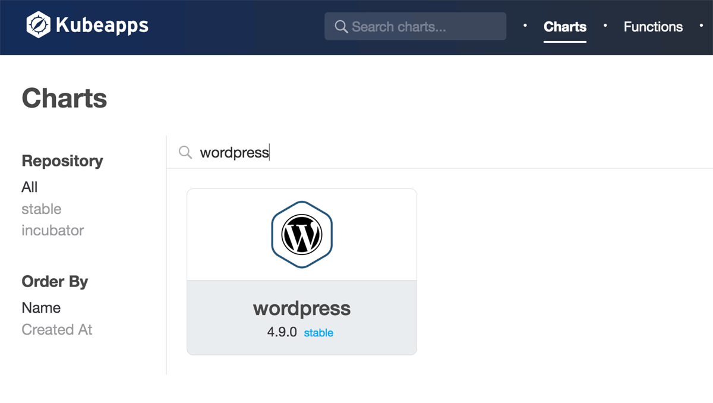
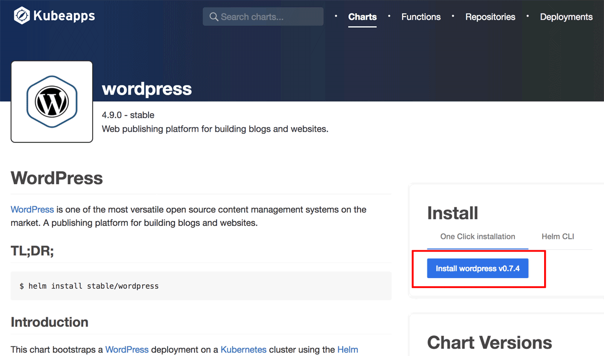
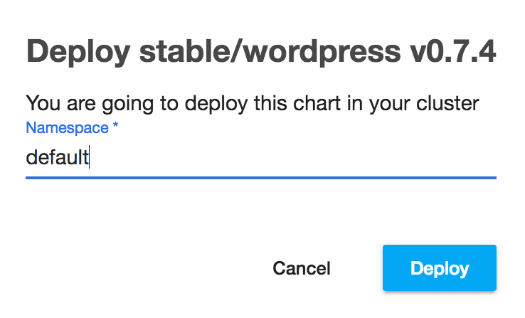
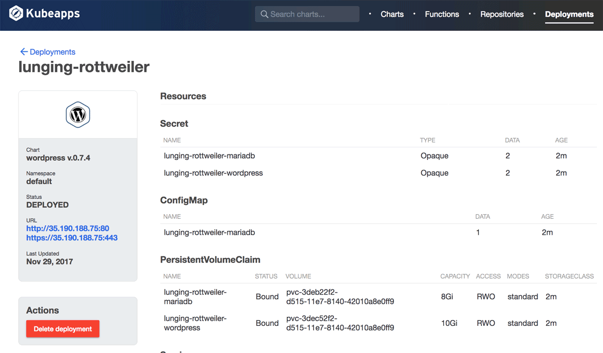
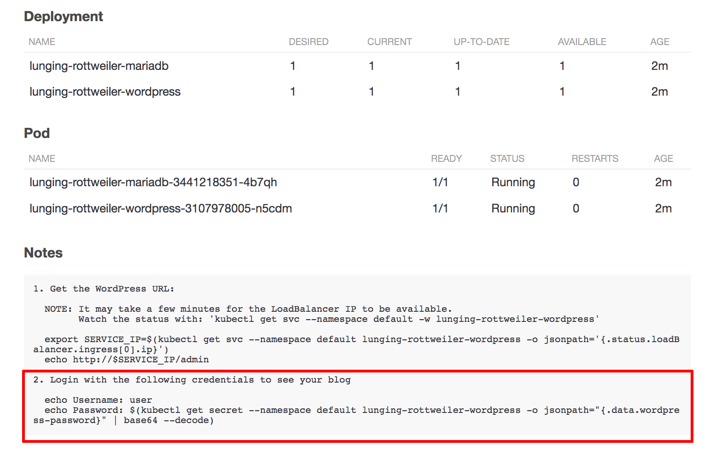

# Get Started with Kubeapps

Kubeapps is a set of tools written by [Bitnami](https://bitnami.com) to super-charge your Kubernetes cluster with:
 * Your own applications [dashboard](https://kubeapps.com/), allowing you to deploy Kubernetes-ready applications into your cluster with a single click.
 * [Kubeless](http://kubeless.io/) - a Kubernetes-native Serverless Framework, compatible with [serverless.com](https://serverless.com).
 * [SealedSecrets](https://github.com/bitnami/sealed-secrets) - a SealedSecret can be decrypted only by the controller running in the cluster and nobody else (not even the original author).

This guide will walk you through the process of deploying Kubeapps for your cluster and installing an example application.

## Prerequisites

Kubeapps assumes a working Kubernetes (v1.8+) with RBAC enabled and [`kubectl`](https://kubernetes.io/docs/tasks/tools/install-kubectl/) installed and configured to talk to your Kubernetes cluster. Kubeapps binaries are available for both Linux and OS X, and Kubeapps has been tested with both `minikube`, Google Kubernetes Engine (GKE) and Azure Container Service (AKS).

## Step 1: Install Kubeapps

To install Kubeapps, download a binary version of the latest Kubeapps Installer for your platform from the [release page](https://github.com/kubeapps/kubeapps/releases). Currently, the Kubeapps Installer is distributed in binary form for Linux (64-bit) and OS X (64-bit). Once downloaded, make the binary executable.

For example, to install the 0.2.0 binary release of the Kubeapps Installer on Linux, use this command:

```
sudo curl -L https://github.com/kubeapps/installer/releases/download/v0.2.0/kubeapps-linux-amd64 -o /usr/local/bin/kubeapps && sudo chmod +x /usr/local/bin/kubeapps
```

> In case the Kubeapps Installer is not available in binary form for your platform, you can also [build it from source](install.md).

Once the Kubeapps Installer is installed, deploy Kubeapps for your cluster with this command:

```
kubeapps up
```

You should see something like this as Kubeapps is deployed:


If you would like to see what exactly `kubeapps up` is installing on your system, we provide `--dry-run` option to show you the Kubeapps manifest as below:

```
kubeapps up --dry-run -o yaml

# prefer json format
kubeapps up --dry-run -o json
```

To remove Kubeapps from your cluster, run this command:

```
kubeapps down
```

## Step 2: Start the Kubeapps Dashboard

Once Kubeapps is installed, securely access the Kubeapps Dashboard from your system by running:

```
kubeapps dashboard
```

This will start an HTTP proxy for secure access to the Kubeapps Dashboard and launch your default browser to access it. Here's what you should see:


## Step 3: Deploy WordPress

Once you have the Kubeapps Dashboard up and running, you can start deploying applications into your cluster.

* Use the "Charts" menu from the Dashboard welcome page to select an application from the list of charts in the official Kubernetes chart repository. This example assumes you want to deploy WordPress.

  

* Click the "Install" button. 

  

* You will be prompted for the cluster namespace in which the application should be deployed.

  

* Click the "Deploy" button. The application will be deployed. You will be able to track the new Kubernetes deployment directly from the browser.

  

To obtain the WordPress username and password, refer to the "Notes" section of the deployment page, which contains the commands you will need to run to obtain the credentials for the deployment.

  

## Next Steps

Learn more about Kubeapps with the links below:

* [Detailed installation instructions](install.md)
* [Kubeapps Dashboard documentation](dashboard.md)
* [Kubeapps components](components.md)
