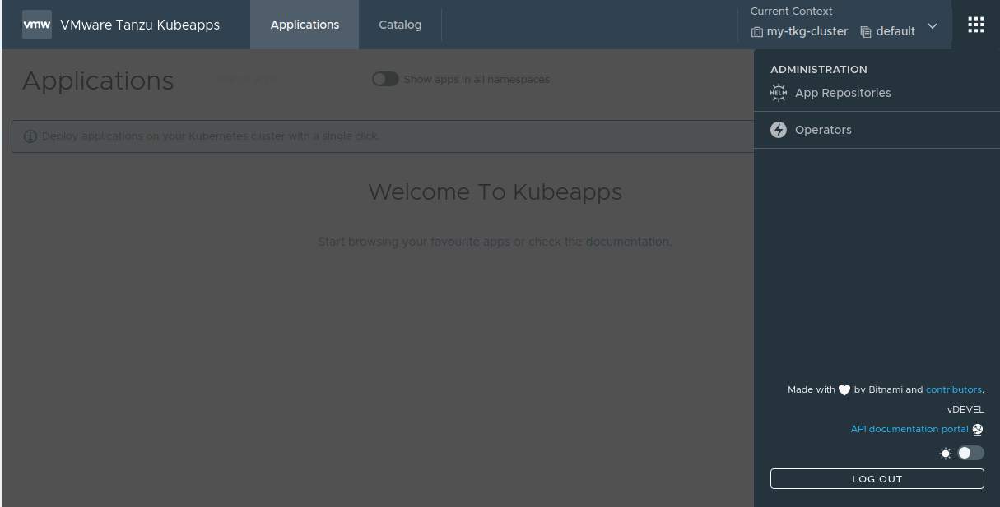

# Step 2 - Configure and Install Kubeapps

Having configured our TKG cluster with Pinniped and the OIDC provider, the next step is to configure Kubeapps accordingly; that is, making Kubeapps proxy the request towards Pinniped, enabling the OIDC login and, optionally, configuring the look and feel.

## 2.1 - Understanding the Kubeapps Configuration

Kubeapps is currently officially delivered as a Helm Chart packaged by Bitmami. Please always refer to the [Kubeapps Bitnami Chart Documentation](https://github.com/bitnami/charts/blob/master/bitnami/kubeapps/README.md) for further reference.

This Helm Chart can be configured with plenty of different items in the [values.yaml](https://github.com/bitnami/charts/blob/master/bitnami/kubeapps/values.yaml). A general overview is depicted below:

```yaml
## Values likely to be modified

### Authentication-related params

clusters: # list of clusters that Kubeapps can target

authProxy: # oauth2proxy configuration for setting up OIDC login

pinnipedProxy:# pinniped-proxy configuration

  ### Look-and-feel-related params

dashboard: # dashboard configuration
  customStyle: # custom css to inject
  customComponents: # custom components to inject
  customLocale: # custom strings to inject

apprepository: # apprepository controller configuration
  initialRepos: # initial repositories to fetch

## Other values

kubeops: # main backend APIs configuration

assetsvc: # asset service configuration

frontend: # nginx configuration (used to serve the dashboard and proxying the users' requests to the backend)

ingress: # if you have an ingress controller installed on your cluster, you can use it to expose Kubeapps.

postgresql: # database configuration

# other top-level entries, but not likely to be modified
```

In this step, we focus on two main categories of the [values.yaml](https://github.com/bitnami/charts/blob/master/bitnami/kubeapps/values.yaml) file: authentication and look and feel.

- **Authentication** includes: i) `clusters` to define the list of clusters that Kubeapps can target and which of them will use Pinniped; ii) `pinnipedProxy`: to enable the _Pinniped Proxy_ component; iii) `authProxy`: to define the flags used by _OAuth2 Proxy_, the component for performing the actual OIDC login.
- **Look and feel** comprises: i) `dashboard.customStyle` for injecting custom CSS; ii) `dashboard.customLocale` for customizing some supported strings; iii) `apprepository.initialRepos` for defining the repositories included by default during the installation.

> **TIP**: these values can be entered in two different ways:
>
> a) As values passed via command line:
>
> ```bash
>   helm install kubeapps --namespace kubeapps --set ingress.enabled=true bitnami/kubeapps
> ```
>
> b) Using a custom _values.yaml_ file
>
> ```bash
> helm install kubeapps --namespace kubeapps -f custom-values.yaml  bitnami/kubeapps
> ```

## 2.2. - Authentication

In this step, we have to configure `clusters`, `pinnipedProxy` and `authProxy` according to what we already set during the [Step 1](./step-1.md).

First of all, we must declare that the target cluster is using Pinniped by setting the `pinnipedConfig.enable=true`. If using multiple target clusters, please refer to the [Deploying to Multiple Clusters](https://github.com/kubeapps/kubeapps/blob/master/docs/user/deploying-to-multiple-clusters.md) guide.

> **TIP**: since the target cluster is the same as the cluster on which is installed, there is no need to set any URL. Also, the `name` field is not used but for using a display name in the dashboard.

```yaml
clusters:
  - name: my-tkg-cluster
    pinnipedConfig:
      enable: true
```

Next, we must enable the _Pinniped Proxy_ component, so that the requests performed by Kubepps can be proxied through Pinniped. To do so, just set `pinnipedProxy.enabled=true`:

```yaml
pinnipedProxy:
  enabled: true
  defaultAuthenticatorName: kubeapps-jwt-authenticator
```

> **TIP**: the `defaultAuthenticatorName` must match the JWTAuthenticator name created in the [Step 1](./step-1.md).

Finally, we must enter the information gathered from the OIDC provider as in the [Step 1](./step-1.md) so that we configure the _OAuth2Proxy_ component. It will perform the authentication flow, generating the appropriate request to the login page and retrieving the token in the callback URL.

Have a look at this example:

```yaml
authProxy:
  enabled: true
  provider: oidc
  clientID: my-client-id
  clientSecret: my-client-secret
  cookieSecret: my-cookie-secret
  additionalFlags:
    - --oidc-issuer-url=my-oidc-issuer-url
    - --scope=openid email groups
    - --set-authorization-header=true
    # - --insecure-oidc-skip-issuer-verification=true
```

1. Replace `my-oidc-issuer-url` with the _issuer_ URL of your OIDC provider. For CSP it is: `https://console-stg.cloud.vmware.com/csp/gateway/am/api`.
2. Replace `my-client-id` with the _app id_ you got from your OIDC provider.
3. Replace `my-client-secret` with the _app secret_ you got from your OIDC provider.
4. Replace `my-cookie-secret`, a seed string for secure cookies, with a 16, 24, or 32 bytes string. For example: `echo "not-good-secret" | base64`.

> **NOTE** In some providers whose _issuer URL_ does not match the _token URL_ (such as VMware CSP), the flag `--insecure-oidc-skip-issuer-verification=true` must be turned on. Beware of the security concerns of enabling this flag; please refer to the [official OAuth2Proxy documentation](https://oauth2-proxy.github.io/oauth2-proxy/docs/configuration/overview/) for further details.

## 2.3 - Look and Feel (optional)

In this step, we have to configure `dashboard` and `apprepository` for providing our users a rich experience, aligned with our branding policies.

We will customize the CSS and some strings according to this example: suppose that we want to change `Kubeapps` with any other name, for instance, `VMware Tanzu™ Kubeapps`.

First, we need to change the string used by the dashboard. To do so, just set the `dashboard.customLocale` with the custom messages. Please refer to the [whole list of customizable strings](https://github.com/kubeapps/kubeapps/blob/master/dashboard/lang/en.json) for further reference. In this example, we will change _Kubeappps_ by _VMware Tanzu Kubeapps_:

```yaml
dashboard:
  customLocale:
    Kubeapps: VMware Tanzu™ Kubeapps
    login-desc-oidc: Access to the VMware Tanzu Kubeapps using your My VMware account.
    login-oidc: Login via VMware Cloud Services
```

Next, add your custom style rules using your own CSS selectors. For instance, to change the Kubeapps logo, set the selector `.kubeapps__logo` with this property `background-image: url('data:image/png;base64...')` as in this example:

```yaml
dashboard:
  customStyle: |-
    .kubeapps__logo {
    background-image: url('data:image/png;base64,iVBORw0KGgoAAAANSUhEUgAAAQQAAAA4CAYAAAAbx4ZoAAANHklEQVR4Xu2debT11RjHv9+wDBWiWZQsU5Q0a6JEVCoqc4MVKhkbaFAkxJJSISoZKskQQoZKiJQkkamMlaESFVKUx/qctfddv/f3nnvO79z3vuuee3r2P/ftd/ZvD9/neb7PsPc5WdkSgUQgESgIOJFIBBKBRKAikISQupAIJAJTCCQhpDIkAolAEkLqQCKQCCyMQEYIqRWJQCKQEULqQCKQCGSEkDqQCCQCAxDIlCHVIxFIBDJlSB1IBBKBDilDRCwhaTlJS0m61xyCdqukm2z/bw7XkFMnAvcoBBZKGSJi5UIG4wDErbZvGIeF5BoSgXsCAv0I4TFjtPG7bf9mjNaTS0kEJhqBcScE2b56oiWQm0sExgiBJIQxEkYuJRGYawSSEOZaAjl/IjBGCCQhjJEwcimJwFwjkIQw1xLI+ROBMUIgCWGMhJFLSQTmGoEkhLmWQM6fCIwRAkkIYySMXEoiMNcIJCHMtQRy/kRgjBCYGEKIiFdIereklW3f0Q/jiHiEpN9J2tL2tyPirZJeI2k12/+Y5p0XSPqUpMfb/uUYyW7gUiKCtT52QKfLba83H/YTESFpM9vfba43Ik6W9BxJG9i+tuteIuLXkt5sG7lmayAwSYSwpKQ/YeC2PzGNcR8paRfbj+PzQghvkXSQbchkgRYR4HOlpDXnISE8RRKY0B4u6VRJz5f09/LsNts/mA/W0I8QImJ/SW+XtIXtS0bZRxLC9GhNRwhLS/qApMskndB6fXdJT5eER+Uz/r5a0sMk/VHSOyVtKOm5khinPuPzQyRhrOeXMfHO65d3qvd9lyS+6XgUfUa5uhwRH5S0tu2N+xj3vSX9QdLRto9tEcJNJUq4veWBdpT0+fJsXkUIrX1AgL+QtJLtv4xiPOPQt00IEbGdpC9I2tX2maOuMQlhdELYQNJp5bUti1Hzn1sVomiOeJukBzYetP+bjzAqFBJCuL4QCmTxw/Ienx/UGr8X7o5ICGsVj76W7Z+2jAKC+iTEZftvDULYRtKjJR1p+5jWO6zvZknPrBFCRHxY0kNs71L7FgU9W9Lytm8pY0O2fFOTiOWsiGAMiBNs7yPp++UzUpheq4oq6QGS8IDn2D64fAbJ4RF5/1+SzpJ0sG3+PbBFxLSEEBEPlfRaSTtJeqSk6yRBrCfYJlRnXadIulsSofY+kpYtzmKfKp+I+JgknEW7XWp7o4g4WtIqtl/Ywvhrkr5lG0fQtzUJISKI1r4n6RjbpHxTrescDZwfLOkA0kxJV6CfpJKtMQfi3hG/l5KiFCeJM0KGdxZ9PLSmuBHRqV+RCbq0X1k73/fBgX/U9n+G6cOgzwelDN8sXv/9jSihPvt4iQJQNCIAjJmogEXSiADog4JAIpAE3pb3aTtgYJKqEvA5kQKEwTu8vy8dRyGEAhSG9iPbvfdriwgU70bbuzWeoVCbSiI33QuDaAgHovgS9QYUtkEIz5aEV1rW9l1lTgzmZZJ2s31GecZ+UFz63RYRr8K2JF1U/rI+SGKNKsSiqL+XdP9SD8GYbogIIrIvF6FDBCjyEZL+anv7YQowhBD47QvG+lypr6wh6UOSDrdNmlEJAcJg7jcWZUZ2PTnavjMiHlV+R6MuhzQFAt7P9gldjbXfXiohSLpGEmnOxbZf1O7bdY6CM46J39ogjUT/XllkSAqC3Nj3UNwjogt+GPp7Jf0Z8rX9nYIX0fIttrct83XtR90E+6JuxreB10X3JG1vm+h6xm0QIeBREXr16M3ogGIUXgSmq4TR9Pi7FsE138Hjf1ESJMI7/OXz2jAQCIHUAoLpheozIIQ9JB1Xios97xkReD682+ZV2OV5JQS8PYZIoamXIkXExSXFeEMRZC9liIj7YoiStrF9UflBGQT9GUkr1MghIg6XtIntradRcn6IhuhgX9sYe40QSME2bJAEMsIDfNr2oQ0yIyrDQHZmHYM0YBAhTLO2l0vauxYdS4QAcU2lYhFBlEP6AQl+pUW+7O1C0knbhPfsbVEjBHSFCOlJRba9SKw1b6c5CiH8l7GaHjUiTpe0qu3NSv1oRrhHRBs/DJ2I+1m2v96Q4YqSfkth1PYFJULo0o90es2K7Yytv8+LgwgBA0eo/K3hPEKp4T0LbxICw/+qzFEJoZl6QAh4f4ye9IEIgcZ4kE/zGYTTq/rPgBDwrhQXD7D9kaKM1DUAnXBzqpWi4qa2t4oI+rBuPN3mkr4hiRQE48fgp2oIEYHxX2P7kIggwoCtN5NEHWS54jGJVE6zDXFiEE+VRAETDwyLXy5pI0nH235fgxCOq6RUnj1REukPpyeso7l+quw320Y+07YhEQLpCevaWdL9CjHiBLa2TSQylTLYJopqzk+N6VTbJ7aeEx4TEWFw1GdmgxB+VuZ4kKRz22sZZY5CCKe005QiI3SeOVbtgntEdMEPQsAJLlPTsIpXRHxV0lW2DyyE0KUfTgYSRv7sA12alTbslIGiH2lA01hrTWEmhID3r2kDGyA1wCMTOdQ2lS7wYFRCKIpBhLCx7fWLJ+NI6h22Abup0L0IoRACeTFRArn7i0s4vlNEwOJtQkDAhMLrFM9n2/tHBAbCmJDBjaVQeX1EPLk8ew+eXhIeFEKEhE6qitmv2BURkPB5JUxvC52fuDvbNkejMyUE1gNJHVi81QqlnrCXbQiiEsJdtvdu4Ud1//QmrhEByZGHb2u7Fo9ngxCQAWOTipDC7VHTs4ZxjRIhHGG71sl6Q0TE6iUE5y+OYSjuEdEFP/TlbbYZd4EWEaQNYXv3QghD+5W1blHSt2eU6PdA26S4i9SGEUIzDagGXHPzmRACY9T3+HdNDWptovmst7EZEgIKjkcht0IIeHA87AL5VTNCKCBjsIR7eMZ1bF8xDSEsUwqG3GsgXN+z5IWHFYVlP0QovXP+iKDgQ+TAsV+TkDCY84cQAnu5qtRo+t2VICynjjMyIUTE8mUfT7D984ZhEfWwrpEIISJIYyjOfdb2m1p75Vh39WYxtmBDCH1hh6LiDrbPKe+gN0Qh6zXvhkREpzk6RAjsA9kOxF0SaQeF42H4QQgnlQiBYmJTB9CfSxoRwtB+rfcpCkPUOCLqHwvc1RiVHYYRAuPVQh//rqlA07DxchgcraYMFJsIn2vKgMISWdBqbQLlph+f1UiEZzDflOLPhBCK0gA0kQ31g2tt79kGpw8h4B3J6y+wTeEGY14oQijPMXpCNWoWK9q+OyLIb1FwPMvVtilYMQYnE3fYfl3D6KhFELkcO4gQyvuQ28k1tWiMsUSXH6GdLmWIiJVKesWpSb2fwHqpmxw1A0IgB+cn+KidYCxNxeckA+IEo16LCCIccugTOxDC1MWkkt8Taq9SLiX1josjotMchRAwTI6op9ZZvDWFZdI/xhuI+wj41RoC++8Vasv4pIM/LulZs4YwrN/S7Yt0peZ1hm2cz4xbF0JgcHJ/jKt5kYXwn7D30oYB1yLhVKhYCofkpM1bfpACRFDHIxJ5Xp85ZhQhFLBfUnIsvNxG/S7htAmhvEc+f6Zt9jWIEDBuIgqEwAlDFTJpB8dYeK+flDEorEGaFJUuiwjyU9IXLg9xL6J32jLd+XhE0A8DqOkVKQenHVTa1x129DikhsDRKsT2ekkcWZF+QPKQXOcIISLAm/CXdKv5O5i3E31EBPqCDuDZUVqiMHLgp3GiMgohFKyo7mNM59mGlMGv0xwFZ/SP/VKoxAHhMKjaN08ZhuIeEV3wgxDAlEIohHBBKapz8kD9gBMt1t+1H+//UxKOhrs1m+BYip4vcNw+KjN0JYRRx521/osQIeCBEfp1tsnhF2rTEMKSTQMbECGsVqKJHW1P1UAiAqPdzjaRyVSLCMI6zrxJN4hCiB6IjAamDA2iWZs6SCleclxGaIghDTxhKIo26B4C5HR8OX79dznePLecaoxCCBzr9jtRudI2a0fh8bwoLlEETgIihEA630NoYUrxl0iNekctIA+do3EPgXCbmhFRIDdSuYdAUbEpt4G4F3Ifhl+9X0C+j35wnMkJGFenuUsC7pUQIMxh/XA4RO4cOUOMnIYcVlOqRTG+iSWERQEl300EZhOBeuGoXpmfbuyu/WZzbe2xkhAWJ7o5diLQ8PxJCLOgDjNNGWZh6hwiEZgVBLp6/q79ZmVR0wySEcLiRDfHTgTmGQJJCPNMYLncRGBxIpCEsDjRzbETgXmGQBLCPBNYLjcRWJwIJCEsTnRz7ERgniGQhDDPBJbLTQQWJwLjTgj5v4NfnNLPsROBFgL9CIFrkUuNCVK38otBY7KWXEYiMPEI9CMEvjjD3W5+aIRvo81V46vKN3X5Nt9cLTDnTQQmDYGFCGHSNpj7SQQSge4IJCF0xyp7JgITj0ASwsSLODeYCHRHIAmhO1bZMxGYeASSECZexLnBRKA7AkkI3bHKnonAxCOQhDDxIs4NJgLdEUhC6I5V9kwEJh6BJISJF3FuMBHojkASQnessmciMPEI/B8l0gSinyDqvwAAAABJRU5ErkJggg==') !important;
    width: 21.6em !important;
    height: 4.2em !important;
    }
```

This image depicts a customized version of Kubeapps applying the aforementioned styles and strings:



Finally, the initial application repositories can be also customized. In the next steps, we will cover how to add different repositories. Notwithstanding, some users use to add the Bitnami open source catalog as follows:

```yaml
apprepository:
  initialRepos:
    - name: bitnami
      url: https://charts.bitnami.com/bitnami
```

## 2.4 - Installing Kubeapps in the Cluster

Since Kubeapps is currently officially delivered as a Helm Chart packaged by Bitmami, to install Kubeapps we need to install the Bitami repository in Helm and perform a usual installation.
If you require to install it in an air-gapped environment, please follow the [Offline Installation Instructions](https://github.com/kubeapps/kubeapps/blob/master/docs/user/offline-installation.md) instead.

> **TIP**: Typically, you may want to make the dashboard externally accessible. To do so, just set `frontend.service.type=LoadBalancer` or use an Ingress. Please refer to [this section of the Kubeapps documentation](https://github.com/kubeapps/kubeapps/tree/master/chart/kubeapps#exposing-externally) for additional information.
>
> ```yaml
> frontend:
>   service:
>     type: LoadBalancer
> ```

```bash
# Install the Bitnami helm repository
helm repo add bitnami https://charts.bitnami.com/bitnami

# Create a 'kubeapps' namespace in our cluster
kubectl create namespace kubeapps

# Install a 'kubeapps' release in the 'kubeapps' namespace with the values defined at 'custom-values.yaml'
helm install kubeapps --namespace kubeapps bitnami/kubeapps -f custom-values.yaml
```

## 2.5 - Setting the RBAC

Since Kubeapps delegates the authorization to the existing RBAC configured in the cluster, every permission should be granted using `ClusterRoleBinding` and `RoleBinding` objects. Please refer to the official documentation on the [Kubeapps Access Control](https://github.com/kubeapps/kubeapps/blob/master/docs/user/access-control.md) for further reference.

> **NOTE:**: the RBAC configuration is something that will depend on your custom business requirements. The configuration used in this example is just intended for demo purposes. Please refer to the official [Kubernetes RBAC documentation](https://kubernetes.io/docs/reference/access-authn-authz/rbac/) for more details.

In this example, we create the `ClusterRoleBinding` `kubeapps-operator` with the `cluster-admin` role for the username `email@example.com`.

1. Create a file `kubeapps-rbac.yaml` with the following content:

```yaml
---
kind: ClusterRoleBinding
apiVersion: rbac.authorization.k8s.io/v1
metadata:
  name: kubeapps-operator
roleRef:
  apiGroup: rbac.authorization.k8s.io
  kind: ClusterRole
  name: cluster-admin
subjects:
  - apiGroup: rbac.authorization.k8s.io
    kind: User
    name: email@example.com
```

2. Replace `email@example.com` with your actual username used in the OIDC provider.
3. Perform a `kubectl apply -f kubeapps-rbac.yaml` to configure the RBAC in your cluster.

## What to Do Next?

At this point, you have a Kubeapps installation up and running. You have configured the authentication in the Kubeapps components as well as some look and feel details. Then, you have performed the installation and have granted the RBAC permissions to be able to use Kubepps.
The next thing is to start adding application repositories to your Kubeapps instance as described in the [Step 4](./step-4.md).

## Additional References

- [Using values.yaml files in Helm Charts](https://helm.sh/docs/chart_template_guide/values_files/)
- [Configure Pinniped to trust the OIDC provider](https://github.com/kubeapps/kubeapps/blob/master/docs/user/using-an-OIDC-provider-with-pinniped.md#configure-pinniped-to-trust-your-oidc-identity-provider)
- [Configuring Kubeapps to proxy requests via Pinniped](https://github.com/kubeapps/kubeapps/blob/master/docs/user/using-an-OIDC-provider-with-pinniped.md#configuring-kubeapps-to-proxy-requests-via-pinniped)
- [Getting started with Kubeapps](https://github.com/kubeapps/kubeapps/blob/master/docs/user/getting-started.md)
- [Adding new translations in Kubeapps](https://github.com/kubeapps/kubeapps/blob/master/docs/developer/translate-kubeapps.md)
