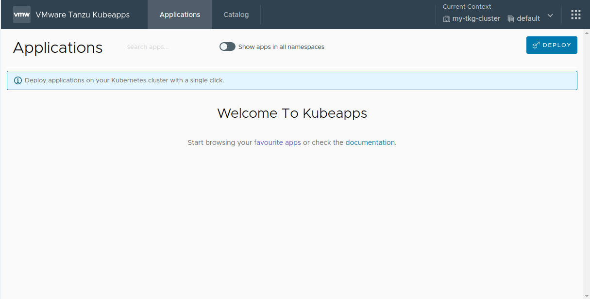
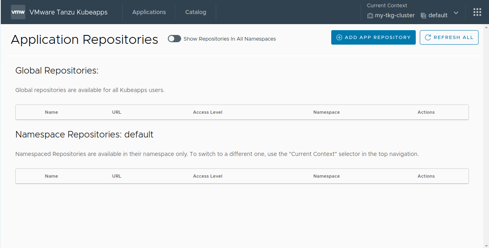

# Step 3 - Add Application Repositories

In this step, we will configure both a public and a private repository in Kubeapps.

## 3.1 - Adding a new repository

To add any repository, first, you have to access the _App Repository_ view as described below:

1. Starting from a fresh new Kubeapps instance, click on the right menu (dotted square).
   
2. Click on the _App Repositories_ button.
   
3. If you have not specified any `initialRepos` during the Kubeapps configuration, you will not have any repositories in your cluster.
   
4. To add a new repository, just click on the _Add App Repository_ button.

Later, you will be asked to enter all the corresponding data to each Application Repository:

1. The `Name` is just a user-faced display name, the `URL` is the endpoint of the repository. This endpoint might require some sort of authentication (`None`, `Basic Auth` (username and password), `Bearer Token` (a token) or another `Custom` mechanism).
   
2. Currently Kubeapps supports both `Helm Repository` and `OCI Registry`. In the case of the latter, you must manually select the list of artifacts to fetch (there is no index yet).
   Additionally, you can exclude some artifacts using regular expressions if desired.
   
3. You can now additionally choose (or create) an `imagePullSecret` so that image can be pulled from the private registry.
   
4. Finally, you can customize the CA certificate (skip the TLS verification at all) and modifying the Sync Job in charge of periodically pulling the latest changes from the Application Repository.
   

Having introduced generalities about the Application Repositories, now you can add both public and private repositories. We will use two specific examples: i) the VMware Marketplace™ and the VMware Tanzu™ Application Catalog™ for Tanzu™ Advanced.

## 3.1 - Adding the VMware Marketplace™

> **NOTE**: this repository is currently under heavy development, the URL herein stated is subject (and likely) to change.

The public content from the VMware Marketplace™ can be retrieved at `https://charts.market.csp.vmware.com/bitnami`. Since it is a public repository, you only need to set a name and save the Application Repository as follows:

1. **Name**: add descriptive name, for instance, `vmware-marketplace`
2. **URL**: set it to `https://charts.market.csp.vmware.com/bitnami`
3. Click on _Install Repo_ to finish the process.


Then, after some minutes of retrieving the whole catalog, you will find it has been populated:

> **TIP**: To check the progress of the synchronization task, use the following command:
>
> ```bash
> kubectl logs -n kubeapps -l apprepositories.kubeapps.com/repo-name=vmware-marketplace
> ```


## 3.2 - Adding the VMware Tanzu™ Application Catalog™ for Tanzu™ Advanced

The private content from the VMware Tanzu™ Application Catalog™ for Tanzu™ Advanced can be retrieved at `https://registry.pivotal.io/tac-for-tanzu-advanced/charts/.`.
Since it is a private repository, it requires adding the `Basic Auth` with username and password. If you do not have it, please reach out to your [VMware sales representative](https://www.vmware.com/company/contact_sales.html).
Furthermore, it is an OCI registry; it implies that you have to manually add the list of artifacts to retrieve.

The configuration can be summarized as follows:

1. **Name**: add descriptive name, for instance, `tac-for-tanzu-advanced`
2. **URL**: set it to `https://registry.pivotal.io/tac-for-tanzu-advanced/charts/`
3. **Repository Authorization**: set it to `Basic Auth`
   - Enter your VMware Tanzu™ Application Catalog™ for Tanzu™ Advanced `username` and `token` in the _Username_ and _Password_ fields respectively.
4. **Repository Type**: set it to `OCI Registry`

   - Add the following data in the _List of Repositories_ field:

   ```
   kibana, kiam, mariadb, postgresql-ha, grafana-operator, nginx-ingress-controller, mongodb, minio, nginx, apache, ejbca, mongodb, elasticsearch, etcd, solr, kubewatch, tomcat, kong, rabbitmq, grafana, logstash, jenkins, postgresql, redis, kube-state-metrics, airflow, mariadb-galera, contour, influxdb, cassandra, wavefront, nats, aspnet-core, wordpress, tensorflow-resnet, spring-cloud-dataflow, fluentd, zookeeper, kafka, node-exporter, memcached, redis, parse, keycloak, external-dns, pytorch, mxnet, harbor, thanos, spark, consul, kubeapps, mysql, wildfly, metrics-server
   ```

> **TIP**: To check the progress of the synchronization task, use the following command:
>
> ```bash
> kubectl logs -n kubeapps -l apprepositories.kubeapps.com/repo-name=tac-for-tanzu-advanced
> ```

4. **Associate Docker Registry Credentials**: set the following data:
   - **Secret Name**: set it to `tac-for-tanzu-advanced`
   - **Server**: set it to `https://registry.pivotal.io/tac-for-tanzu-advanced/`
   - **Username**: your VMware Tanzu™ Application Catalog™ for Tanzu™ Advanced `username`
   - **Password**: your VMware Tanzu™ Application Catalog™ for Tanzu™ Advanced `token`
   - Click on _Submit_ to create and save the secret.
5. Once the secret has been created, it will appear in the list of _Associate Docker Registry Credentials_. Tick the checkbox for this newly-created `tac-for-tanzu-advanced` registry credential.
6. Click on _Install Repo_ to finish the process.


Then, after some minutes of retrieving the whole catalog, you will find it has been populated:


> **NOTE**: To obtain the most current list of repositories, log in to the registry using the `oras` tool and execute the command:
>
> ```bash
> oras pull registry.pivotal.io/tac-for-tanzu-advanced/index:latest -a && cat asset-index.json | jq -r '.charts | map(.name) | join(",")'
> ```

## 3.X - RBAC in Application Repositories

A Kubeapps `AppRepository` can be created by anyone with the required RBAC for that namespace.

If you have cluster-wide RBAC for creating AppRepositories, you can still create an `AppRepository` whose charts will be available to users in all namespaces by selecting `All Namespaces` when creating the repository.

To grant a user (e.g., `USERNAME`) permissions to create `AppRepositories` objects in a specific namespace (e.g., `CUSTOM-NAMESPACE`), you must create `RoleBinding` objects associating `apprepositories-read` and `apprepositories-write` as follows.

> **TIP**: if you only require granting users the with permissions to deploy charts from `AppRepositories` in a specific namespace, create only the `apprepositories-read` `RoleBinding` object.

```bash
# Grant the user <USERNAME> read apprepositories permissions on the <CUSTOM-NAMESPACE> namespace
kubectl -n <CUSTOM-NAMESPACE> create rolebinding <USERNAME>-apprepositories-read \
    --user <USERNAME>
    --clusterrole kubeapps:$KUBEAPPS_NAMESPACE:apprepositories-read

    --clusterrole kubeapps:$KUBEAPPS_NAMESPACE:apprepositories-write
```

```bash
# Grant the user <USERNAME> write apprepositories permissions on the <CUSTOM-NAMESPACE> namespace
kubectl -n <CUSTOM-NAMESPACE> create rolebinding <USERNAME>-apprepositories-write \
    --user <USERNAME> \
    --clusterrole kubeapps:$KUBEAPPS_NAMESPACE:apprepositories-write
```

Furthermore, when choosing or creating an `imagePullSecret` during the `AppRepository` creation, under the hood, it will check any referenced docker image within the chart is from a docker registry server matching one of the secrets associated with the `AppRepository`, then Kubeapps with Helm 3 will automatically append the corresponding imagePullSecret so that image can be pulled from the private registry.

Note that the user deploying the chart will need to be able to read secrets in that namespace, which is usually the case when deploying to a namespace.

## What to Do Next?

At this point, you have learned how Application Repositories work in Kubeapps as you have added both public and private repositories. The next step is to deploy, upgrade, roll back and delete applications as described in the [Step 4](./step-4.md).

## Additional References

- [Adding an public application repository](https://github.com/kubeapps/kubeapps/blob/master/docs/user/dashboard.md)
- [Consume Tanzu Application Catalog Helm Charts using Kubeapps](https://docs.vmware.com/en/VMware-Tanzu-Application-Catalog/services/tac-docs/GUID-using-tac-consume-tac-kubeapps.html)
- [Adding an private application repository](https://github.com/kubeapps/kubeapps/blob/master/docs/user/private-app-repository.md)
