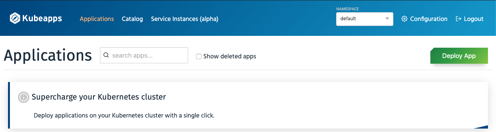
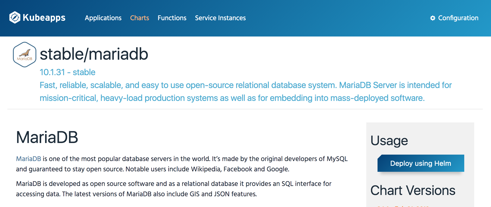
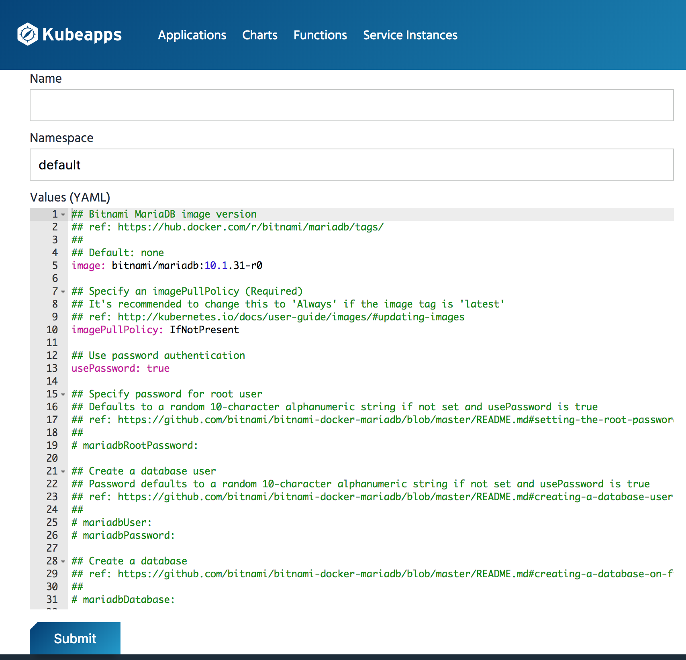
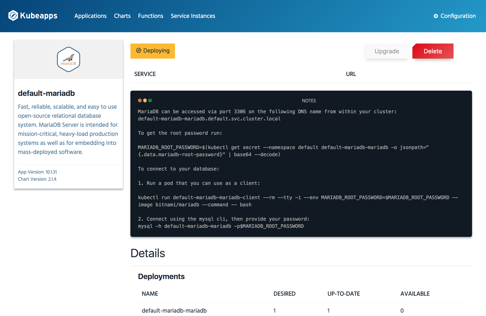
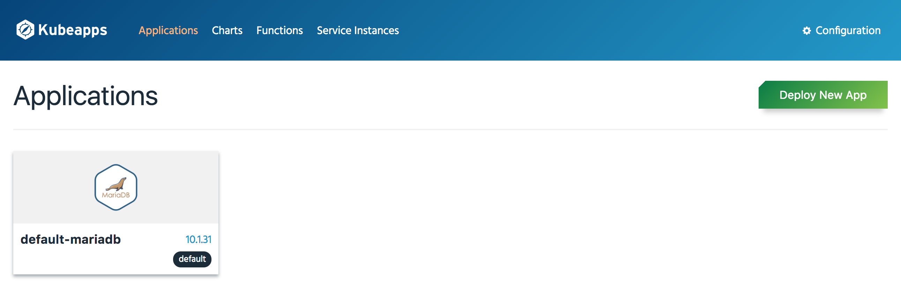
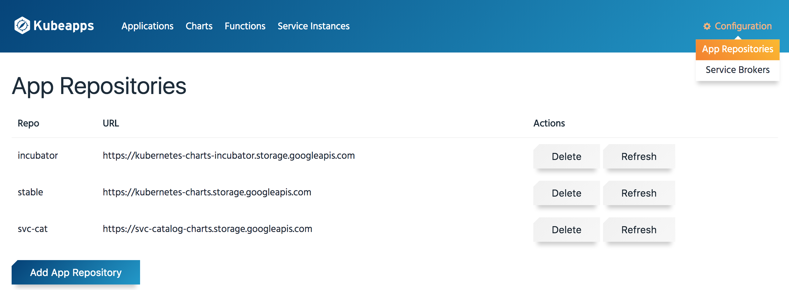

# Using the Dashboard

Once you have [installed Kubeapps in your cluster](../../chart/kubeapps/README.md) you can use the Dashboard to start managing and deploying applications in your cluster. Checkout the [Getting Started](getting-started.md) guide to learn how to access the Dashboard and deploy your first application.

The following sections walk you through some common tasks with the Kubeapps Dashboard.

## Work with Charts

### Deploy new applications using the Dashboard

* Start with the Dashboard welcome page:

  

* Use the "Charts" menu to select an application from the list of charts in the official Kubernetes chart repositories. This example assumes you want to deploy MariaDB.

  

* Click the "Deploy using Helm" button. You will be prompted for the release name, cluster namespace and values for your application deployment.

  

* Click the "Submit" button. The application will be deployed. You will be able to track the new Kubernetes deployment directly from the browser. The "Notes" section of the deployment page contains important information to help you use the application.

  

### List all the applications running in your cluster

The "Applications" page displays a list of the application deployments in your cluster that are managed by Helm.

### Remove existing application deployments

You can remove any of the applications from your cluster by clicking the "Delete" button on the application's status page:

### Add more chart repositories

By default, Kubeapps comes with the official Kubernetes chart repositories enabled. You can see the list of enabled chart repositories in the "App Repositories" page under the "Configuration" menu:

Add new repositories (for example, your organization's chart repository) by clicking the "Add App Repository" button. Fill the "Add Repository" form using the guidelines below:

* Name: Use any unique identifier.
* URL: Add the URL of your chart repository (the same URL used with `helm repo add`)

