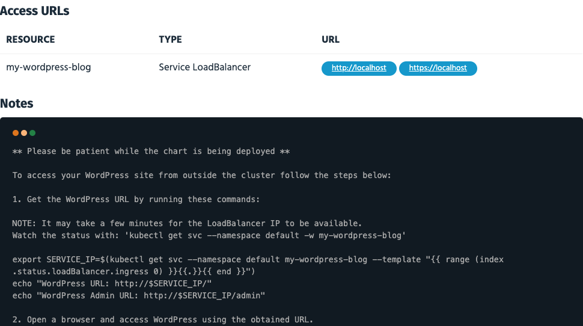
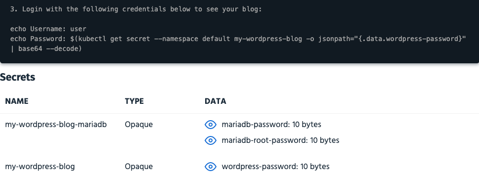
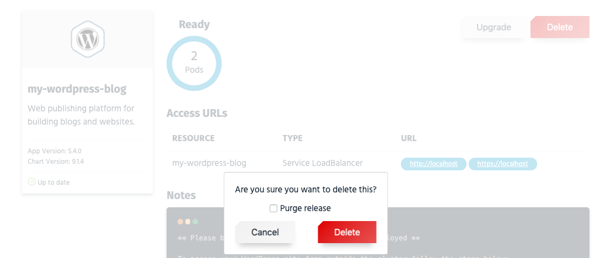

# Get Started with Kubeapps

This guide will walk you through the process of deploying Kubeapps for your cluster and installing an example application.

## Prerequisites

Kubeapps assumes a working Kubernetes cluster (v1.8+), [`Helm`](https://helm.sh/) (2.14.0+) installed in your cluster and [`kubectl`](https://kubernetes.io/docs/tasks/tools/install-kubectl/) installed and configured to talk to your Kubernetes cluster. Kubeapps has been tested with Azure Kubernetes Service (AKS), Google Kubernetes Engine (GKE), `minikube` and Docker for Desktop Kubernetes. Kubeapps works on RBAC-enabled clusters and this configuration is encouraged for a more secure install.

> On GKE, you must either be an "Owner" or have the "Container Engine Admin" role in order to install Kubeapps.

## Step 1: Install Kubeapps

Use the Helm chart to install the latest version of Kubeapps:

For Helm 2:

```bash
helm repo add bitnami https://charts.bitnami.com/bitnami
helm install --name kubeapps --namespace kubeapps bitnami/kubeapps
```

If you are using Helm 3, you need to set an extra flag to enable it:

```bash
helm repo add bitnami https://charts.bitnami.com/bitnami
kubectl create namespace kubeapps
helm install kubeapps --namespace kubeapps bitnami/kubeapps --set useHelm3=true
```

For detailed information on installing, configuring and upgrading Kubeapps, checkout the [chart README](../../chart/kubeapps/README.md).

The above commands will deploy Kubeapps into the `kubeapps` namespace in your cluster. It may take a few minutes to execute. Once it has been deployed and the Kubeapps pods are running, continue to step 2.

## Step 2: Create a Kubernetes API token

For trying out Kubeapps, access to the Dashboard requires a Kubernetes API token to authenticate with the Kubernetes API server as shown below, but for any real installation of Kubeapps you should instead [configure an OAuth2/OIDC provider](using-an-OIDC-provider.md).

```bash
kubectl create serviceaccount kubeapps-operator
kubectl create clusterrolebinding kubeapps-operator --clusterrole=cluster-admin --serviceaccount=default:kubeapps-operator
```

> **NOTE** It's not recommended to create `cluster-admin` users for Kubeapps production usage. Please refer to the [Access Control](/docs/user/access-control.md) documentation to configure fine-grained access control for users.

To retrieve the token,

### On Linux/macOS:

```bash
kubectl get secret $(kubectl get serviceaccount kubeapps-operator -o jsonpath='{range .secrets[*]}{.name}{"\n"}{end}' | grep kubeapps-operator-token) -o jsonpath='{.data.token}' -o go-template='{{.data.token | base64decode}}' && echo
```

### On Windows:

Create a file called `GetDashToken.cmd` with the following lines in it:

```bat
@ECHO OFF
REM Get the Service Account
kubectl get serviceaccount kubeapps-operator -o jsonpath={.secrets[].name} > s.txt
SET /p ks=<s.txt
DEL s.txt

REM Get the Base64 encoded token
kubectl get secret %ks% -o jsonpath={.data.token} > b64.txt

REM Decode The Token
DEL token.txt
certutil -decode b64.txt token.txt
```

Open a command prompt and run the `GetDashToken.cmd` Your token can be found in the `token.txt` file.

## Step 3: Start the Kubeapps Dashboard

Once Kubeapps is installed, securely access the Kubeapps Dashboard from your system by running:

```bash
kubectl port-forward -n kubeapps svc/kubeapps 8080:80
```

This will start an HTTP proxy for secure access to the Kubeapps Dashboard. Visit http://127.0.0.1:8080/ in your preferred web browser to open the Dashboard. Here's what you should see:


Paste the token generated in the previous step to authenticate and access the Kubeapps dashboard for Kubernetes.


***Note:*** If you are setting up Kubeapps for other people to access, you will want to use a different service type or setup Ingress rather than using the above `kubectl port-forward`. For detailed information on installing, configuring and upgrading Kubeapps, checkout the [chart README](../../chart/kubeapps/README.md).

## Step 4: Deploy WordPress

Once you have the Kubeapps Dashboard up and running, you can start deploying applications into your cluster.

- Use the "Deploy App" or click on the "Catalog" page in the Dashboard to select an application from the list of charts in any of the configured Helm chart repositories. This example assumes you want to deploy WordPress.

  

- Click the "Deploy" button.

  

- You will be prompted for the release name and values for the application. The form is populated by the values (YAML), which you can see in the adjacent tab.

  

- Click the "Submit" button. The application will be deployed. You will be able to track the new Helm deployment directly from the browser. The status will be shown at the top and you can also look at the individual resources lower in the page. It will also show the number of ready pods. If you run your cursor over the status, you can see the workloads and number of ready and total pods within them.

  

To access your new WordPress site, you can run the commands in the "Notes" section to get the URLs or simply click a URL (HTTP and HTTPS) shown.

***Note:*** Depending on your cloud provider of choice, it may take some time for an access URL to be available for the application and the Service will stay in a "Pending" state until a URL is assigned. If using Minikube, you will need to run `minikube tunnel` in your terminal in order for an IP address to be assigned to your application.



To get the credentials for logging into your WordPress account, refer to the "Notes" section. You can also get the WordPress password by scrolling down to "Secrets" and clicking the eye next to `wordpress-password`.



## [Optional] Step 5: Uninstall/Delete WordPress
If you want to uninstall/delete your WordPress application, you can do so by clicking the "Delete" button. You can choose to click the checkbox for "Purge Release" (default action with the Helm 3 CLI). If you do not click it, the Helm chart history will remain (default action with Helm 2). This is fine, so long as you don't attempt to install another chart with the same name in the same namespace.



## Next Steps

Learn more about Kubeapps with the links below:

- [Detailed installation instructions](../../chart/kubeapps/README.md)
- [Deploying Operators](./operators.md)
- [Kubeapps Dashboard documentation](dashboard.md)
- [Kubeapps components](../architecture/overview.md)
- [Roadmap](https://github.com/kubeapps/kubeapps/wiki/Roadmap)
