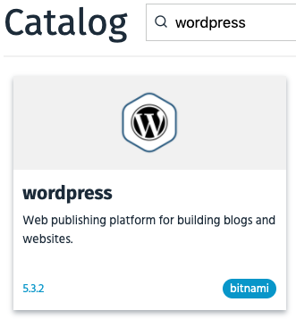
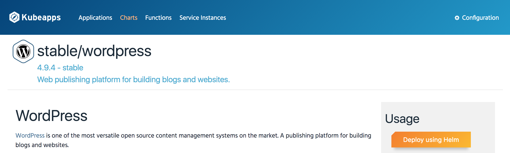
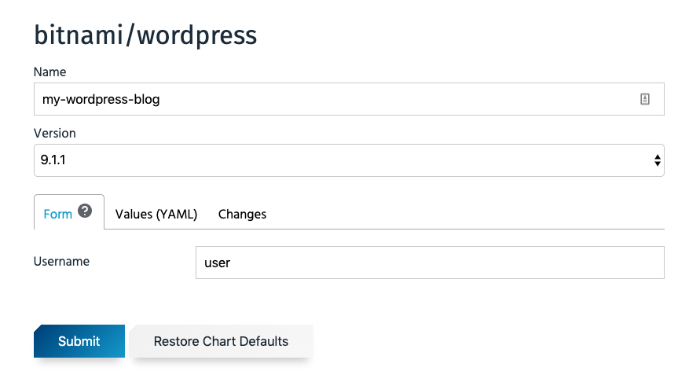
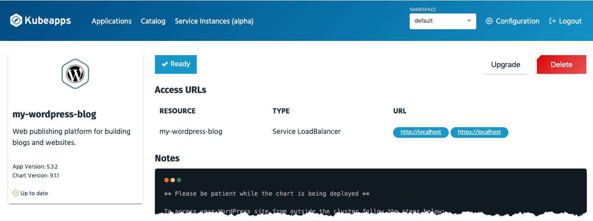

# Get Started with Kubeapps

This guide will walk you through the process of deploying Kubeapps for your cluster and installing an example application.

## Prerequisites

Kubeapps assumes a working Kubernetes cluster (v1.8+), [`Helm`](https://helm.sh/) (2.10.0+) installed in your cluster and [`kubectl`](https://kubernetes.io/docs/tasks/tools/install-kubectl/) installed and configured to talk to your Kubernetes cluster. Kubeapps has been tested with Azure Kubernetes Service (AKS), Google Kubernetes Engine (GKE), `minikube` and Docker for Desktop Kubernetes. Kubeapps works on RBAC-enabled clusters and this configuration is encouraged for a more secure install.

> On GKE, you must either be an "Owner" or have the "Container Engine Admin" role in order to install Kubeapps.

## Step 1: Install Kubeapps

Use the Helm chart to install the latest version of Kubeapps:

```bash
helm repo add bitnami https://charts.bitnami.com/bitnami
helm install --name kubeapps --namespace kubeapps bitnami/kubeapps
```

For detailed information on installing, configuring and upgrading Kubeapps, checkout the [chart README](../../chart/kubeapps/README.md).

The above commands will deploy Kubeapps into the `kubeapps` namespace in your cluster. It may take a few minutes to execute. Once it has been deployed and the Kubeapps pods are running, continue to step 2.

## Step 2: Create a Kubernetes API token

Access to the Dashboard requires a Kubernetes API token to authenticate with the Kubernetes API server.

```bash
kubectl create serviceaccount kubeapps-operator
kubectl create clusterrolebinding kubeapps-operator --clusterrole=cluster-admin --serviceaccount=default:kubeapps-operator
```

> **NOTE** It's not recommended to create `cluster-admin` users for Kubeapps production usage. Please refer to the [Access Control](/docs/user/access-control.md) documentation to configure fine-grained access control for users.

To retrieve the token,

### On Linux/macOS:

```bash
kubectl get secret $(kubectl get serviceaccount kubeapps-operator -o jsonpath='{.secrets[].name}') -o jsonpath='{.data.token}' | base64 --decode && echo
```

### On Windows:

Create a file called `GetDashToken.cmd` with the following lines in it:

```bat
@ECHO OFF
REM Get the Service Account
kubectl get serviceaccount kubeapps-operator -o jsonpath={.secrets[].name} > s.txt
SET /p ks=<s.txt
DEL s.txt

REM Get the Base64 encoded token
kubectl get secret %ks% -o jsonpath={.data.token} > b64.txt

REM Decode The Token
DEL token.txt
certutil -decode b64.txt token.txt
```

Open a command prompt and run the `GetDashToken.cmd` Your token can be found in the `token.txt` file.

## Step 3: Start the Kubeapps Dashboard

Once Kubeapps is installed, securely access the Kubeapps Dashboard from your system by running:

```bash
export POD_NAME=$(kubectl get pods -n kubeapps -l "app=kubeapps,release=kubeapps" -o jsonpath="{.items[0].metadata.name}")
echo "Visit http://127.0.0.1:8080 in your browser to access the Kubeapps Dashboard"
kubectl port-forward -n kubeapps $POD_NAME 8080:8080
```

This will start an HTTP proxy for secure access to the Kubeapps Dashboard. Visit http://127.0.0.1:8080/ in your preferred web browser to open the Dashboard. Here's what you should see:


Paste the token generated in the previous step to authenticate and access the Kubeapps dashboard for Kubernetes.


## Step 4: Deploy WordPress

Once you have the Kubeapps Dashboard up and running, you can start deploying applications into your cluster.

- Use the "Catalog" page in the Dashboard to select an application from the list of charts in any of the configured Helm chart repositories. This example assumes you want to deploy WordPress.

  

- Click the "Deploy using Helm" button.

  

- You will be prompted for the release name and values for the application.

  

- Click the "Submit" button. The application will be deployed. You will be able to track the new Kubernetes deployment directly from the browser.

  

To obtain the WordPress username and password, refer to the "Notes" section of the deployment page, which contains the commands you will need to run to obtain the credentials for the deployment.

You can also use the URLs shown to directly access the application. Note that, depending on your cloud provider of choice, it may take some time for an access URL to be available for the application and the Service will stay in a "Pending" state until a URL is assigned. If using Minikube, you will need to run `minikube tunnel` in your terminal in order for an IP address to be assigned to your application.


## Next Steps

Learn more about Kubeapps with the links below:

- [Detailed installation instructions](../../chart/kubeapps/README.md)
- [Kubeapps Dashboard documentation](dashboard.md)
- [Kubeapps components](../architecture/overview.md)
- [Roadmap](https://github.com/kubeapps/kubeapps/wiki/Roadmap)
