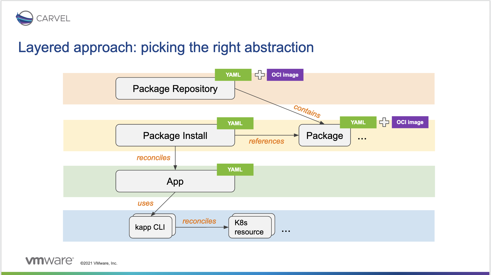
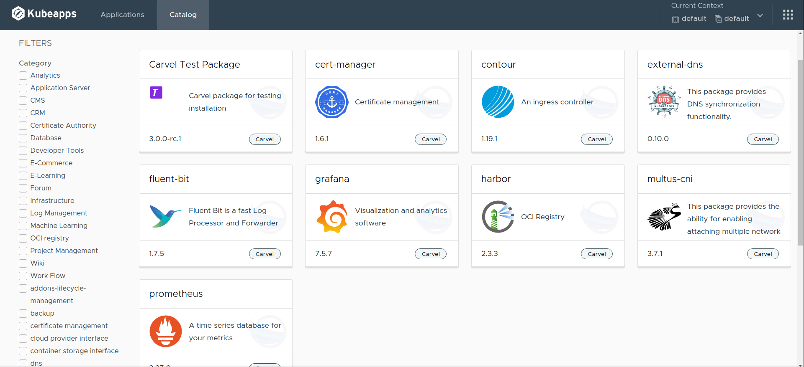
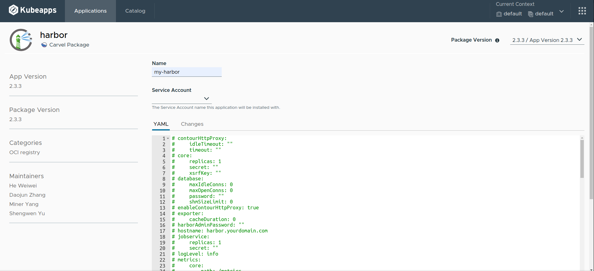
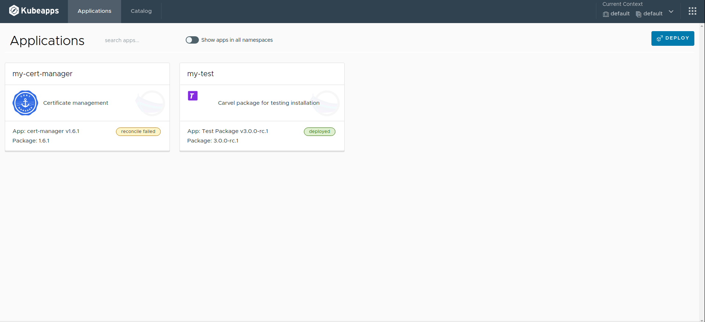
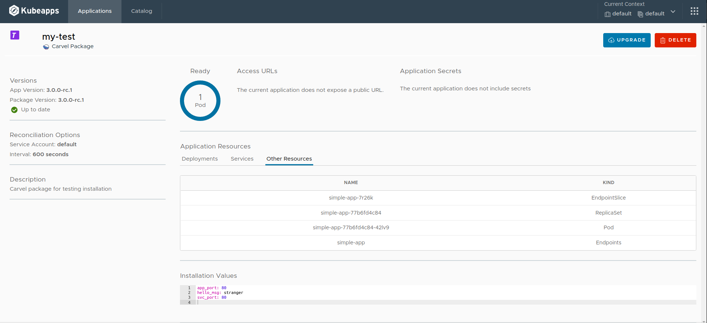

# Managing Carvel Packages with Kubeapps

> **NOTE**: This guide is about a feature that is under active development and, therefore, not yet ready for production use. The information herein stated is subject to change without notice until we reach a stable release.

## Table of Contents

1. [Introduction](#introduction)
2. [Installing kapp-controller in your Cluster](#installing-kapp-controller-in-your-cluster)
   1. [Quick overview of the kapp-controller CRs](#quick-overview-of-the-kapp-controller-crs)
3. [Using Kubeapps for Managing Carvel Packages
   ](#using-kubeapps-for-managing-carvel-packages)
   1. [Configuring Kubeapps to Cupport Carvel Packages](#configuring-kubeapps-to-support-carvel-packages)
   2. [Installing a Package Repository](#installing-a-package-repository)
   3. [Installing a Package](#installing-a-package)
   4. [Viewing the Installed Applications](#viewing-the-installed-applications)
4. [Conclusions](#conclusions)

---

## Introduction

Historically, Kubeapps was initially developed to solely manage [Helm Charts](https://helm.sh) on your Kubernetes clusters. However, it has evolved to support multiple formats, such as [Carvel Packages](https://carvel.dev/kapp-controller/docs/latest/packaging/#package) and [Helm releases via Fluxv2](https://fluxcd.io/docs/guides/helmreleases/).

> **TIP**: Find more information about the architectural evolution at [this video](https://www.youtube.com/watch?v=rS2AhcIPQEs) and [this technical documentation](../developer/kubeapps-apis.md).

[Carvel](https://carvel.dev/) is often defined as a set of reliable, single-purpose, composable tools that aid in your application building, configuration, and deployment to Kubernetes.
Particularly, two of these tools have paramount importance for Kubeapps: [kapp](https://carvel.dev/kapp/) and [kapp-controller](https://carvel.dev/kapp-controller/).

On the one hand, [kapp](https://carvel.dev/kapp/) is a CLI for deploying and viewing groups of Kubernetes resources as [Applications](https://carvel.dev/kapp/docs/latest/apps/). On the other hand, [kapp-controller](https://carvel.dev/kapp-controller/) is a controller for managing the lifecycle of those applications, which also helps package software into distributable [Packages](https://carvel.dev/kapp-controller/docs/latest/packaging/#package) and enables users to discover, configure, and install these packages on a Kubernetes cluster.

This guide walks you through the process of using Kubeapps for configuring and deploying [Packages](https://carvel.dev/kapp-controller/docs/latest/packaging/#package) and managing [Applications](https://carvel.dev/kapp/docs/latest/apps/).

## Installing kapp-controller in your Cluster

> **NOTE**: This section can safely be skipped if you already have kapp-controller installed in your cluster.

In order to manage Carvel Packages, first of all, you will need to install kapp-controller in your cluster. That is, applying a set of Kubernetes resources and CRDs.

According to the [Carvel kapp-controller official documentation](https://carvel.dev/kapp-controller/docs/latest/install/), you can install everything it kapp-controller requires just by running the following command:

```bash
kubectl apply -f https://github.com/vmware-tanzu/carvel-kapp-controller/releases/latest/download/release.yml
```

After running this command, you should have everything you need to manage Carvel Packages in your cluster. Next section will give you an overview of the relevant Custom Resources included in kapp-controller.

### Quick overview of the kapp-controller CRs

At the time of writing this guide, kapp-controller will install the following Custom Resources Definitions:

- [PackageRepository](https://carvel.dev/kapp-controller/docs/latest/packaging/#package-repository): is a collection of packages and their metadata. Similar to a maven repository or a rpm repository, adding a package repository to a cluster gives users of that cluster the ability to install any of the packages from that repository.

  - [Package](https://carvel.dev/kapp-controller/docs/latest/packaging/#package): is a combination of configuration metadata and OCI images that informs the package manager what software it holds and how to install itself onto a Kubernetes cluster.

  - [PackageMetadata](https://carvel.dev/kapp-controller/docs/latest/packaging/#package-metadata): are attributes of a single package that do not change frequently and that are shared across multiple versions of a single package. It contains information similar to a project’s README.md.

- [PackageInstall](https://carvel.dev/kapp-controller/docs/latest/packaging/#package-install) is an actual installation of a package and its underlying resources on a Kubernetes cluster.

- [App](https://carvel.dev/kapp-controller/docs/latest/app-overview/) is a set of Kubernetes resources. These resources could span any number of namespaces or could be cluster-wide.

The following image depicts the relationship between the different kapp-controller CRs:



## Using Kubeapps for Managing Carvel Packages

### Configuring Kubeapps to Support Carvel Packages

As any other packaging format, the kapp-controller support is brought into Kubeapps by means of a plugin.

This `kapp-controller` plugin is currently being built by default in the Kubeapps release and it is just a matter of enabling it when installing Kubeapps.

> **TIP**: Please refer to the [getting started documentation](./getting-started.md) for more information on how to install Kubeapps and pass custom configuration values.

In the [values.yaml](../../chart/kubeapps/values.yaml) file, under `kubeappsapis.enabledPlugins` add
`kapp-controller` to the list of enabled plugins. For example:

```yaml
kubeappsapis:
  - resources
  - helm
  - kapp-controller # add this one
```

### Installing a Package Repository

> **NOTE**: Currently, Kubeapps does not offer any graphical way to manage [Carvel Packages Repositories](https://carvel.dev/kapp-controller/docs/latest/packaging/#package-repository). Therefore, you will need to install the package repository manually.

Since we are actively working on [refactor the Application Repository management in Kubeapps](https://github.com/kubeapps/kubeapps/projects/11?card_filter_query=milestone%3A%22app+repository+refactor%22), [Carvel Packages Repositories](https://carvel.dev/kapp-controller/docs/latest/packaging/#package-repository) cannot be currently managed by Kubeapps.
This section covers how to manage repositories manually.

First, you need to find a Carvel Package Repository already published. If not, you can always [create your own manually](https://carvel.dev/kapp-controller/docs/latest/packaging-tutorial/#creating-a-package-repository).
In this section, we will use the `Tanzu Community Edition` package repository.

> **TIP**: In [this Carvel website](https://carvel.dev/kapp-controller/docs/latest/oss-packages/) you will find a list of Carvel Packages and Package Repositories that are available to open-source users.

Next, you need to create a `PackageRepository` CR. This is done by running the following command:

```bash
cat > repo.yaml << EOF
---
apiVersion: packaging.carvel.dev/v1alpha1
kind: PackageRepository
metadata:
  name: tce-repo
spec:
  fetch:
    imgpkgBundle:
      image: projects.registry.vmware.com/tce/main:0.9.1
EOF
```

Then, you need to apply the `PackageRepository` CR to your cluster using `kubectl` (or, alternatively, the `kapp` CLI), by running the following command:

```bash
kubectl apply -f repo.yaml
```

Under the hood, kapp-controller will create `Package` and `PackageMetadata` CRs for each of the packages in the repository.

> **TIP**: Run `kubectl get packagerepository`, `kubectl get packages` and `kubectl get packagemetadatas` to get the created CRs.

### Installing a Package

Installing a Carvel Package in Kubeapps is the same experience as installing any other package (such as a Helm Chart) in Kubeapps.

> **TIP**: Please refer to the [user documentation](./dashboard.md) for more information on how to use Kubeapps as a user.

Assuming that a Package Repository, such as the `Tanzu Community Edition`, is already installed in the cluster, go to the `Catalog` tab and select the package you want to install.

The following image depicts the catalog page with a set of packages from the `Tanzu Community Edition` repository.



Next, select any package you want to install, for example, `Harbor`, as depicted below:



A big difference with respect to other packaging formats is that **you must select a `ServiceAccount` to be used for installing the package**.
The reason why is that kapp-controller forces to explicitly provide needed privileges for management of app resources.

> **TIP**: Find more information about the kapp-controller security model in [their official documentation](https://carvel.dev/kapp-controller/docs/latest/security-model/).

In Kubeapps, a dropdown will allow you to select which `ServiceAccount` you want to use.

> **NOTE**: As a consequence, the user logged in Kubeapps will need RBAC permissions to perform a `list` operation on `ServiceAccount` objects.

Furthermore, there is another difference: **the values for installing the package are commented out by default**.
This this because there is no concept of _default values_ in Carvel Packages.

In Kubeapps, we work around this decision by generating some default values based upon the OpenAPI Schema of the package.

> **TIP**: For instance, a property `foo-prop` whose data type is `string` will yield a default value of `foo-prop: ""`

> **TIP**: you can uncomment a set of lines easily by selecting them and typing `Ctrl + /`.

Finally, after clicking the `Install` button, the required CRs will be installed in the cluster (`PackageInstall` and the `Secret` holding the passed values).
At this moment, kapp-controller will perform the required actions to start creating the Kubernetes resources defined by the package. This process is known as _reconciliation_.

### Viewing the Installed Applications

Viewing the installed Carvel Packages in Kubeapps is the same experience as viewing any other installed package (such as a Helm Chart) in Kubeapps.

> **TIP**: Please refer to the [user documentation](./dashboard.md) for more information on how to use Kubeapps as a user.

Go to the `Applications` tab to see every Application that has been installed in the cluster. Click on _show apps in all namespaces_ to view the ones currently installed in every namespace of the cluster.

The following example shows an example of the Applications page with two Carvel Packages installed:



Since the reconciliation process can eventually fail for several reasons, this page will show the current status of each application. If it is `deployed` it means that the application is successfully running in the cluster.

Next, click on the application you want to view, for example, `my-test` to go to the details page, as depicted in the following image:



As in any other packaging format, this page will display those Kubernetes resources that have been created as a result of the Package installation.
Besides, the current values are shown at the end of the page.

Next, you can click on the `Delete` button to uninstall the application or the `Upgrade` button to edit the values of the application or update it to another version.

> **NOTE**: as opossed to Helm Charts, Carvel Packages cannot be rolled back, hence there is no `Rollback` button.

Finally, note that every installed Carvel Package through Kubeapps can also be managed by the [kapp](https://carvel.dev/kapp/) CLI using the `kapp inspect -a <APPLICATION_NAME>` command. For example:

```bash
kapp inspect -a my-test-ctrl
```

An example output of this command is:

```bash
Target cluster 'https://127.0.0.1:40903' (nodes: kubeapps-control-plane)

Resources in app 'my-test-ctrl'

Namespace  Name                         Kind           Owner    Conds.  Rs  Ri  Age
default    simple-app                   Deployment     kapp     2/2 t   ok  -   9m
^          simple-app                   Endpoints      cluster  -       ok  -   9m
^          simple-app                   Service        kapp     -       ok  -   9m
^          simple-app-77b6fd4c84        ReplicaSet     cluster  -       ok  -   9m
^          simple-app-77b6fd4c84-42lv9  Pod            cluster  4/4 t   ok  -   9m
^          simple-app-7r26k             EndpointSlice  cluster  -       ok  -   9m

Rs: Reconcile state
Ri: Reconcile information

6 resources

Succeeded
```

## Conclusions

This guide has covered how to manage Carvel Packages in Kubeapps, starting from [how to configure Kubeapps itself](#configuring-kubeapps-to-support-carvel-packages), then how to [add Carvel Packages Repositories](#installing-a-package-repository), next [how to browse and install Carvel Packages](#installing-a-package), and finally [how to view the installed Carvel Packages](#viewing-the-installed-applications).

Some additional resources and references include:

- [Getting Started with kapp-controller](https://tanzu.vmware.com/developer/guides/kapp-controller-gs/)
  - [kapp-controller documentation](https://carvel.dev/kapp-controller/docs/latest/)
- [Getting Started with kapp](https://tanzu.vmware.com/developer/guides/kapp-gs/)
  - [kapp documentation](https://carvel.dev/kapp/docs/latest)

Finally, we are [currently working](https://github.com/kubeapps/kubeapps/projects/11?card_filter_query=milestone%3A%22pluggable+support+for+carvel%22) on this kapp-controller plugin for managing Carvel Packages, so if you encounter any problems, please [file an issue](https://github.com/kubeapps/kubeapps/issues/new) in the Kubeapps repository.
