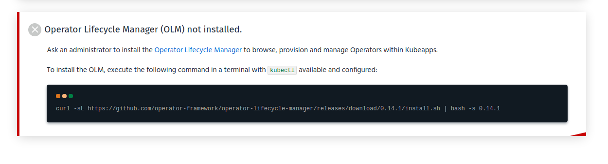
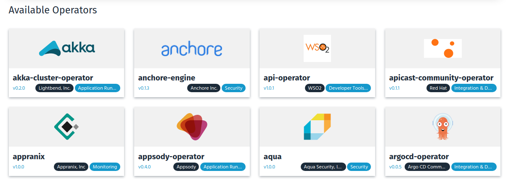
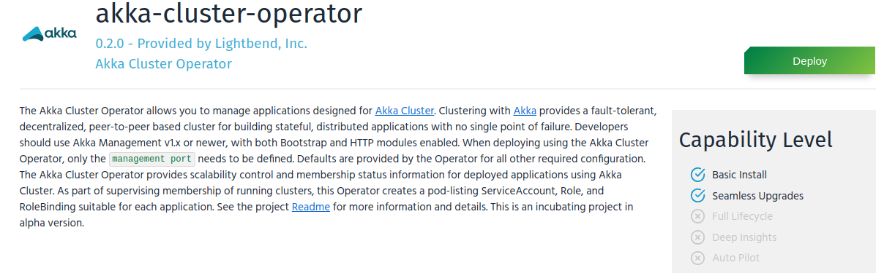
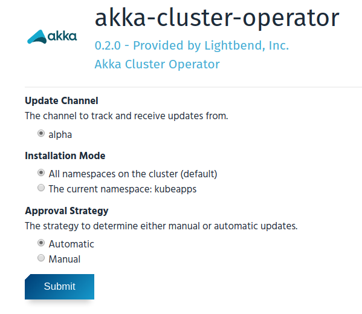
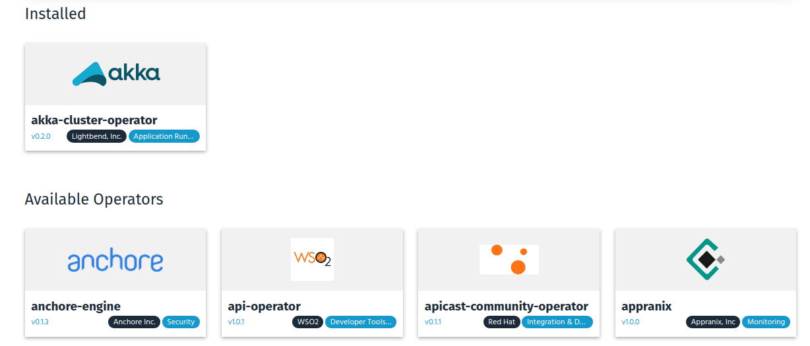
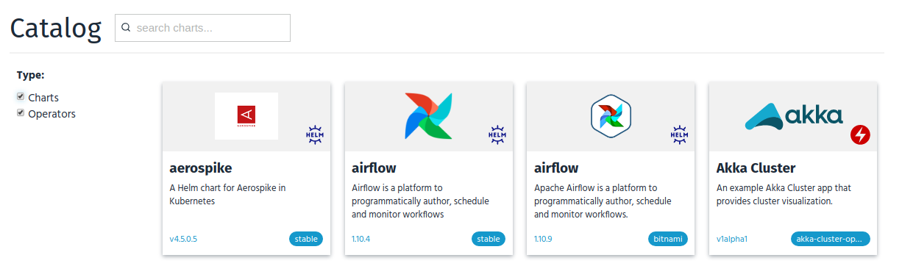
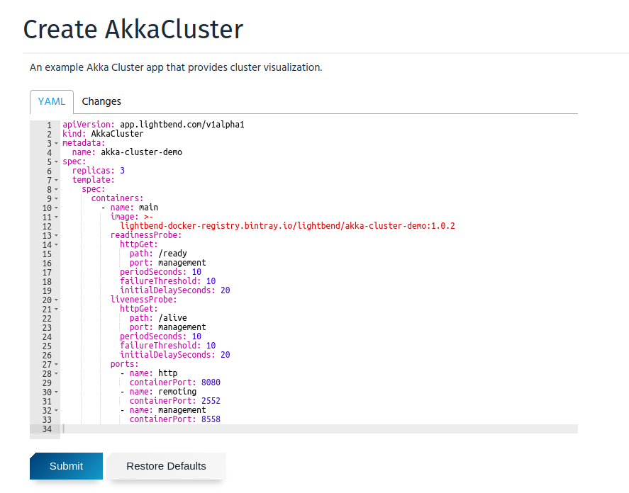
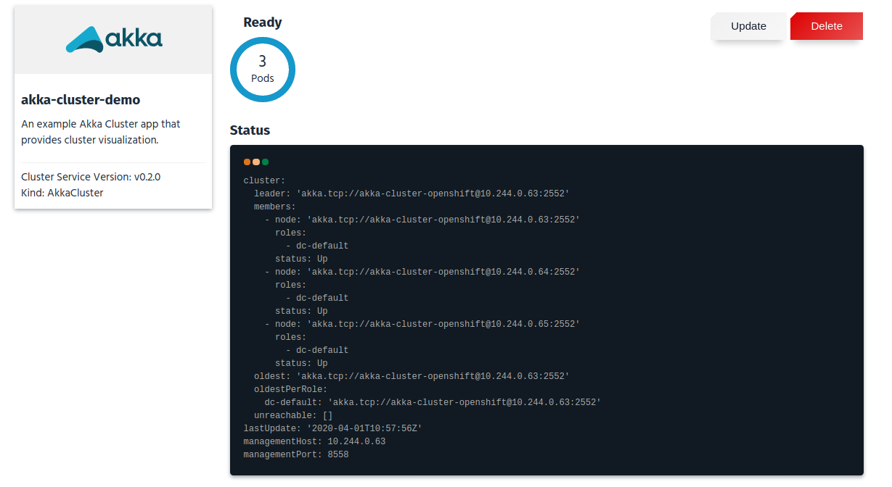

# Get Started with Operators in Kubeapps

This guide will walk you through the process of enabling support for Operators in Kubeapps and deploy an Operator instance.

In this tutorial we will be using the the [Operator Lifecycle Manager (OLM)](https://github.com/operator-framework/operator-lifecycle-manager) to expose the Operators from the [OperatorHub](https://operatorhub.io/).

## Prerequisites

Kubeapps assumes a working Kubernetes cluster (v1.12+) and [`kubectl`](https://kubernetes.io/docs/tasks/tools/install-kubectl/) installed and configured to talk to your Kubernetes cluster. Users following this tutorial require to have admin privileges in the cluster in order to install and manage Operators.

## Step 1: Enabling Operators support in Kubeapps

The support for Operators is currently under heavy development. For the moment, it's not enabled by default. If you want to use it, you need to enable the related feature flag. This can be done either at installation time or when upgrading Kubeapps. It's just necessary to enable the flag `featureFlags.operators`: 

```bash
helm repo add bitnami https://charts.bitnami.com/bitnami
helm install --name kubeapps --namespace kubeapps bitnami/kubeapps --set featureFlags.operators=true
```

If you are using Helm 3:

```bash
kubectl create namespace kubeapps
helm install --name kubeapps --namespace kubeapps bitnami/kubeapps --set featureFlags.operators=true
```

For detailed information on installing, configuring and upgrading Kubeapps, checkout the [chart README](../../chart/kubeapps/README.md).

## Step 2: Install the Operator Lifecycle Manager (OLM)

Once you access the dashboard, if you go to Configuration => Operators, you will see a message alerting that the OLM is not installed:

  

Follow the instructions to install the latest OLM version:

```bash
curl -L https://github.com/operator-framework/operator-lifecycle-manager/releases/download/0.15.1/install.sh -o install.sh
chmod +x install.sh
./install.sh 0.15.1
```

Note that you will need special permissions to manage Operators. If you receive a Forbidden error, apply the following ClusterRole to your admin user:

```bash
kubectl create clusterrolebinding kubeapps-operator-cluster-admin --clusterrole=cluster-admin --serviceaccount kubeapps:kubeapps-operator
```

NOTE: replace the `kubeapps:kubeapps-operator` with the service account you are using or the cluster user.

## Step 3: Install an Operator

After some minutes, you should be able to see the full list of Operators available:

  

Let's deploy the "Akka Cluster Operator". When clicking on it, the information about the Operator is displayed:

  

When clicking on the Deploy button, a form to deploy the operator will be displayed. There are two type of Operators: Global and namespaced. Namespaced Operators will be available in a single namespace while global Operators across the cluster. In this case, we are installing a global Operator:

  

Once the Operator is installed (it may take a minute or two) it would be listed like that and you can start deploy instances of that Operator:

  

## Step 4: Deploy an Operator Instance

Now, available Operators are listed in the Catalog along with the existing Helm Charts:

  

You can filter out Charts and select the Akka Cluster example. That would render the YAML form in which you can modify any setting in order to deploy a custom instance:

  

Finally, when the instance gets deployed, after some minutes, you will be able to inspect its status and resources:

  

You can also click in the Update button to modify the instance or in the Delete button to remove it.

## Step 5: Provide Feedback

We need your feedback to improve this integration! If you find any issue or have a suggestion please [open an issue in GitHub](https://github.com/kubeapps/kubeapps/issues/new) or contact us in the [#kubeapps](https://kubernetes.slack.com/messages/kubeapps) channel in Slack.
