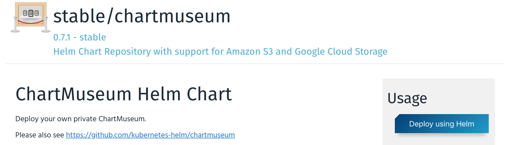
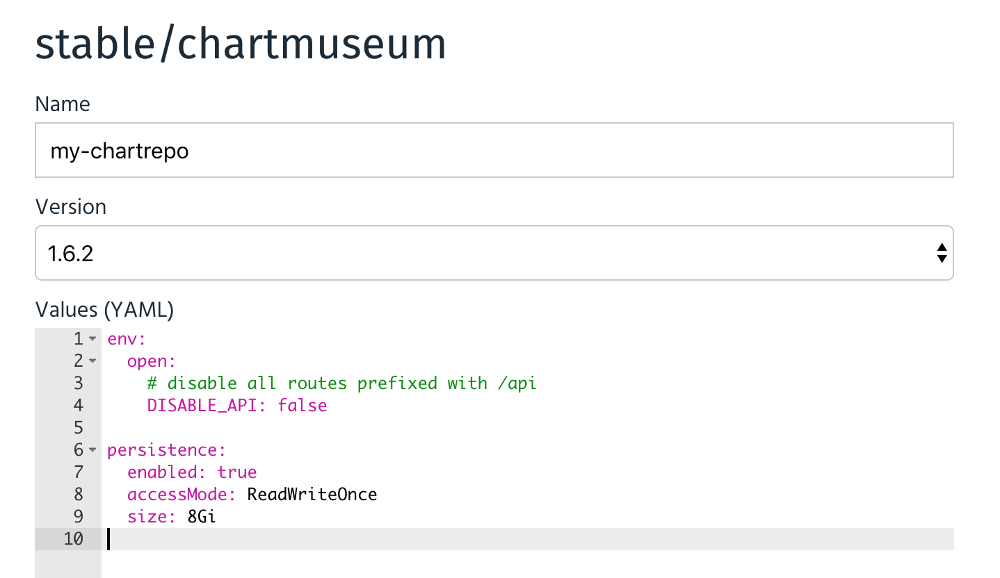
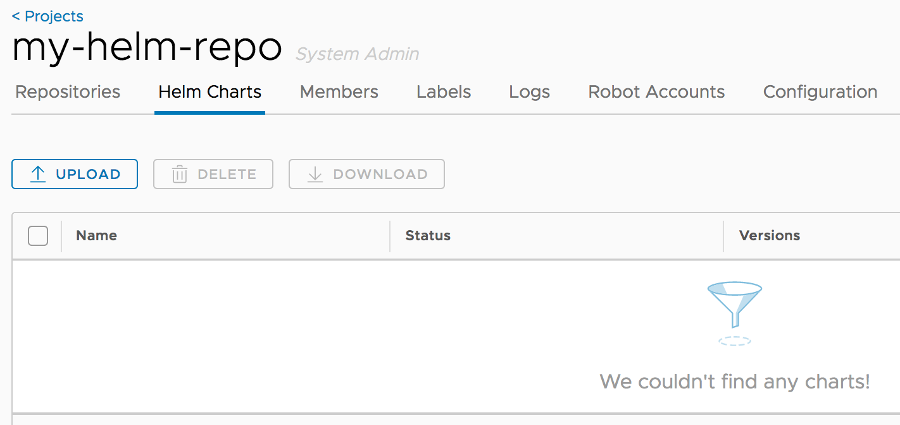
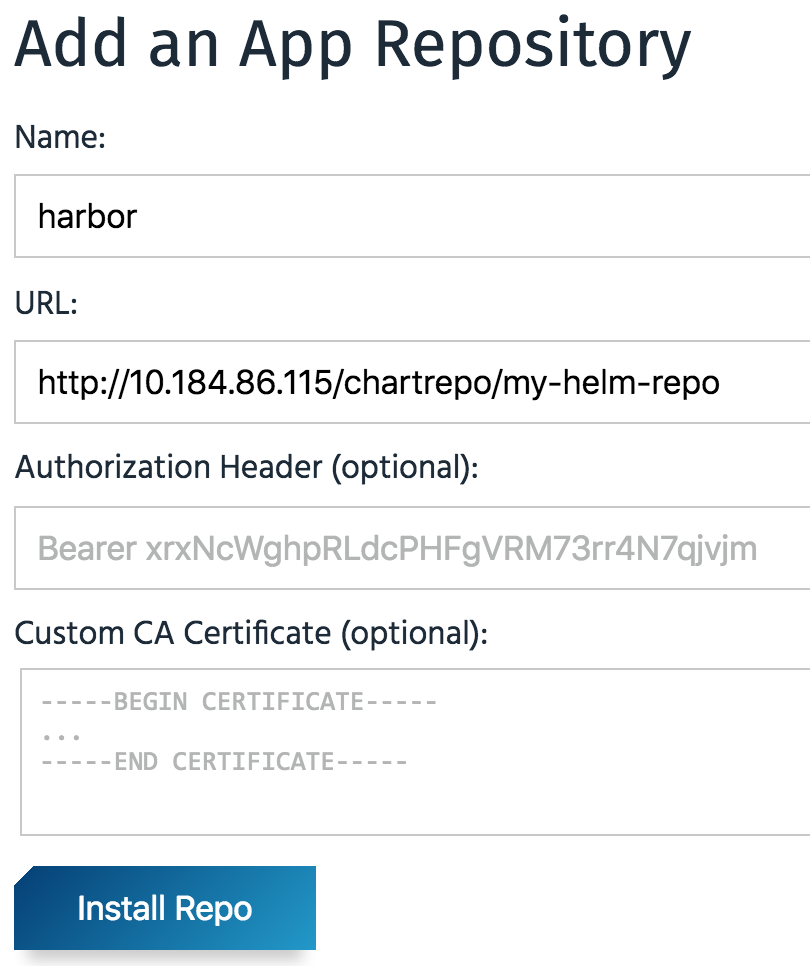
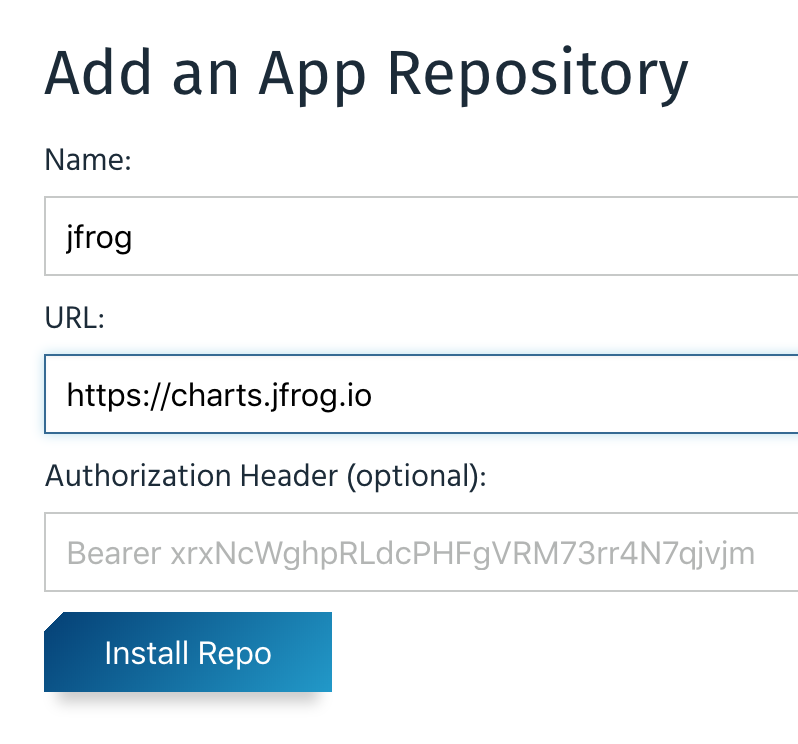
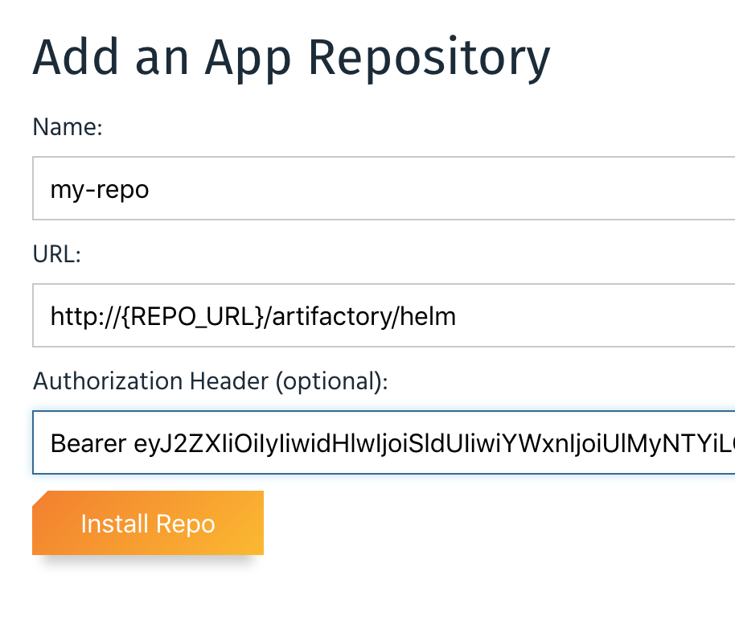

# Using a Private Repository with Kubeapps

It is possible to use a private Helm repository to store your own Helm charts and deploy them using Kubeapps. In this guide we will show how you can do that with some of the solutions available right now:

- [ChartMuseum](#chartmuseum)
- [Harbor](#harbor)
- [Artifactory](#artifactory) (Pro)

## ChartMuseum

[ChartMuseum](https://chartmuseum.com) is an open-source Helm Chart Repository written in Go (Golang), with support for cloud storage backends, including Google Cloud Storage, Amazon S3, Microsoft Azure Blob Storage, Alibaba Cloud OSS Storage and OpenStack Object Storage.

To use ChartMuseum with Kubeapps, first deploy its Helm chart from the `stable` repository:



In the deployment form we should change at least two things:

- `env.open.DISABLE_API`: We should set this value to `false` so we can use the ChartMuseum API to push new charts.
- `persistence.enabled`: We will set this value to `true` to enable persistence for the charts we store. Note that this will create a [Kubernetes Persistent Volume Claim](https://kubernetes.io/docs/concepts/storage/persistent-volumes/#lifecycle-of-a-volume-and-claim) so depending on your Kubernetes provider you may need to manually allocate the required Persistent Volume to satisfy the claim. Some Kubernetes providers will automatically create PVs for you so setting this value to `true` will be enough.



### ChartMuseum: Upload a Chart

Once ChartMuseum is deployed you will be able to upload a chart. In one terminal open a port-forward tunnel to the application:

```console
$ export POD_NAME=$(kubectl get pods --namespace default -l "app=chartmuseum" -l "release=my-chartrepo" -o jsonpath="{.items[0].metadata.name}")
$ kubectl port-forward $POD_NAME 8080:8080 --namespace default
Forwarding from 127.0.0.1:8080 -> 8080
Forwarding from [::1]:8080 -> 8080
```

And in a different terminal you can push your chart:

```console
$ helm package /path/to/my/chart
Successfully packaged chart and saved it to: /path/to/my/chart/my-chart-1.0.0.tgz
$ curl --data-binary "@my-chart-1.0.0.tgz" http://localhost:8080/api/charts
{"saved":true}
```

### ChartMuseum: Configure the repository in Kubeapps

To add your private repository go to `Configuration > App Repositories` in Kubeapps and click on "Add App Repository". You will need to add your repository using the Kubernetes DNS name for the ChartMuseum service. This will be `<release_name>-chartmuseum.<namespace>:8080`:


Once you create the repository you can click on the link for the specific repository and you will be able to deploy your own applications using Kubeapps.

### ChartMuseum: Authentication/Authorization

It is possible to configure ChartMuseum to use authentication with two different mechanism:

- Using HTTP [basic authentication](https://chartmuseum.com/docs/#basic-auth) (user/password). To use this feature, it's needed to:
  - Specify the parameters `secret.AUTH_USER` and `secret.AUTH_PASS` when deploying the ChartMuseum.
  - Select `Basic Auth` when adding the repository to Kubeapps specifying that user and password.
- Using a [JWT token](https://github.com/chartmuseum/auth-server-example). Once you obtain a valid token you can select `Bearer Token` in the form and add the token in the dedicated field.

## Harbor

[Harbor](https://github.com/goharbor/harbor) is an open source trusted cloud native registry project that stores, signs, and scans content, e.g. Docker images. Harbor is hosted by the [Cloud Native Computing Foundation](https://cncf.io/). Since version 1.6.0, Harbor is a composite cloud native registry which supports both container image management and Helm chart management. Harbor integrates [ChartMuseum](https://chartmuseum.com) to provide the Helm chart repository functionality. The access to Helm Charts in a Harbor Chart Repository can be controlled via Role-Based Access Control.

To use Harbor with Kubeapps, first deploy Harbor using [Harbor offline installer](https://github.com/goharbor/harbor/blob/master/docs/installation_guide.md#downloading-the-installer) or the official [Harbor Helm Chart](https://github.com/goharbor/harbor-helm). Here are the minimum steps required for using the Harbor offline installer to deploy Harbor for serving as Helm Chart Repository on a Linux machine.

```
$ wget https://storage.googleapis.com/harbor-releases/release-1.8.0/harbor-offline-installer-v1.8.1.tgz
$ tar xvf harbor-offline-installer-v1.8.1.tgz
$ cd harbor
$ sed -i 's/hostname: reg.mydomain.com/hostname: <Current-Machine-IP>/' harbor.yml
$ sudo ./install.sh --with-chartmuseum
```

You will see the following message if Harbor is installed successfully.

```console
----Harbor has been installed and started successfully.----

Now you should be able to visit the admin portal at http://<IP>.
For more details, please visit https://github.com/goharbor/harbor .
```

### Harbor: Upload a Chart

- First login Harbor admin portal at `http://<IP>` as the default admin user configured in harbor.yml.
- Create a new Project named 'my-helm-repo' with public access. Each project will serve as a Helm chart repository.
  
- Click the project name to view the project details page, then click 'Helm Charts' tab to list all helm charts.
  
- Click 'UPLOAD' button to upload a Helm chart. You can also use helm command to upload charts.
  

Please refer to ['Manage Helm Charts in Harbor'](https://github.com/goharbor/harbor/blob/master/docs/user_guide.md#manage-helm-charts) for more details.

### Harbor: Configure the repository in Kubeapps

To add Harbor as the private chart repository, go to `Configuration > App Repositories` in Kubeapps and click on "Add App Repository" and use the Harbor helm repository URL `http://<IP>/chartrepo/my-helm-repo`.



Once you create the repository you can click on the link for the specific repository and you will be able to deploy your own applications using Kubeapps.

### Harbor: Authentication/Authorization

It is possible to configure Harbor to use HTTP basic authentication:

  - When creating a new project for serving as the helm chart repository in Harbor, set the `Access Level` of the project to non public. This enforces authentication to access the charts in the chart repository via Helm CLI or other clients.
  - When `Adding App Repository` in Kubeapps, select `Basic Auth` for `Authorization` and specifiy the username and password for Harbor.

## Artifactory

JFrog Artifactory is a Repository Manager supporting all major packaging formats, build tools and CI servers.

> **Note**: In order to use the Helm repository feature, it's necessary to use an Artifactory Pro account.

To install Artifactory with Kubeapps first add the JFrog repository to Kubeapps. Go to `Configuration > App Repositories` and add their repository:



Then click on the JFrog repository and deploy Artifactory. For detailed installation instructions, check its [README](https://github.com/jfrog/charts/tree/master/stable/artifactory). If you don't have any further requirement, the default values will work.

When deployed, in the setup wizard, select "Helm" to initialize a repository:


By default, Artifactory creates a chart repository called `helm`. That is the one you can use to store your applications.

### Artifactory: Upload a chart

First, you will need to obtain the user and password of the Helm repository. To do so, click on the `helm` repository and in the `Set Me Up` menu enter your password. After that you will be able to see the repository user and password.

Once you have done that, you will be able to upload a chart:

```
$ curl -u{USER}:{PASSWORD} -T /path/to/chart.tgz "http://{REPO_URL}/artifactory/helm/"
```

### Artifactory: Configure the repository in Kubeapps

To be able able to access private charts with Kubeapps first you need to generate a token. You can do that with the Artifactory API:

```
curl -u{USER}:{PASSWORD} -XPOST "http://{REPO_URL}/artifactory/api/security/token?expires_in=0" -d "username=kubeapps" -d "scope=member-of-groups:readers"
{
  "scope" : "member-of-groups:readers api:*",
  "access_token" : "TOKEN CONTENT",
  "token_type" : "Bearer"
}
```

The above command creates a token with read-only permissions. Now you can go to the `Configuration > App Repositories` menu and add your personal repository:



After submitting the repository, you will be able to click on the new repository and see the chart you uploaded in the previous step.

## Modifying the synchronization job

Kubeapps runs a periodic job (CronJob) to populate and synchronize the charts existing in each repository. Since Kubeapps v1.4.0, it's possible to modify the spec of this job. This is useful if you need to run the Pod in a certain Kubernetes node, or set some environment variables. To do so you can edit (or create) an AppRepository and specify the `syncJobPodTemplate` field. For example:

```yaml
apiVersion: kubeapps.com/v1alpha1
kind: AppRepository
metadata:
  name: my-repo
  namespace: kubeapps
spec:
  syncJobPodTemplate:
    metadata:
      labels:
        my-repo: "isPrivate"
    spec:
      containers:
        - env:
            - name: FOO
              value: BAR
  url: https://my.charts.com/
```

The above will generate a Pod with the label `my-repo: isPrivate` and the environment variable `FOO=BAR`.
