# Kubernetes Service Catalog Kubeapps Integration

## Kubernetes Service Catalog

[Service Catalog](https://svc-cat.io/) is an extension API that enables applications running in
Kubernetes clusters to easily use external managed software offerings, such
as a datastore service offered by a cloud provider. These services are
provided by a Service Broker, which is an endpoint talking to these providers.
Once the cluster administrator deploys a ClusterServiceBroker, several
ClusterServiceClasses and ClusterServicePlans will be available in the cluster
for users to provision those services. To provision a service, users will create
a ServiceInstance object and to connect it to their application they will create
a ServiceBinding object.

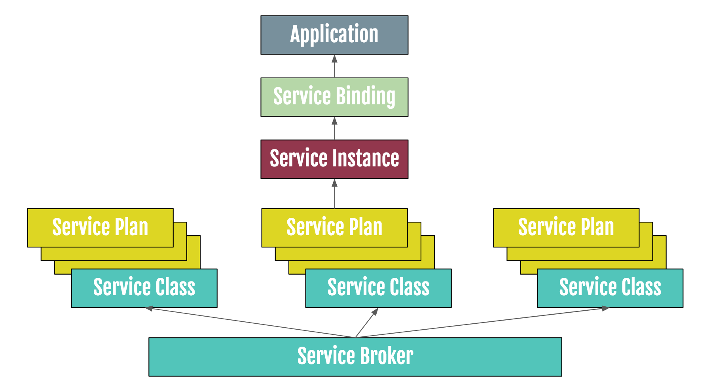

## Service Catalog and Kubeapps

Kubeapps has native integration with the Service Catalog and allows Kubeapps users
to provision external cloud services directly from the Kubeapps interface.

In this tutorial we will explain how to deploy the Service Catalog into your cluster,
we will configure two Service Brokers (GCP and Azure) and we will provision some
cloud services that we will then use in other applications.

This tutorial assumes that you already have a Kubernetes cluster setup with Helm and
Kubeapps. If you don't have Helm or Kubeapps you can follow the [installation instructions for Kubeapps](getting-started.md).

## Deploy Service Catalog

The Service Catalog is distributed as a Helm chart and it is ready to be
deployed with Kubeapps.

To deploy it in your cluster, navigate to `Service Instances` and click on
`Install Catalog`.

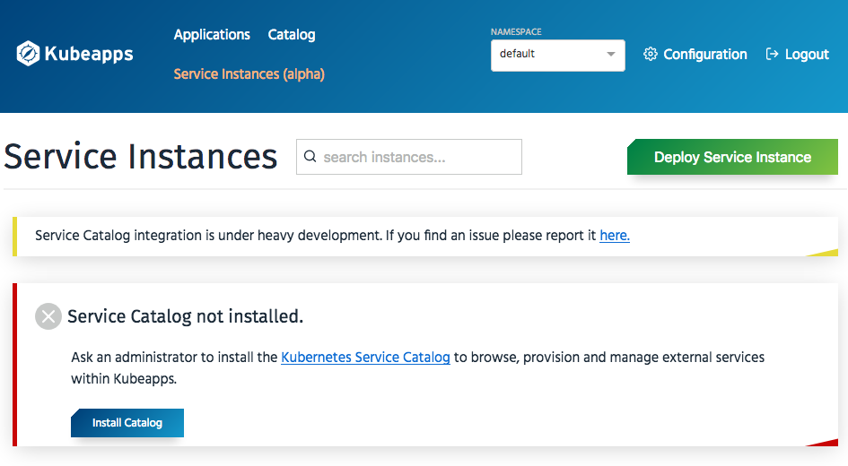

You will deploy the Service Catalog as any other Helm chart
installed through Kubeapps. We recommend to at least change the following value in
`values.yaml`:

```
asyncBindingOperationsEnabled: true
```

This value is needed for some of the GCP Service Classes to work properly.

Alternatively, you can deploy the Service Catalog using the Helm CLI:

```
helm repo add svc-cat https://svc-catalog-charts.storage.googleapis.com
helm repo update
helm install svc-cat/catalog --name catalog --namespace catalog --set asyncBindingOperationsEnabled=true
```

This will deploy the Service Catalog API server and its controller into a namespace called
`catalog`.

## Deploy the Azure Service Broker

To deploy the Open Service Broker for Azure the first thing that you will need to
do is to configure your Azure account properly. The services you are going to use
are paid-for and, therefore, you need to have your account and billing settings
set up properly.

Once you have your account set up, follow the instructions in the [Open Service
Broker for Azure on AKS Quickstart](https://github.com/Azure/open-service-broker-azure/blob/master/docs/quickstart-aks.md).
Although the Quickstart mentions AKS, the instructions should work in any Kubernetes
cluster.

To check that the broker has been successfully deployed run the following:

```
kubectl get ClusterServiceBroker osba
```

If the Broker has been successfully installed and the catalog has been properly
downloaded you should get the following output:

```
NAME         URL                                                                                     STATUS   AGE
osba         https://osba-open-service-broker-azure.osba.svc.cluster.local                           Ready    6m
```

## Deploy the GCP Service Broker

To deploy the GCP Service Broker you will need to configure a GCP account and project.
The services you are going to use are paid-for and, therefore, you need to have your
account and billing settings set up properly.

Once you have your account set up, follow the instructions at https://cloud.google.com/kubernetes-engine/docs/how-to/add-on/service-catalog/install-service-catalog. 
You can skip the part of deploying the Service Catalog (which we already deployed
using the Helm chart). Although the instructions mention GKE, they should work
in any Kubernetes cluster.

To check that the broker has been successfully deployed run the following:

```
kubectl get ClusterServiceBroker gcp-broker
```

If the Broker has been successfully installed and the catalog has been properly
downloaded you should get the following output:

```
NAME         URL                                                                                     STATUS   AGE
gcp-broker   https://servicebroker.googleapis.com/v1beta1/projects/bitnamigcetest2/brokers/default   Ready    1m
```

## Kubeapps integration

When a user clicks on Services Instances menu in Kubeapps they will get the list
of Service Instances available in the selected namespace. As we haven't provisioned
any yet, the list will be empty and we will get a message about provisioning
an instance.

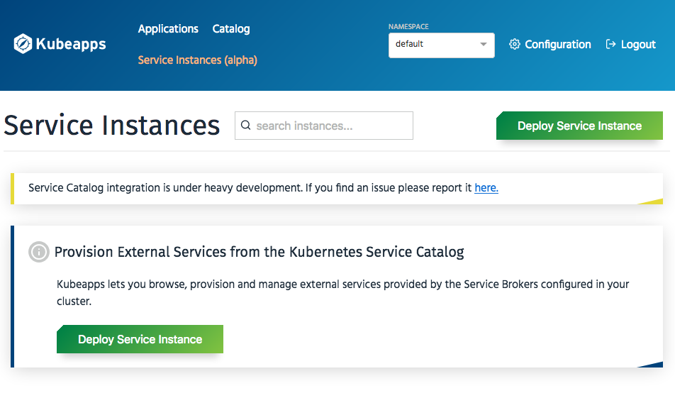

Clicking on "Deploy Service Instance" will provide us with a list of available
classes:

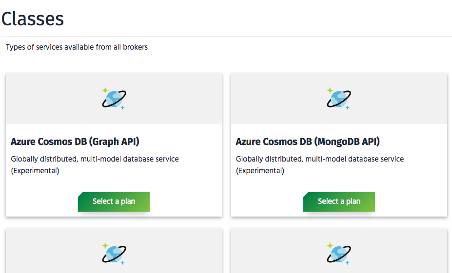


## Example 1. Wordpress with Azure MySQL as database

For our first example we will provision an Azure MySQL instance and we will
use it as the database for our new Wordpress deployment.

### Provisioning the Azure MySQL database

In the list of classes, click on "Select a plan" in the Azure Database for
MySQL 5.7 card:

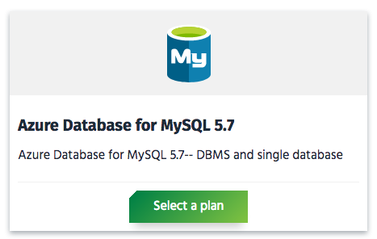

We will select the `Basic Tier` which will be enough for our testing purposes

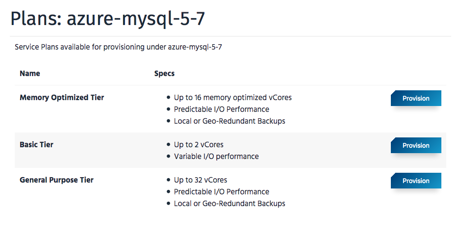

After giving it a name, we will provide a set of options for our instance,
like firewall rules to allow incoming traffic, the location of the instance,
and the Azure resource group:

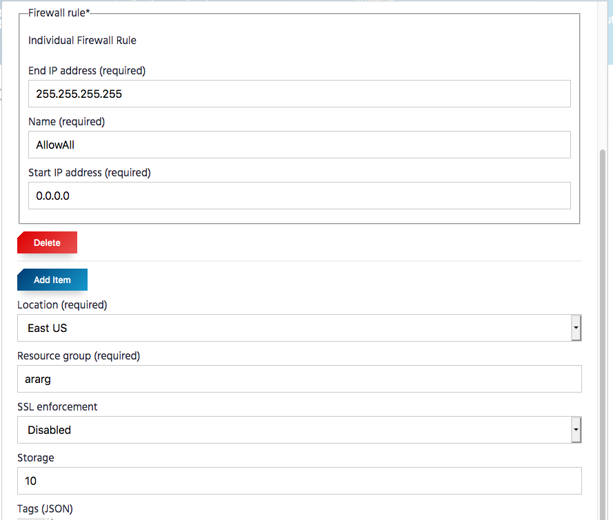

Once we click on `Submit` the instance will start provisioning. Refresh the
page regularly to check on the progress. Provisioning an Azure MySQL instance
takes around 10-15 minutes.

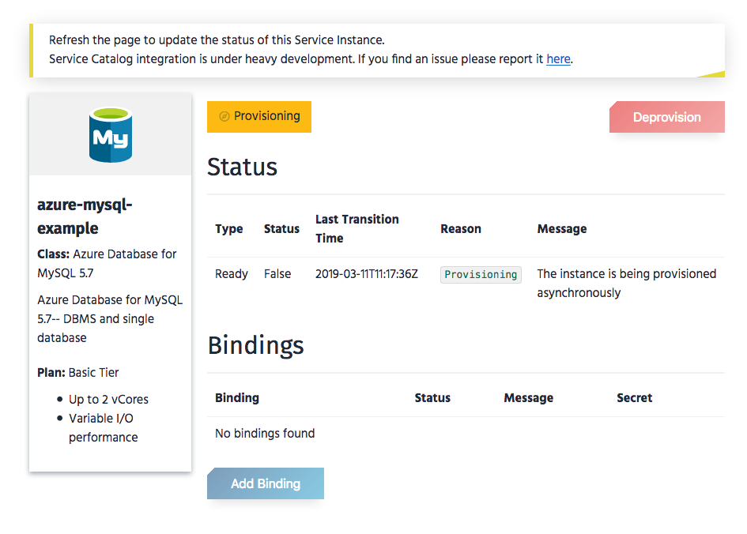

Once provisioned you will be able to create a Binding to connect your application
to it. Click on `Add Binding` and select a name for it (the default should
be OK). Creating a new binding should be very fast. 

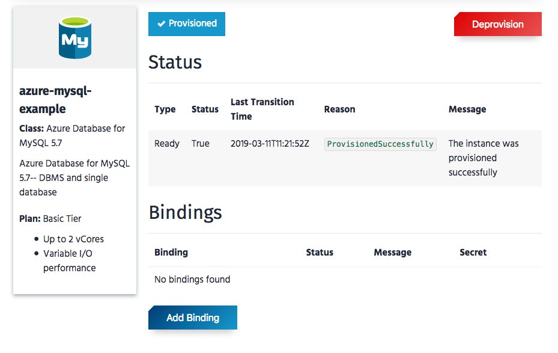

Once the binding creation has been completed, the details of the created
secret can be explored directly from the same page, clicking on `show`. (Make sure
to have access to this page (maybe in a different browser tab) as we will need
those values in the next step).

It is important to understand the schema of the secret, as it is dependent
on the broker and the instance. For Azure MySQL the secret will have the
following schema:

```
database: name of the database
host: the URL of the instance
username: the user name to connect to the database
password: the password for user username
port: the port where MySQL is listening
[...]
```

### Deploying Wordpress

We will now deploy Wordpress, using Azure MySQL as database. In the `Catalog`
we will search for `wordpress`:


We will click on `Deploy` and will modify the `values.yaml` of the application
with the following values:

```
externalDatabase.host: host value in the binding secret
externalDatabase.user: username value in the binding secret
externalDatabase.password: password value in the binding secret
externalDatabase.database: database value in the binding secret
mariadb.enabled: false (to avoid deploying a MariaDB database)
```

Once those values have been modified, click on `Submit` and wait until the
deployment is completed:

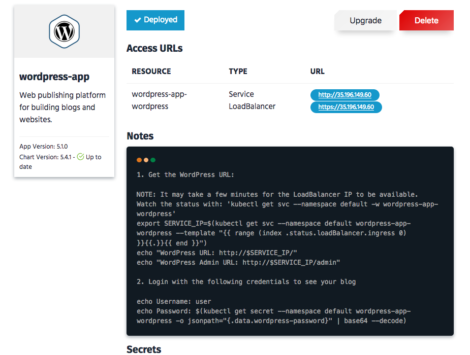

If we check the wordpress pod log we can see that it connected successfully
to the Azure MySQL database:

```
kubectl logs wordpress-app-wordpress-597b9dbb5-2rk4k

Welcome to the Bitnami wordpress container
Subscribe to project updates by watching https://github.com/bitnami/bitnami-docker-wordpress
Submit issues and feature requests at https://github.com/bitnami/bitnami-docker-wordpress/issues

WARN  ==> You set the environment variable ALLOW_EMPTY_PASSWORD=yes. For safety reasons, do not use this flag in a production environment.
nami    INFO  Initializing apache
apache  INFO  ==> Patching httpoxy...
apache  INFO  ==> Configuring dummy certificates...
nami    INFO  apache successfully initialized
nami    INFO  Initializing php
nami    INFO  php successfully initialized
nami    INFO  Initializing mysql-client
nami    INFO  mysql-client successfully initialized
nami    INFO  Initializing libphp
nami    INFO  libphp successfully initialized
nami    INFO  Initializing wordpress
mysql-c INFO  Trying to connect to MySQL server
mysql-c INFO  Found MySQL server listening at 93489418-7a54-4b2c-b807-d239cb26ad5d.mysql.database.azure.com:3306
mysql-c INFO  MySQL server listening and working at 93489418-7a54-4b2c-b807-d239cb26ad5d.mysql.database.azure.com:3306
```

## Example 2. Chartmuseum using a GCP storage bucket

[ChartMuseum](https://github.com/helm/chartmuseum) is an open-source project
that allows you to easily have your own valid Helm chart repository. It has
support for different cloud storage backends, including [Google Cloud Storage](https://cloud.google.com/storage/).

In this example we will create a Google Cloud Storage instance with Kubeapps
Service Catalog integration, and we will use it as backend for a ChartMuseum
deployment.

### Provisioning the Google Cloud Storage bucket.

Under `Service Instances` click on `Deploy Service Instance` and select Google
Cloud Storage:

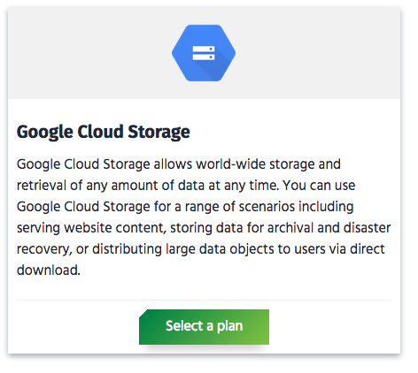

Select the `Beta plan` and provide a name. 

We will be adding some parameters to configure the name of the bucket and
the location. We will leave the rest of the options with the default values:  

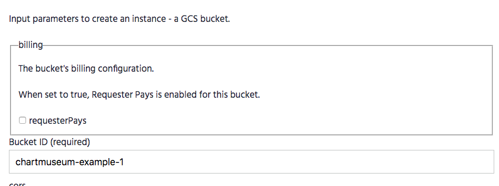

Once provisioned, click on `Add binding` to create a binding:

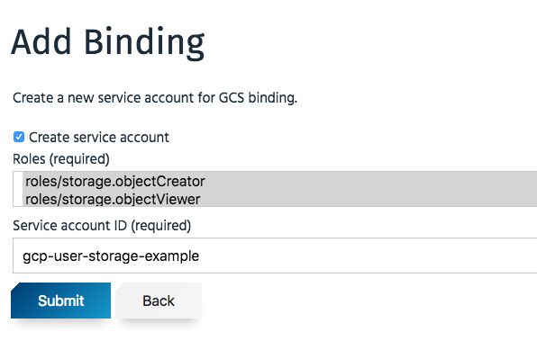

That will create a new service account in your GCP project with the right
permissions to access the bucket.

Once the binding creation has been completed, the details of the created
secret can be explored directly from the same page, clicking on `show`. (Make sure
to have access to this page (maybe in a different browser tab) as we will need
those values in the next step).

It is important to understand the schema of the secret, as it is dependent
on the broker and the instance. For Google Storage the secret will have the
following schema:

```
bucketId: the id of the bucket
privateKeyData: JSON with authantication details for the bucket
projectId: the GCP project where the bucket was created
serviceAccount: the service account to access the bucket
```

### Deploy Chartmuseum

We will now deploy ChartMuseum, using Google Cloud Storage as backend.
In the `Catalog` we will search for `chartmuseum`:


Click on `Deploy` and modify the following values:

```
env.open.STORAGE: google
env.open.STORAGE_GOOGLE_BUCKET: <name of the created bucket in the instance>
env.open.STORAGE_GOOGLE_PREFIX: charts
gcp.secret.enabled: true
gcp.secret.name: <name of the binding secret>
gcp.secret.key: privateKeyData
```

As ChartMuseum expects the format of the authentication information contained
in the JSON, it is only needed to specify the key of the secret that contains
that JSON (in our case `privateKeyData`).

Click on `Submit` and it should be deployed successfully, using the GCP
bucket as backend.
