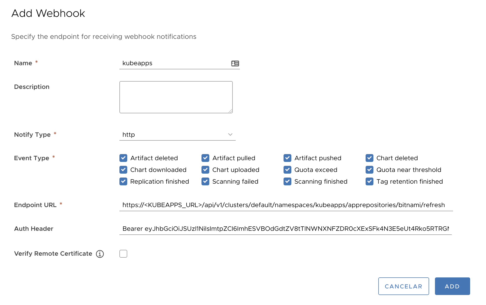

# Syncing App Repositories using a webhook

##  Introduction

Kubeapps's default configuration schedules the syncing process of the App Repositories every *ten minutes*. However, this behavior can be easily changed globally by editing the [values.yaml file](https://github.com/kubeapps/kubeapps/blob/master/chart/kubeapps/values.yaml#L215) (`crontab: "*/10 * * * *"`).

Nevertheless, this default approach might not be useful for environments with highly frequent changes. Moreover, if there are a few App Repositories with numerous changes while others hardly are modified, therefore, increasing the default global syncing periodicity is not a good approach.

Kubeapps now support a method for manually trigger a sync process over a given App Repository intended to be used as a webhook endpoint. 
A number of platforms do use webhooks for triggering actions when something occurs. For instance, [Harbor notifies the webhook endpoint of certain events that occur in the project]
(https://goharbor.io/docs/1.10/working-with-projects/project-configuration/configure-webhooks/).
Webhook notifications provide information about events in JSON format and are usually delivered by HTTP(s) POST to an existing webhook endpoint URL.

This document will use Harbor as a running example for explaining how a webhook is configured for triggering an App Repository syncing process.
> In other platforms the process will be pretty similar. Doubts? Please feel free to [open an issue](https://github.com/kubeapps/kubeapps/issues/new) if you need further guidance!


## TL; DR

- Create the ServiceAccount, grant with sufficient permissions and get the token:
```bash
cat <<EOF | kubectl apply -f -
---
apiVersion: v1
kind: ServiceAccount
metadata:
  name: apprepositories-webhook
---
kind: ClusterRole
apiVersion: rbac.authorization.k8s.io/v1
metadata:
  name: apprepositories-webhook
rules:
  - apiGroups:
      - kubeapps.com
    resources:
      - apprepositories
    verbs:
      - get
      - update
---
apiVersion: rbac.authorization.k8s.io/v1
kind: RoleBinding
metadata:
  name: apprepositories-webhook
  namespace: kubeapps
roleRef:
  apiGroup: rbac.authorization.k8s.io
  kind: ClusterRole
  name: apprepositories-webhook
subjects:
- kind: ServiceAccount
  name: apprepositories-webhook
  namespace: default
EOF
```

- Get the `<TOKEN>`:
```bash
kubectl get secret $(kubectl get serviceaccount apprepositories-webhook -o jsonpath='{range .secrets[*]}{.name}{"\n"}{end}' | grep apprepositories-webhook) -o jsonpath='{.data.token}' -o go-template='{{.data.token | base64decode}}' && echo
```

- In your platform:
	- Webhook URL:    `https://<KUBEAPPS_URL>/api/v1/clusters/<CLUSTER_NAME>/namespaces/<NAMESPACE_NAME>/apprepositories/<APPREPO_NAME>/refresh`
	- Method: `POST`
	- Authentication header: `Bearer <TOKEN>`

> For instance: `https://<KUBEAPPS_URL>/api/v1/clusters/default/namespaces/kubeapps/apprepositories/bitnami/refresh` will update the App Repository `bitnami` in the namespace `kubeapps` of the cluster `default`. 


## Creating and granting a ServiceAccount for authenticating requests

Since the webhook endpoint will be used outside the user browser session (i.e., no OICD login), an ad-hoc ServiceAccount ought to be created; next, it has to be granted with sufficient permissions to `get` and `update` the `AppRepository` objects. Finally, the ServiceAccount token must be retrieved.

### Creating the Kubernetes ServiceAccount, ClusterRole and RoleBinding objects

First, the `ServiceAccount` and the `ClusterRole` objects are created. In this example, the ServiceAccount *apprepositories-webhook* is being created.

```bash
cat <<EOF | kubectl apply -f -
---
apiVersion: v1
kind: ServiceAccount
metadata:
  name: apprepositories-webhook
---
kind: ClusterRole
apiVersion: rbac.authorization.k8s.io/v1
metadata:
  name: apprepositories-webhook
rules:
  - apiGroups:
      - kubeapps.com
    resources:
      - apprepositories
    verbs:
      - get
      - update
EOF
```

Next, the `ClusterRole` *apprepositories-webhook* (with `get` and `update` permissions over `apprepositories`) has to be associated to a certain (or multiple) namespace(s) by means of a `RoleBinding`:

> To bind it in multiple namespaces, create as RoleBinding (changing `namespace: my-namespace` to match your needs) as you need.

```bash
cat <<EOF | kubectl apply -f -
---
apiVersion: rbac.authorization.k8s.io/v1
kind: RoleBinding
metadata:
  name: apprepositories-webhook
  namespace: my-namespace
roleRef:
  apiGroup: rbac.authorization.k8s.io
  kind: ClusterRole
  name: apprepositories-webhook
subjects:
- kind: ServiceAccount
  name: apprepositories-webhook
  namespace: default
EOF
```

### Retrieving the ServiceAccount token

The `<TOEKN>`  for the ServiceAccount *apprepositories-webhook* is retrieved:

```bash
kubectl get secret $(kubectl get serviceaccount apprepositories-webhook -o jsonpath='{range .secrets[*]}{.name}{"\n"}{end}' | grep apprepositories-webhook) -o jsonpath='{.data.token}' -o go-template='{{.data.token | base64decode}}' && echo
```
This value will be the Bearer token to be passed in the `Authentication` HTTP header.

## Configuring a webhook in Harbor

A high-level description of the main steps is presented herein; please refer to the [official Harbor documentation](https://goharbor.io/docs/1.10/working-with-projects/project-configuration/configure-webhooks/) for further information.

1. Log in to the Harbor interface with an account that has at least project administrator privileges.
2. Go to  *Projects*, select a project, and select  *Webhooks*.
3. Enter this URL: `https://<KUBEAPPS_URL>/api/v1/clusters/<CLUSTER_NAME>/namespaces/<NAMESPACE_NAME>/apprepositories/<APPREPO_NAME>/refresh`. Modify `<KUBEAPPS_URL>` , `<CLUSTER_NAME>`, `<NAMESPACE_NAME>`, `<APPREPO_NAME>` to match your needs. 
	> For instance: `https://<KUBEAPPS_URL>/api/v1/clusters/default/namespaces/kubeapps/apprepositories/bitnami/refresh` will update the App Repository `bitnami` in the namespace `kubeapps` of the cluster `default`.
	
4.  As authentication header enter `Bearer <TOKEN>`
	> Note `<TOKEN>`is the value retrieved [before](#retrieving-the-serviceaccount-token).
	
5. Select as many events as you need to trigger notifications.
6.  Click  *Continue*  to create the webhook.

This picture illustrates the configurtation of a webhook in Habor:

  

## Final remarks

Currently, Kubeapps does not process any payload. Therefore, the information that the platform may send as part of the `POST` request will be ignored.
Feel free to [open an issue](https://github.com/kubeapps/kubeapps/issues/new) if you need further guidance or your use case is not matching with this approach.

