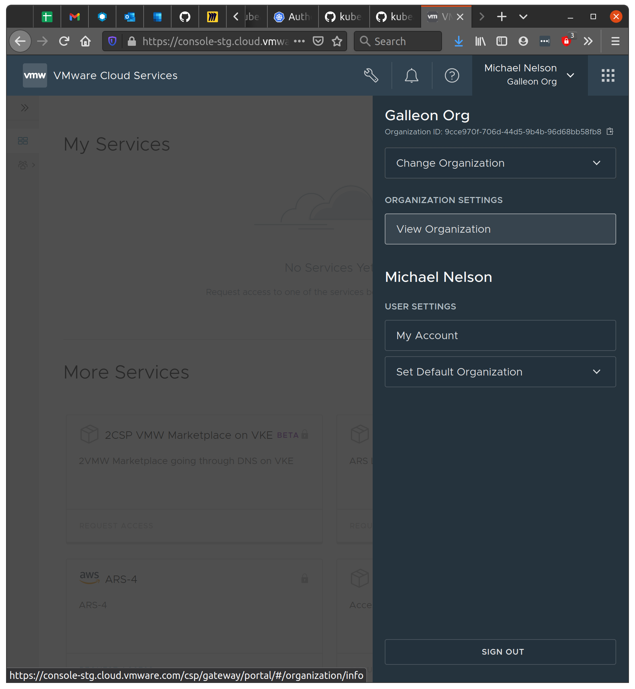

# Using an OAuth2/OIDC Provider with Kubeapps

OpenID Connect (OIDC) is a simple identity layer on top of the OAuth 2.0 protocol which allows clients to verify the identity of a user based on the authentication performed by an authorization server, as well as to obtain basic profile information about the user.

A Kubernetes cluster can be configured to trust an external OIDC provider so that authenticated requests can be matched with defined RBAC. Additionally, some managed Kubernetes environments enable authenticating via plain OAuth2 (GKE).
This guide will explain how you can use an existing OAuth2 provider, including OIDC, to authenticate users within Kubeapps.

For a complete worked example of this process on a specific Kubernetes environment, one of the Kubeapps developers has written a series detailing the installation of [Kubeapps on a set of VMware TKG clusters with OpenID Connect](https://liveandletlearn.net/post/kubeapps-on-tkg-management-cluster/).

## Pre-requisites

For this guide we assume that you have a Kubernetes cluster that is properly configured to use an OIDC Identity Provider (IdP) to handle the authentication to your cluster. You can read [more information about the Kubernetes API server's configuration options for OIDC](https://kubernetes.io/docs/reference/access-authn-authz/authentication/#openid-connect-tokens). This allows that the Kubernetes API server itself to trust tokens from the identity provider. Some hosted Kubernetes services are already configured to accept accept access_tokens from their identity provider as bearer tokens (see GKE below). Alternatively, if you do not have access to configure your cluster's API server, you can [install and configure Pinniped in your cluster to trust your identity provider and configure Kubeapps to proxy requests via Pinniped](./using-an-OIDC-provider-with-pinniped.md).

There are several Identity Providers (IdP) that can be used in a Kubernetes cluster. The steps of this guide have been validated using the following providers:

- [Keycloak](https://www.keycloak.org/): Open Source Identity and Access Management.
- [Dex](https://github.com/dexidp/dex): Open Source OIDC and OAuth 2.0 Provider with Pluggable Connectors.
- [Azure Active Directory](https://docs.microsoft.com/en-us/azure/active-directory/fundamentals/active-directory-whatis): Identity Provider that can be used for AKS.
- [Google OpenID Connect](https://developers.google.com/identity/protocols/OpenIDConnect): OAuth 2.0 for Google accounts.

When configuring the identity provider, you will need to ensure that the redirect URL for your Kubeapps installation is configured, which is your Kubeapps URL with the absolute path '/oauth2/callback'. For example, if I am deploying Kubeapps with TLS on the domain my-kubeapps.example.com, then the redirect URL will be `https://my-kubeapps.example.com/oauth2/callback`.

For Kubeapps to use an Identity Provider it's necessary to configure at least the following parameters:

- Client ID: Client ID of the IdP.
- Client Secret: (If configured) Secret used to validate the Client ID.
- Provider name (which can be oidc, in which case the OIDC Issuer URL is also required).
- Cookie secret: a 16, 24 or 32 byte base64 encoded seed string used to encrypt sensitive data (eg. `echo "not-good-secret" | base64`).

**Note**: Depending on the configuration of the Identity Provider more parameters may be needed.

Kubeapps uses [OAuth2 Proxy](https://github.com/oauth2-proxy/oauth2-proxy) to handle the OAuth2/OpenIDConnect authentication. The following sections explain how you can find the parameters above for some of the identity providers tested. If you have configured your cluster to use an Identity Provider you will already know some of these parameters. More detailed information can be found on the [OAuth2 Proxy Auth configuration page](https://oauth2-proxy.github.io/oauth2-proxy/auth-configuration).

### Keycloak

In the case of Keycloak, you can find the parameters in the Keycloak admin console:

- Client-ID: Keycloak client ID.
- Client-secret: Secret associated to the client above.
- OIDC Issuer URL: `https://<keycloak.domain>/auth/realms/<realm>`.

### Dex

For Dex, you can find the parameters that you need to set in the configuration (a ConfigMap if Dex is deployed within the cluster) that the server reads the configuration from. Note that since Dex is only a connector you need to configure it with some third-party credentials that may be a client-id and client-secret as well. Don't confuse those credentials with the ones of the application that you can find under the `staticClients` section.

- Client-ID: Static client ID.
- Client-secret: Static client secret.
- OIDC Issuer URL: Dex URL (i.e. https://dex.example.com:32000).

### Azure Active Directory

For setting up an Azure Kubernetes cluster (aks) with Azure Active Directory you can follow [this guide](https://docs.microsoft.com/en-us/azure/aks/aad-integration). At the end of the tutorial you should have an Active Directory Application (Server). That's the Application from which we will get the needed parameters.

- Client-ID: Azure Active Directory server Application ID.
- Client-secret: A "Password" Key of the server Application.
- OIDC Issuer URL: `https://sts.windows.net/<Tenant-ID>/`. The Tenant-ID can be found at `Home > Default Directory - Properties > Directory ID`.

**Note**: If you are using an nginx reverse proxy to get to kubeapps you might need to increase the `proxy_buffer_size` as [Azure's session store is too large for nginx](https://oauth2-proxy.github.io/oauth2-proxy/auth-configuration#azure-auth-provider). Similar changes might also be required for other reverse proxies.

### Google OIDC

In the case of Google we can use an OAuth 2.0 client ID. You can find more information [here](https://developers.google.com/identity/protocols/OpenIDConnect). In particular we will use a "Web Application".

- Client-ID: `<abc>.apps.googleusercontent.com`.
- Client-Secret: Secret for the Web application.
- OIDC Issuer URL: https://accounts.google.com.

### VMware Cloud Services

Login to VMware Cloud Services and select the organization which you want to use.

1. Select View Organization (under Organization settings of the org menu),
  
2. Click on the OAuth Apps tab,
3. Click Create App, select Web App and continue,
4. Enter a name and description for your OAuth app,
5. Add the callback URL where Kubeapps will be running (e.g. https://my.kubeapps.example.com/oauth2/callback),
6. Leave the rest of the options other than the OpenID checkbox, which must be checked,
7. Click Create

You will now see a dialog with the app id and secret. Click on the Download JSON option as there is other useful info in the JSON.

Your Kubernetes cluster's API server (or alternatively, your [Pinniped JWTAuthenticator](./using-an-OIDC-provider-with-pinniped.md)) will need to be configured with the following options (the staging VMware cloud services issuer URL is used in the example below):

```json
    kind: ClusterConfiguration
    apiServer:
      extraArgs:
        oidc-issuer-url: https://gaz-preview.csp-vidm-prod.com
        oidc-client-id: <your client id from above>
        oidc-username-claim: email
        oidc-groups-claim: group_names
```

Once your cluster is running, you can then deploy Kubeapps with the following additional values:

```yaml
authProxy:
  enabled: true
  provider: oidc
  clientID: <your app id>
  clientSecret: <your app secret>
  cookieSecret: <your random seed string for secure cookies>
  additionalFlags:
    # For staging VMware Cloud Services issuer url is https://console-stg.cloud.vmware.com/csp/gateway/am/api
    # For production, use https://console.cloud.vmware.com/csp/gateway/am/api
    - --oidc-issuer-url=https://console-stg.cloud.vmware.com/csp/gateway/am/api
    - --scope=openid email group_names
    - --insecure-oidc-skip-issuer-verification
```

Note: VMware Cloud Services has an issuer URL specific to organizations which is required for the Kubeapps auth proxy configuration above, but if you check the [`.well-known/openid-configuration`](https://console-stg.cloud.vmware.com/csp/gateway/am/api/.well-known/openid-configuration) you will see that it identifies a different (parent) issuer, `https://gaz-preview.csp-vidm-prod.com`. It is for this reason that the `--insecure-oidc-skip-issuer-verification` option is required above. For the same reason, the OIDC `id_token`s that are minted specify the parent issuer as well, which is why the Kubernetes API server config above uses that.

Once deployed, if you experience issues logging in, please refer to the [Debugging auth failures when using OIDC](#debugging-auth-failures-when-using-oidc) section below.

## Deploying an auth proxy to access Kubeapps

The main difference in the authentication is that instead of accessing the Kubeapps service, we will be accessing an oauth2 proxy service that is in charge of authenticating users with the identity provider and injecting the required credentials in the requests to Kubeapps. There are a number of available solutions for this use-case, like [keycloak-gatekeeper](https://github.com/keycloak/keycloak-gatekeeper) and [oauth2_proxy](https://github.com/oauth2-proxy/oauth2-proxy). For this guide we will use `oauth2_proxy` since it supports both OIDC and plain OAuth2 for many providers.

Once the proxy is accessible, you will be redirected to the identity provider to authenticate. After successfully authenticating, you will be redirected to Kubeapps and be authenticated with your user's OIDC token.

The next sections explain how you can deploy this proxy either using the Kubeapps chart or manually.

### Using the chart

Kubeapps chart allows you to automatically deploy the proxy for you as a sidecar container if you specify the necessary flags. In a nutshell you need to enable the feature and set the client ID, secret and the IdP URL. The following examples use Google as the Identity Provider, modify the flags below to adapt them.

> If you are serving Kubeapps under a subpath (eg., "example.com/subpath") you will also need to set the `authProxy.oauthLoginURI` and `authProxy.oauthLogoutURI` flags, as well as the additional flag `--proxy-prefix`. For instance:

```bash
  # ... other OIDC flags
 --set authProxy.oauthLoginURI="/subpath/oauth2/login" \
 --set authProxy.oauthLogoutURI="/subpath/oauth2/logout" \
 --set authProxy.additionalFlags="{<other flags>,--proxy-prefix=/subpath/oauth2}"\
```

**Example 1: Using the OIDC provider**

This example uses `oauth2-proxy`'s generic OIDC provider with Google, but is applicable to any OIDC provider such as Keycloak, Dex, Okta or Azure Active Directory etc. Note that the issuer url is passed as an additional flag here, together with an option to enable the cookie being set over an insecure connection for local development only:

```bash
helm install kubeapps bitnami/kubeapps \
  --namespace kubeapps \
  --set authProxy.enabled=true \
  --set authProxy.provider=oidc \
  --set authProxy.clientID=my-client-id.apps.googleusercontent.com \
  --set authProxy.clientSecret=my-client-secret \
  --set authProxy.cookieSecret=$(echo "not-good-secret" | base64) \
  --set authProxy.additionalFlags="{--cookie-secure=false,--oidc-issuer-url=https://accounts.google.com}" \
```

**Example 2: Using a custom oauth2-proxy provider**

Some of the specific providers that come with `oauth2-proxy` are using OpenIDConnect to obtain the required IDToken and can be used instead of the generic oidc provider. Currently this includes only the GitLab, Google and LoginGov providers (see [OAuth2_Proxy's provider configuration](https://oauth2-proxy.github.io/oauth2-proxy/configuration) for the full list of OAuth2 providers). The user authentication flow is the same as above, with some small UI differences, such as the default login button is customized to the provider (rather than "Login with OpenID Connect"), or improved presentation when accepting the requested scopes (as is the case with Google, but only visible if you request extra scopes).

Here we no longer need to provide the issuer -url as an additional flag:

```bash
helm install kubeapps bitnami/kubeapps \
  --namespace kubeapps \
  --set authProxy.enabled=true \
  --set authProxy.provider=google \
  --set authProxy.clientID=my-client-id.apps.googleusercontent.com \
  --set authProxy.clientSecret=my-client-secret \
  --set authProxy.cookieSecret=$(echo "not-good-secret" | base64) \
  --set authProxy.additionalFlags="{--cookie-secure=false}"
```

**Example 3: Authentication for Kubeapps on a GKE cluster**

Google Kubernetes Engine does not allow an OIDC IDToken to be used to authenticate requests to the managed API server, instead requiring the standard OAuth2 access token.
For this reason, when deploying Kubeapps on GKE we need to ensure that

* The scopes required by the user to interact with cloud platform are included, and
* The Kubeapps frontend uses the OAuth2 `access_key` as the bearer token when communicating with the managed Kubernetes API

Note that using the custom `google` provider here enables google to prompt the user for consent for the specific permissions requested in the scopes below, in a user-friendly way. You can also use the `oidc` provider but in this case the user is not prompted for the extra consent:

```bash
helm install kubeapps bitnami/kubeapps \
  --namespace kubeapps \
  --set authProxy.enabled=true \
  --set authProxy.provider=google \
  --set authProxy.clientID=my-client-id.apps.googleusercontent.com \
  --set authProxy.clientSecret=my-client-secret \
  --set authProxy.cookieSecret=$(echo "not-good-secret" | base64) \
  --set authProxy.additionalFlags="{--cookie-secure=false,--scope=https://www.googleapis.com/auth/userinfo.email https://www.googleapis.com/auth/cloud-platform}" \
  --set frontend.proxypassAccessTokenAsBearer=true
```

### Manual deployment

In case you want to manually deploy the proxy, first you will create a Kubernetes deployment and service for the proxy. For the snippet below, you need to set the environment variables `AUTH_PROXY_CLIENT_ID`, `AUTH_PROXY_CLIENT_SECRET`, `AUTH_PROXY_DISCOVERY_URL` with the information from the IdP and `KUBEAPPS_NAMESPACE`.

```bash
export AUTH_PROXY_CLIENT_ID=<ID>
export AUTH_PROXY_CLIENT_SECRET=<SECRET>
export AUTH_PROXY_DISCOVERY_URL=<URL>
export AUTH_PROXY_COOKIE_SECRET=$(echo "not-good-secret" | base64)
kubectl create -n $KUBEAPPS_NAMESPACE -f - -o yaml << EOF
apiVersion: apps/v1
kind: Deployment
metadata:
  labels:
    name: kubeapps-auth-proxy
  name: kubeapps-auth-proxy
spec:
  replicas: 1
  selector:
    matchLabels:
      name: kubeapps-auth-proxy
  strategy:
    rollingUpdate:
      maxSurge: 1
      maxUnavailable: 1
    type: RollingUpdate
  template:
    metadata:
      labels:
        name: kubeapps-auth-proxy
    spec:
      containers:
      - args:
        - -provider=oidc
        - -client-id=$AUTH_PROXY_CLIENT_ID
        - -client-secret=$AUTH_PROXY_CLIENT_SECRET
        - -oidc-issuer-url=$AUTH_PROXY_DISCOVERY_URL
        - -cookie-secret=$AUTH_PROXY_COOKIE_SECRET
        - -upstream=http://localhost:8080/
        - -http-address=0.0.0.0:3000
        - -email-domain="*"
        - -pass-basic-auth=false
        - -pass-access-token=true
        - -pass-authorization-header=true
         - proxy-prefix=/oauth2
        image: bitnami/oauth2-proxy
        imagePullPolicy: IfNotPresent
        name: kubeapps-auth-proxy
---
apiVersion: v1
kind: Service
metadata:
  labels:
    name: kubeapps-auth-proxy
  name: kubeapps-auth-proxy
spec:
  ports:
  - name: http
    port: 3000
    protocol: TCP
    targetPort: 3000
  selector:
    name: kubeapps-auth-proxy
  sessionAffinity: None
  type: ClusterIP
EOF
```

The above is a sample deployment, depending on the configuration of the Identity Provider those flags may vary. For this example we use:

- `-client-id`, `-client-secret` and `-oidc-issuer-url`: Client ID, Secret and IdP URL as stated in the section above.
- `-upstream`: Internal URL for the `kubeapps` service.
- `-http-address=0.0.0.0:3000`: Listen in all the interfaces.
- `-proxy-prefix=/oauth2`: If you are serving Kubeapps under a subpath, with this parameter the default prefix can be changed.

**NOTE**: If the identity provider is deployed with a self-signed certificate (which may be the case for Keycloak or Dex) you will need to disable the TLS and cookie verification. For doing so you can add the flags `-ssl-insecure-skip-verify` and `--cookie-secure=false` to the deployment above. You can find more options for `oauth2-proxy` [here](https://oauth2-proxy.github.io/oauth2-proxy/configuration).

#### Exposing the proxy

Once the proxy is in place and it's able to connect to the IdP we will need to expose it to access it as the main endpoint for Kubeapps (instead of the `kubeapps` service). We can do that with an Ingress object. Note that for doing so an [Ingress Controller](https://kubernetes.io/docs/concepts/services-networking/ingress/#ingress-controllers) is needed. There are also other methods to expose the `kubeapps-auth-proxy` service, for example using `LoadBalancer` as type in a cloud environment. In case an Ingress is used, remember to modify the host `kubeapps.local` for the value that you want to use as a hostname for Kubeapps:

```bash
kubectl create -n $KUBEAPPS_NAMESPACE -f - -o yaml << EOF
apiVersion: extensions/v1beta1
kind: Ingress
metadata:
  annotations:
    nginx.ingress.kubernetes.io/connection-proxy-header: keep-alive
    nginx.ingress.kubernetes.io/proxy-read-timeout: "600"
  name: kubeapps
spec:
  rules:
  - host: kubeapps.local
    http:
      paths:
      - backend:
          serviceName: kubeapps-auth-proxy
          servicePort: 3000
        path: /
EOF
```

## Debugging auth failures when using OIDC

If you find after configuring your OIDC/OAuth2 setup following the above instructions, that although you can successfully authenticate with your provider you are nonetheless unable to login to Kubeapps but instead see a 403 or 401 request in the browser's debugger, then you will need to investigate *why* the Kubernetes cluster is not accepting your credential.

### Viewing the JWT id token

The easiest way to check the credential that is being used is to temporarily set the `--set-authorization-header=true` option for the oauth2 proxy of the kubeapps deployment.

```bash
kubectl -n kubeapps patch deployments kubeapps --type=json \
  -p '[{"op": "add", "path": "/spec/template/spec/containers/1/args/-", "value": "--set-authorization-header=true" }]'
```

Once the deployment runs a new container with the extra option, Kubeapps will then include the `id_token` that is being used to authenticate you with the Kubernetes api server in the response back to the browser.

To view the token, in your browser debugger's Network tab, watch for the request to `/api/clusters/default` or similar which will have a 40X status. Click on this request to view the headers and in the Response headers look for the `Authorization` header. The bearer token of the value will be the base64-encoded `id_token`. Copy the token as shown:

  

### Testing the JWT Token directly with your Kubernetes cluster

If the credential is for a real environment, you can decode it on a command line with:

```bash
export TOKEN=<paste value here>
echo $TOKEN | base64 -d
```

to check that the user and groups associated with the credential are what you expect for your Kubernetes server. If the credential is for a test environment, you can instead just paste the value into a site like `https://jwt.io` to have it decoded and neatly formatted.

If the user and group values are what you expected you can then confirm that the appropriate `RoleBinding` or `ClusterRoleBinding` is specified on your cluster.

To use the token value with a query directly to your Kubernetes api server (ie. to verify that Kubeapps isn't actually involved), you can:

```bash
curl -H "Authorization: Bearer $TOKEN" https://my.k8s.cluster/
```

You should see the same status that you saw in the browser (as Kubeapps is using the token in exactly the same way).

### Checking your Kubernetes cluster OIDC options

Once you can reproduce the issue, there are a couple of possibilities for the cause which commonly trip people up.
One common issue is that the Kubernetes cluster's api server is not configured for oidc (some people don't realise this is necessary). This is easy to check by grepping for `oidc` in the api server pod output, for example, if your cluster *is* configured for OpenID Connect, you should see something like:

```bash
$ kubectl -n kube-system get po -l component=kube-apiserver -o yaml | grep oidc
      - --oidc-ca-file=/etc/kubernetes/pki/apiserver.crt
      - --oidc-client-id=default
      - --oidc-groups-claim=groups
      - '--oidc-groups-prefix=oidc:'
      - --oidc-issuer-url=https://172.18.0.2:32000
      - --oidc-username-claim=email
      - '--oidc-username-prefix=oidc:'
```

### Checking your OIDC prefix

Another common point of confusion is the `--oidc-username-prefix` option specified above. If it is set to a value such as `oidc:` (or using a [default value](https://kubernetes.io/docs/reference/access-authn-authz/authentication/#configuring-the-api-server) without being set explicitly), then a JWT token identifying a user of `myname@example.com` will require the RBAC RoleBinding to specify the user as `oidc:myname@example.com` to match the OIDC user with the defined RBAC.

### Checking the logs of your Kubernetes API server

Finally, if none of the above are relevant to your issue, you can check the logs of the Kubernetes API server deployment for OIDC-related lines at the time of your login attempt. These may show a configuration issue with the API server itself.
