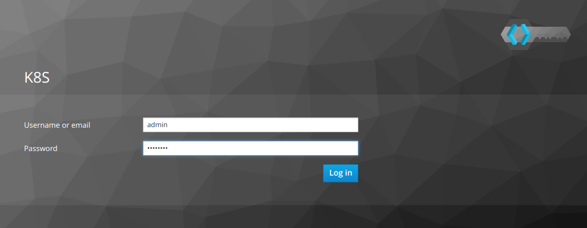

# Using an OIDC Provider with Kubeapps

OpenID Connect (OIDC) is a simple identity layer on top of the OAuth 2.0 protocol, which allows computing clients to verify the identity of an end-user based on the authentication performed by an authorization server, as well as to obtain basic profile information about the end-user.

It is possible to configure your Kubernetes cluster to use an OIDC provider in order to manage accounts, groups and roles with a single application. This guide will explain how you can use an existing OIDC provider to authenticate users within Kubeapps.

## Pre-requisites

For this guide we assume that you have a Kubernetes cluster that is properly configured to use an Identity Provider to handle the authorization of your cluster. You can find more information about how Kubernetes uses OIDC tokens [here](https://kubernetes.io/docs/reference/access-authn-authz/authentication/#openid-connect-tokens). This means that the Kubernetes API server should be configured to use that OIDC provider.

There are several Identity Providers (IdP) that can be used in a Kubernetes cluster. The steps of this guide have been validated using the following providers:

- [Keycloak](https://www.keycloak.org/): Open Source Identity and Access Management.
- [Dex](https://github.com/dexidp/dex): Open Source OIDC and OAuth 2.0 Provider with Pluggable Connectors.
- [Azure Active Directory](https://docs.microsoft.com/en-us/azure/active-directory/fundamentals/active-directory-whatis): Identity Provider that can be used for AKS.
- [Google OpenID Connect](https://developers.google.com/identity/protocols/OpenIDConnect): OAuth 2.0 for Google accounts.

For Kubeapps to use an Identity Provider it's necessary to configure at least the following parameters:

- Client ID: Client ID of the IdP.
- Client Secret: (If configured) Secret used to validate the Client ID.
- OIDC Issuer URL (or discovery URL): URL of the OIDC issuer.

**Note**: Depending on the configuration of the Identity Provider more parameters may be needed.

In the next sections we will explain how you can find the parameters above for some of the identity providers tested.

### Keycloak

In the case of Keycloak, you can find the parameters in the Keycloak admin console:

- Client-ID: Keycloak client ID.
- Client-secret: Secret associated to the client above.
- OIDC Issuer URL: `https://<keycloak.domain>/auth/realms/<realm>`.

### Dex

For Dex, you can find the parameters that you need to set in the configuration (a ConfigMap if Dex is deployed within the cluster) that the server reads the configuration from. Note that since Dex is only a connector you need to configure it with some third-party credentials that may be a client-id and client-secret as well. Don't confuse those credentials with the ones of the application that you can find under the `staticClients` section.

- Client-ID: Static client ID.
- Client-secret: Static client secret.
- OIDC Issuer URL: Dex URL (i.e. https://dex.example.com:32000).

### Azure Active Directory

For setting up an Azure Kubernetes cluster (aks) with Azure Active Directory you can follow [this guide](https://docs.microsoft.com/en-us/azure/aks/aad-integration). At the end of the tutorial you should have an Active Directory Application (Server). That's the Application from which we will get the needed parameters.

- Client-ID: Azure Active Directory server Application ID.
- Client-secret: A "Password" Key of the server Application.
- OIDC Issuer URL: `https://sts.windows.net/<Tenant-ID>/`. The Tenant-ID can be found at `Home > Default Directory - Properties > Directory ID`.

### Google OIDC

In the case of Google we can use an OAuth 2.0 client ID. You can find more information [here](https://developers.google.com/identity/protocols/OpenIDConnect). In particular we will use a "Web Application".

- Client-ID: `<abc>.apps.googleusercontent.com`.
- Client-Secret: Secret for the Web application.
- OIDC Issuer URL: https://accounts.google.com.

## Deploying a proxy to access Kubeapps

The main difference is that instead of accessing the Kubeapps service, we will be using a proxy service that would be in charge of authenticating users against the IdP and inject the required credentials in the requests to Kubeapps. There are some available solutions for this like [keycloak-gatekeeper](https://github.com/keycloak/keycloak-gatekeeper) and [oauth2_proxy](https://github.com/pusher/oauth2_proxy). For this guide we will use `keycloak-gatekeeper` since it has support for WebSockets.

First we will create a Kubernetes deployment and service for the proxy. For the snippet below, you need to set the environment variables `AUTH_PROXY_CLIENT_ID`, `AUTH_PROXY_CLIENT_SECRET` and `AUTH_PROXY_DISCOVERY_URL` with the information from the IdP and `KUBEAPPS_NAMESPACE`.

```
export AUTH_PROXY_CLIENT_ID=<ID>
export AUTH_PROXY_CLIENT_SECRET=<SECRET>
export AUTH_PROXY_DISCOVERY_URL=<URL>
kubectl create -n $KUBEAPPS_NAMESPACE -f - -o yaml << EOF
apiVersion: extensions/v1beta1
kind: Deployment
metadata:
  labels:
    name: kubeapps-auth-proxy
  name: kubeapps-auth-proxy
spec:
  replicas: 1
  selector:
    matchLabels:
      name: kubeapps-auth-proxy
  strategy:
    rollingUpdate:
      maxSurge: 1
      maxUnavailable: 1
    type: RollingUpdate
  template:
    metadata:
      labels:
        name: kubeapps-auth-proxy
    spec:
      containers:
      - args:
        - --client-id=$AUTH_PROXY_CLIENT_ID
        - --client-secret=$AUTH_PROXY_CLIENT_SECRET
        - --discovery-url=$AUTH_PROXY_DISCOVERY_URL
        - --skip-openid-provider-tls-verify
        - --secure-cookie=false
        - --upstream-url=http://kubeapps/
        - --resources=uri=/api/kube/*|white-listed=true
        - --listen=0.0.0.0:3000
        image: keycloak/keycloak-gatekeeper
        imagePullPolicy: IfNotPresent
        name: kubeapps-auth-proxy
---
apiVersion: v1
kind: Service
metadata:
  labels:
    name: kubeapps-auth-proxy
  name: kubeapps-auth-proxy
spec:
  ports:
  - name: http
    port: 3000
    protocol: TCP
    targetPort: 3000
  selector:
    name: kubeapps-auth-proxy
  sessionAffinity: None
  type: ClusterIP
EOF
```

The above is a sample deployment, depending on the configuration of the Identity Provider those flags may vary. For this example we use:

- `--client-id`, `--client-secret` and `--discovery-url`: Client ID, Secret and IdP URL as stated in the section above.
- `--skip-openid-provider-tls-verify`, `--secure-cookie=false`: If the `discovery-url` is served through HTTPS with a self-signed certificate (i.e. Keycloak or Dex), those flags are necessary to avoid errors while validating the TLS certificate.
- `--upstream-url`: Internal URL for the `kubeapps` service.
- `--resources=uri=/api/kube/*|white-listed=true`: In order to use WebSockets we need to bypass the authentication for those request. In that case, Kubeapps will inject the `Bearer` token manually.
- `listen=0.0.0.0:3000`: Listen in all the interfaces.

## Exposing the proxy

Once the proxy is in place and it's able to connect to the IdP we will need to expose it to access it as the main endpoint for Kubeapps (instead of the `kubeapps` service). We can do that with an Ingress object. Note that for doing so an [Ingress Controller](https://kubernetes.io/docs/concepts/services-networking/ingress/#ingress-controllers) is needed. There are also other methods to expose the `kubeapps-auth-proxy` service, for example using `LoadBalancer` as type in a cloud environment. In case an Ingress is used, remember to modify the host `kubeapps.local` for the value that you want to use as hostname for your application:

```
kubectl create -n $KUBEAPPS_NAMESPACE -f - -o yaml << EOF
apiVersion: extensions/v1beta1
kind: Ingress
metadata:
  annotations:
    nginx.ingress.kubernetes.io/connection-proxy-header: keep-alive
    nginx.ingress.kubernetes.io/proxy-read-timeout: "600"
  name: kubeapps
spec:
  rules:
  - host: kubeapps.local
    http:
      paths:
      - backend:
          serviceName: kubeapps-auth-proxy
          servicePort: 3000
        path: /
EOF
```

Once you do that you can access the application, you will be prompted to introduce your credentials:



After introducing those credentials you will be redirected to the Kubeapps application.
