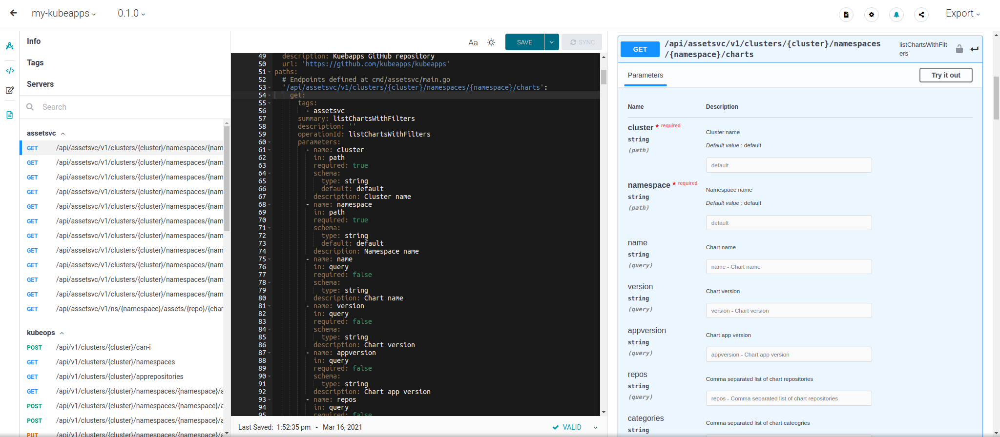
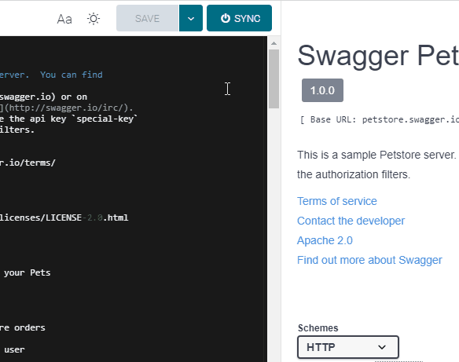
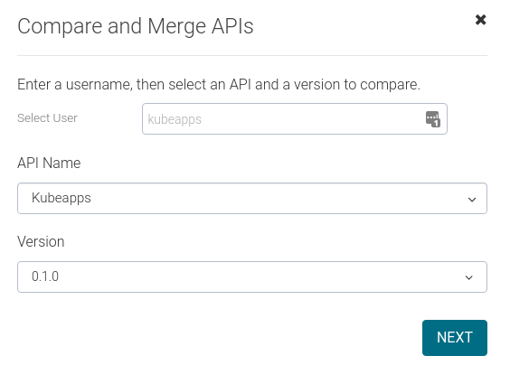

# Update the Kubeapps API documentation

The Kubeapps API docs are defined using the [OpenAPI Specification](https://www.openapis.org). The latest develoment file is located at [/dashboard/public/openapi.yaml](../../main/dashboard/public/openapi.yaml).
However, to make them more accessible to the users, they are hosted in [SwaggerHub](https://swagger.io/tools/swaggerhub) as well as integrated into the Kubeapps dashboard once installed.

If you are interested in the Kubeapps API, please [reach out to us](https://kubernetes.slack.com/messages/kubeapps) for further information.

## Using SwaggerHub

The current public API documentation is available at [app.swaggerhub.com/apis/kubeapps/Kubeapps](https://app.swaggerhub.com/apis/kubeapps/Kubeapps). Note that a SwaggerHub account is required for editing or forking any API.

> This guide assumes the changes are going to be performed by someone external to the Kubeapps organization. For developers, simply skip the fork stage.

### Forking the current API docs in SwaggerHub

Follow this guide on [how to fork an API in SwaggerHub](https://support.smartbear.com/swaggerhub/docs/apis/forking-api.html). After that, you will have a copy of the current Kubeapps API docs in your personal SwaggerHub account.

### Performing changes

Editing an OpenAPI file is just editing a YAML file, nonetheless, SwaggerHub does include validation and visual help for making this task easier. Please refer to the
[SwaggerHub YAML editor](https://support.smartbear.com/swaggerhub/docs/ui/editor.html) and the SwaggerHub [YAML editor](https://support.smartbear.com/swaggerhub/docs/ui/editor.html) and the [visual editor](https://support.smartbear.com/swaggerhub/docs/ui/visual-editor.html) guides for knowing more about how to use them.

Once you finish editing, the changes can be saved and synced.

### Syncing changes

In order to send your changes to the official Kubeapps repo, you need to commit the current API docs changes in your Kubeapps fork in GitHub. Whereas it is possible just to copy from SwaggerHub and paste the YAML in your repo, you can [confiugre Swagger to automatically push the saved changes in GitHub](https://support.smartbear.com/swaggerhub/docs/integrations/github-sync.html).

Note that "pulling" from GitHub is a paid feature that users may don't have. In that case, always try to check the latest published version, as explained in [this guide](https://support.smartbear.com/swaggerhub/docs/apis/compare-and-merge.html).

> Kubeapps maintainers can compare directly against https://raw.githubusercontent.com/vmware-tanzu/kubeapps/main/dashboard/public/openapi.yaml

### Sending a PR

Finally, after pushing the changes in the desired branch of your fork, it is possible to send a PR. This way Kubeapps maintainers will eventually merge it and your changes will be published upstream.

> Kubeapps maintainers will found the API changes in the branch `openapi`, so the PR to be created is `kubeapps/openapi -> kubeapps/main`

## Versioning policy

Kubeapps API is still in a very initial stage and it likely subject to changes. Wherefore, for the sake of simplicity, we are not publishing new versions in SwaggerHub. Instead, we will keep just the latest version and will overwrite it with upcoming changes.
Note that the [openapi.yaml](../../main/dashboard/public/openapi.yaml) file corresponding to each Kubeapps version can still be downloaded as part of the normal [Kubeapps releases page](https://github.com/vmware-tanzu/kubeapps/releases).
