# Managing application lifecycle with Kubeapps

## Table of Contents

1. [Introduction](#introduction)
2. [Pre-requisites](#pre-requisites)
3. [Browse applications in the configured repositories](#browse-applications-in-the-configured-repositories)
4. [Application details](#application-details)
5. [Deploy an application](#deploy-an-application)
6. [Update an application](#update-an-application)
7. [Delete an application](#delete-an-application)
8. [Browse applications installed in the cluster](#browse-applications-installed-in-the-cluster)

## Introduction

[Kubeapps](https://kubeapps.dev/) provides a cloud native solution to browse, deploy and manage the lifecycle of applications on a Kubernetes cluster. It is a one-time install that gives you a number of important benefits, including the ability to:

- browse and deploy packaged applications from public or private repositories
- customize deployments through an intuitive user interface
- upgrade, manage and delete the applications that are deployed in your Kubernetes cluster
- expose an API to manage your package repositories and your applications

This guide explains in detail how to **manage the lifecycle** of your applications in Kubernetes with Kubeapps.

## Pre-requisites

- Kubeapps up and running (see [Get Started with Kubeapps](../tutorials/getting-started.md))
- A Package Repository configured in Kubeapps (see [Managing Package Repositories with Kubeapps](../tutorials/managing-package-repositories.md))

## Browse applications in the configured repositories

To explore the list of applications available in the existing repositories configured in Kubeapps:

1. Click **Catalog** in the main menu.
2. Kubeapps displays in the center of the page a list with the applications available in the configured repositories.

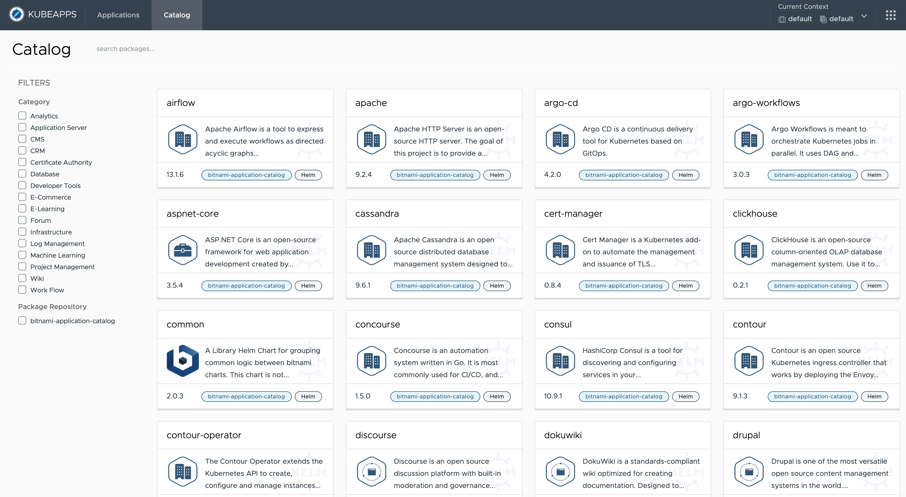

**Search** and **filtering options** are available to improve the experience to explore and find applications.

## Application details

Kubeapps provides a complete overview of applications, metadata and parameters to have all necessary information before deploying into your cluster.

- Click on any app from the **Catalog view**, for example, **Wordpress**.
- Kubeapps navigates to the detail page including:

  - **Application data** (on the left side): name, package format, app version, package version, categories, home URL, maintainers, related URLs
  - **README.md**: Kubeapps render the information available in the package README.md file (including all configuration parameters to install the package).

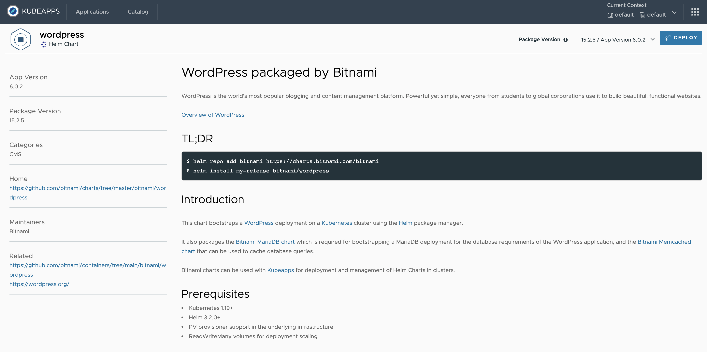
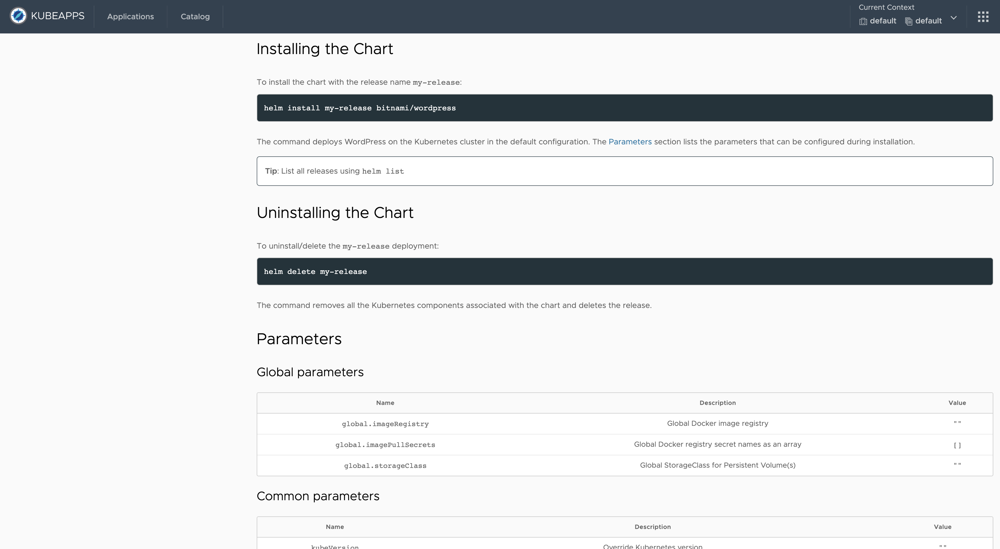

From the top-right corner, you can select the **package version** to deploy the application into your cluster.

## Deploy an application

Click the **Deploy** button from the detail page. Kubeapps displays a new view for the deployment, including:

- `Application data`: same information displayed previously in the detail view.
- `Name`: a descriptive name for the application.
- `Deployment values`: set application values for deployment. Kubeapps provides two alternatives to edit parameters:
  - **Visual editor**: table view component to search, paginate and update values for the different parameters.
  - **YAML editor**: to directly edit the YAML file (including the capability to enable a diff view to show changes from default).

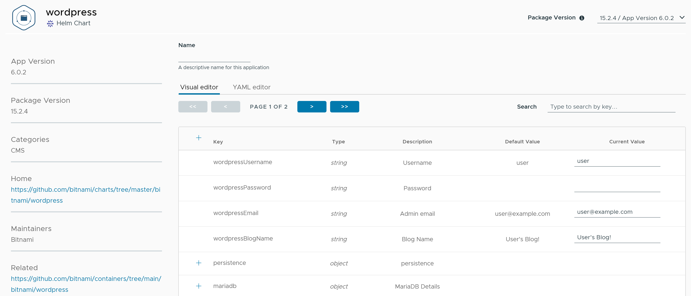
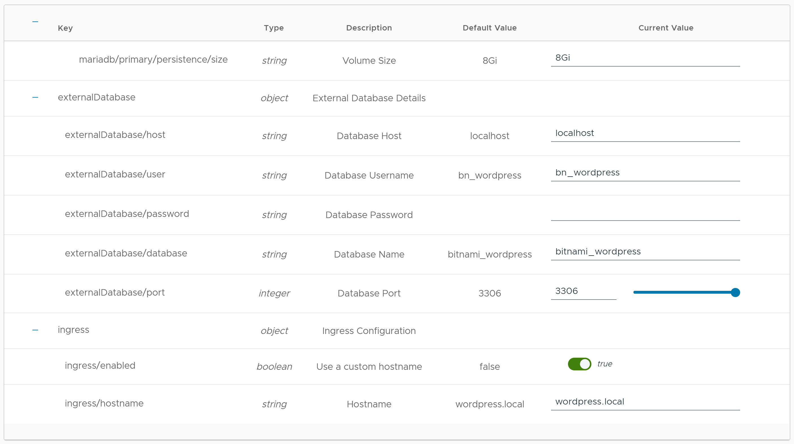
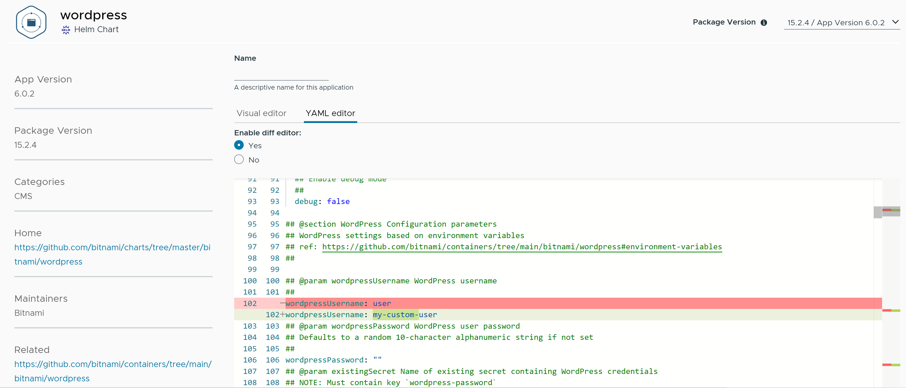

Set values for configuration parameters and click the **Deploy** button to launch the deployment.

> There is another button to help you restore parameters to the default values in the package.

You can track the deployment directly from Kubeapps. The "Notes" section on the deployment page contains important information to help you use the application.

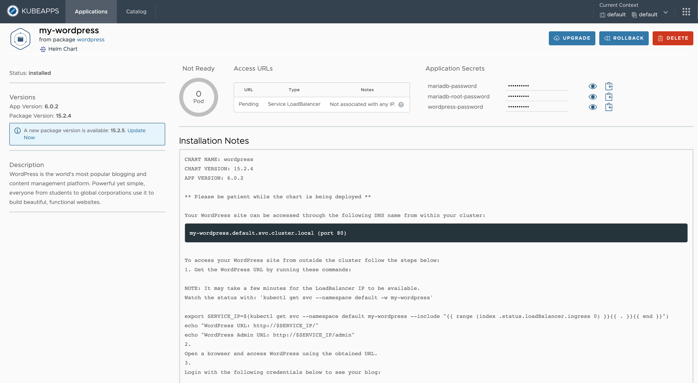
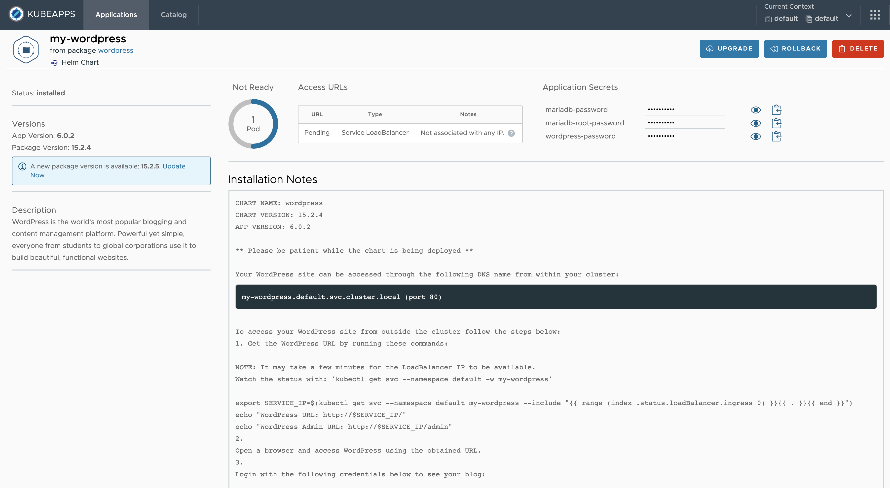
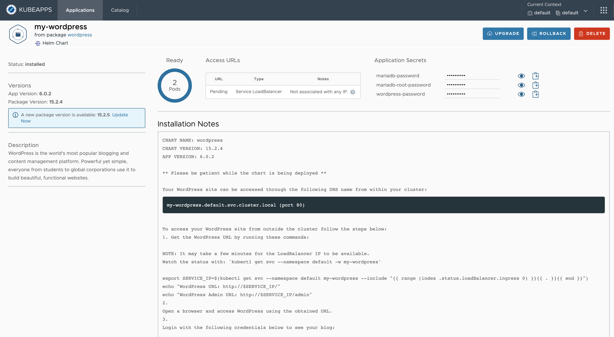

## Update an application

Kubeapps provides an easy way to identify applications with an updated version available in the repository.

- In the list of applications installed in your cluster, with an **arrow**:

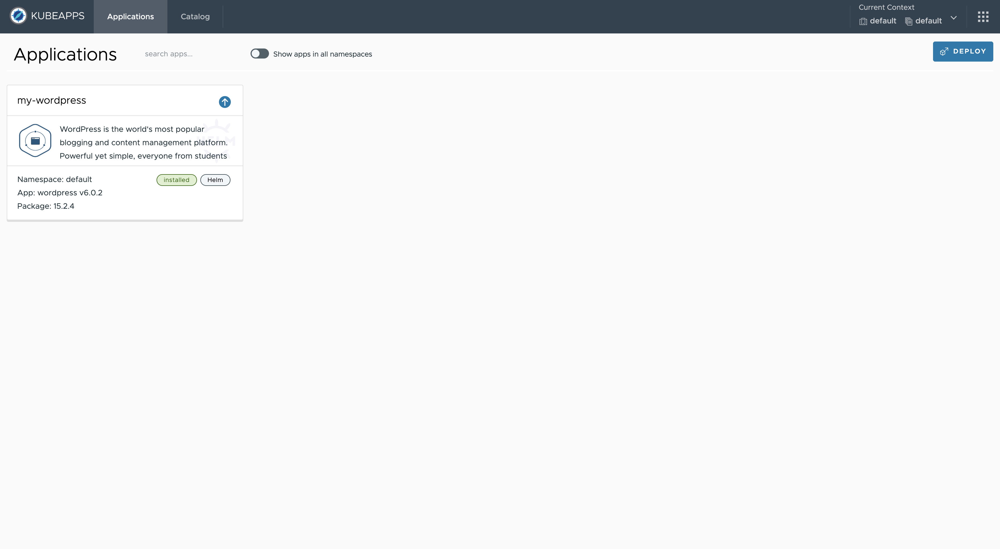

- In the detail view with an **info message** on the left side:

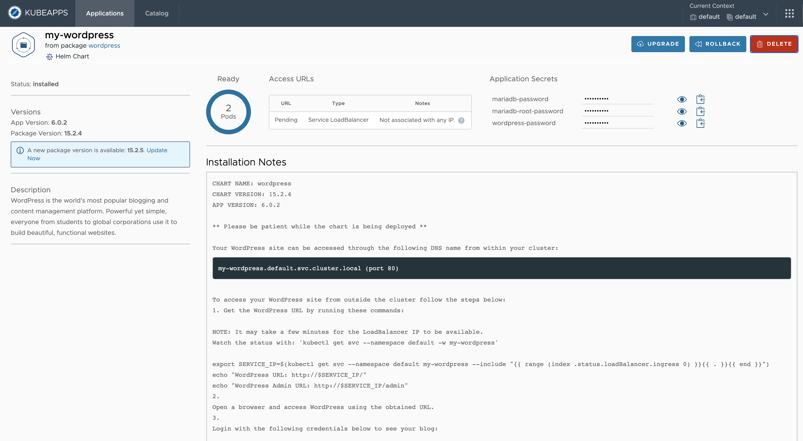

Once you have selected the application to update, click either the **Update** button or the **Update Now** link in the message. Kubeapps displays the deployment view.

For the update case, the Visual Editor table displays the following columns:

- `Default value`: including the default value for each parameter in the package.
- `Deployed value`: including the value deployed in the cluster for each parameter.
- `Current value`: to set the value for each parameter in the upgrade process.

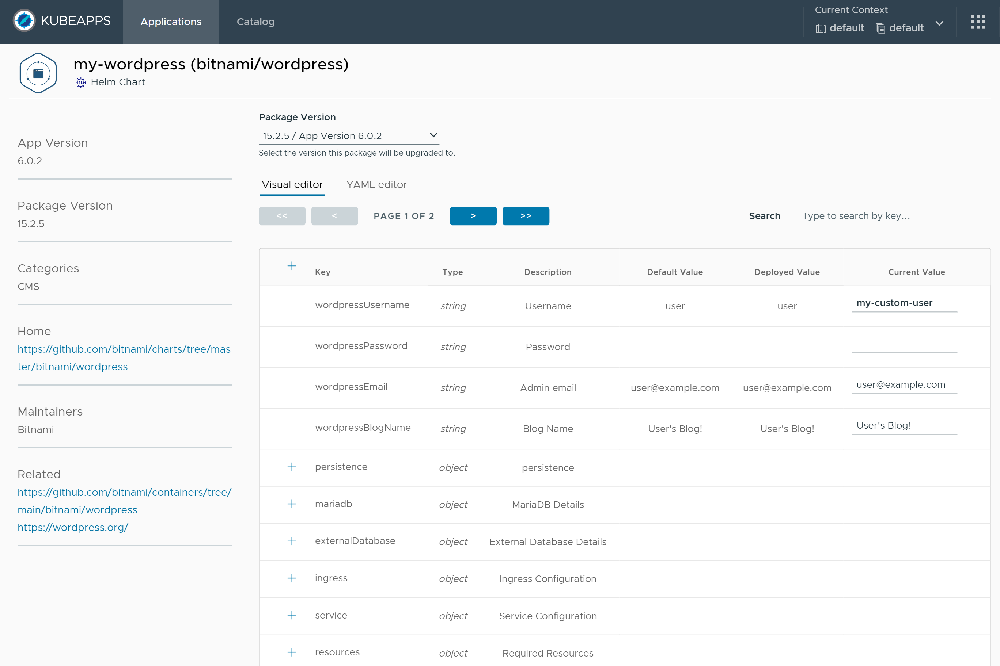

The YAML Editor includes options to enable a diff to compare:

- `Package values`: comparing new values in the YAML file with default values in the package.
- `Deployed values`: comparing new values in the YAML file with deployed values in the cluster.

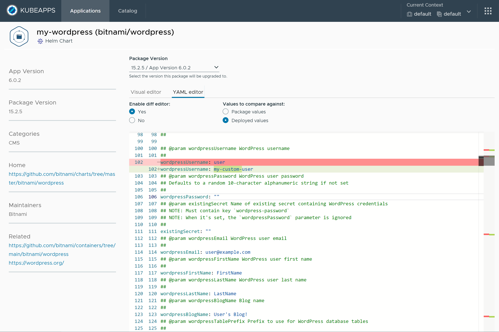

### Delete an application

You can remove any of the applications from your cluster by clicking the **Delete** button on the application's status page:

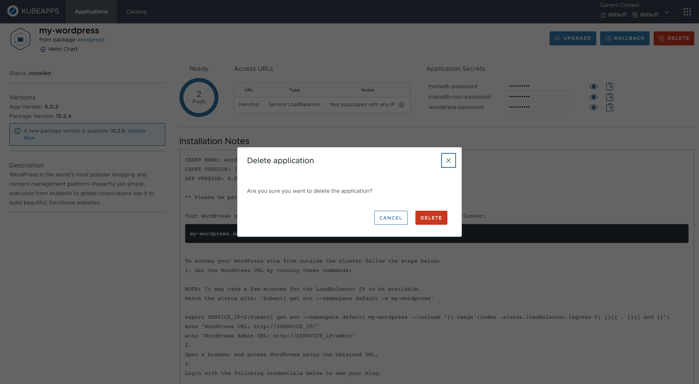

## Browse applications installed in the cluster

To explore the list of applications installed in the cluster directly from Kubeapps:

1. Click **Application** in the main menu.
2. Kubeapps displays in the center of the page a list with the applications installed in the selected context (cluster / namespace):

Kubeapps also provides the ability for listing applications in all namespaces for the selected cluster. Activate the toggle option **Show apps in all namespaces**:

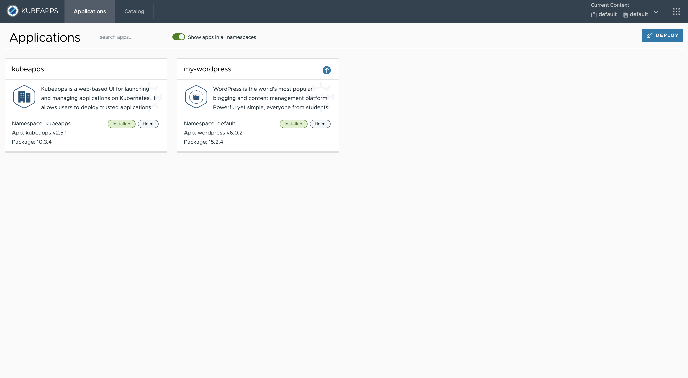

> **NOTE**: An additional benefit for Kubeapps is that it reflects the status of applications in the cluster (even if not managed directly by using Kubeapps). So any change performed by using the Helm, Flux or Carvel directly from the CLI, is visible from Kubeapps when listing the installed applications in the cluster.
