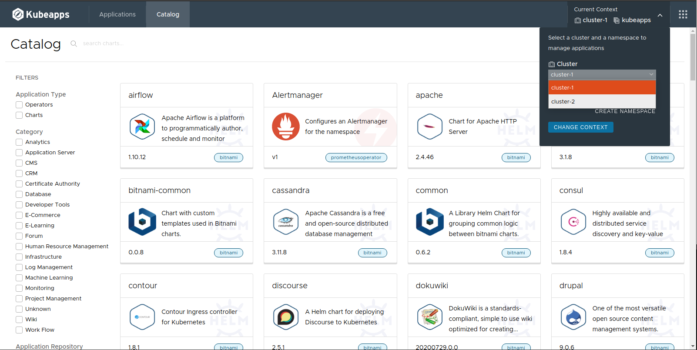
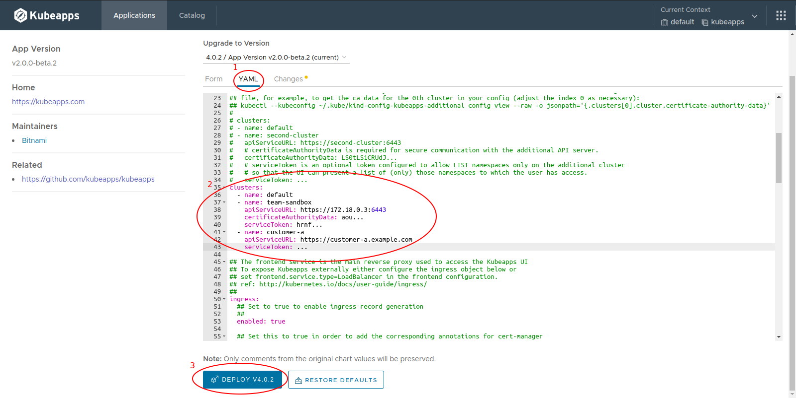

# Configuring Kubeapps for multiple clusters

<!-- TODO(agamez): piece of docs requiring update. Reason: screenshots using old Kubeapps logo -->

It is now possible to configure Kubeapps to target other clusters when deploying a chart, in addition to the cluster on which Kubeapps is itself deployed.

Once configured, you can select the cluster to which you are deploying in the same way that you can already select the namespace to which you are deploying:



When you have selected the target cluster and namespace, you can browse the catalog as normal and deploy apps to the chosen target cluster and namespace as you would normally.

You can watch a brief demonstration of deploying to an additional cluster:

[](https://www.youtube.com/watch?v=pzVMZGTK0vU)

or read a specific configuration example of [multi-cluster Kubeapps running on a Tanzu Kubernetes Grid](https://liveandletlearn.net/post/kubeapps-on-tkg-management-cluster/) environment. The following documentation aims to be generic for any multi-cluster Kubernetes environment.

## Requirements

To use the multi-cluster support in Kubeapps, you must first setup your clusters to use the OIDC authentication plugin configured with a chosen OIDC/OAuth2 provider. This setup depends on various choices that you make and is out of the scope of this document, but some specific points are mentioned below to help with the setup.

### Configuring your Kubernetes API servers for OIDC

The multi-cluster feature requires that each of your Kubernetes API servers trusts the same OpenID Connect provider, whether that be a specific commercial OAuth2 provider such as Google, Azure or Github, or an instance of [Dex](https://dexidp.io/docs/kubernetes/). After you have selected your OIDC provider you will need to configure at least one OAuth2 client to use. For example, if you are using Dex, you could use the following Dex configuration to create a single client id which can be used by your API servers:

```yaml
staticClients:
  - id: kubeapps
    redirectURIs:
      - "https://localhost/oauth2/callback"
    name: "Kubeapps-Cluster"
    secret: ABcdefGHIjklmnoPQRStuvw0
```

The upstream Kubernetes documentation has more information about [configuring your Kubernetes API server to trust an OIDC provider](https://kubernetes.io/docs/reference/access-authn-authz/authentication/#configuring-the-api-server), which can be tricky the first time you configure OIDC support as it will be different depending on which flavour of OIDC provider you choose, your RBAC setup on the cluster as well as the chosen Kubernetes environment.

Certain multi-cluster environments, such as Tanzu Kubernetes Grid, have specific instructions for configuring their workload clusters to trust an instance of Dex. See the [Deploying an Authentication-Enabled Cluster](https://docs.vmware.com/en/VMware-Tanzu-Kubernetes-Grid/1.0/vmware-tanzu-kubernetes-grid-10/GUID-manage-instance-deploy-oidc-cluster.html) in the TKG documentation for an example. For a multi-cluster Kubeapps setup on TKG you will also need to configure [Kubeapps and Dex to support the different client-ids used by each cluster](#clusters-with-different-client-ids).

If you are testing the multi-cluster support on a local [Kubernetes-in-Docker cluster](https://kind.sigs.k8s.io/), you can view the example configuration files used for configuring two kind clusters in a local development environment:

- [Kubeapps cluster API server config](https://github.com/vmware-tanzu/kubeapps/blob/main/site/content/docs/latest/reference/manifests/kubeapps-local-dev-apiserver-config.yaml)
- An [additional cluster API server config](https://github.com/vmware-tanzu/kubeapps/blob/main/site/content/docs/latest/reference/manifests/kubeapps-local-dev-additional-apiserver-config.yaml)

These are used with an instance of Dex running in the Kubeapps cluster with a [matching configuration](https://github.com/vmware-tanzu/kubeapps/blob/main/site/content/docs/latest/reference/manifests/kubeapps-local-dev-dex-values.yaml) and Kubeapps itself [configured with its own auth-proxy](https://github.com/vmware-tanzu/kubeapps/blob/main/site/content/docs/latest/reference/manifests/kubeapps-local-dev-auth-proxy-values.yaml).

Configuring your Kubernetes cluster for OIDC authentication can be tricky, despite the upstream documentation, so be prepared to check the logs of your `kube-apiserver` pod:

```bash
# First find the name of your kubernetes api server pod(s)
kubectl -n kube-system get pods

# then follow the logs of the pod to check for any errors.
kubectl -n kube-system logs -f kube-apiserver-pod-name
```

This will normally be enough to find any configuration issues with your OIDC setup, but in some cases you may even want to reconfigure your Kubernetes setup so the API server runs with a higher `--v` verbosity level. One specific detail to watch out for: any values for the oidc options which you provide must result in valid yaml. So, for example, note how the username and group prefixes end up quoted in the yaml resource below so that they remain valid yaml list items for the command arguments:

```bash
kubectl -n kube-system get po kube-apiserver-kubeapps-control-plane -o yaml | grep "\-\ kube-apiserver\|oidc"
    - kube-apiserver
    - --oidc-ca-file=/etc/kubernetes/pki/apiserver.crt
    - --oidc-client-id=default
    - --oidc-groups-claim=groups
    - '--oidc-groups-prefix=oidc:'
    - --oidc-issuer-url=https://172.18.0.2:32000
    - --oidc-username-claim=email
    - '--oidc-username-prefix=oidc:'
```

For more information about configuring Kubeapps, as opposed to the Kubernetes API server itself, with various OIDC providers see [Using an OIDC provider](../tutorials/using-an-OIDC-provider.md). Similarly, the logs of the Kubeapps frontend `auth-proxy` container will provide more details for debugging authentication requests from Kubeapps itself.

## A Kubeapps Configuration example

Once you have the cluster configuration for OIDC authentication sorted, we then need to ensure that Kubeapps is aware of the different clusters to which it can deploy applications.

The `clusters` option available in the Kubeapps' chart `values.yaml` is a list of yaml maps, each defining at least the name you are assigning to the cluster as well as the API service URL for each additional cluster. For example, in the following configuration:

```yaml
clusters:
  - name: default
  - name: team-sandbox
    apiServiceURL: https://172.18.0.3:6443
    certificateAuthorityData: aou...
    serviceToken: hrnf...
  - name: customer-a
    apiServiceURL: https://customer-a.example.com
    serviceToken: ...
```

`default` is the name you are assigning to the cluster on which Kubeapps is itself installed. You can only define at most one cluster without an `apiServiceURL` corresponding to the cluster on which Kubeapps is installed, or don't provide one at all if you don't want users targeting the cluster on which Kubeapps is installed. For each additional cluster the `name` and `apiServiceURL` are the only required items.

Note that the apiServiceURL can be a public or internal URL, the only restrictions being that:

- the URL is reachable from the pods of the Kubeapps installation.
- the URL uses TLS (https protocol)

If a private URL is used, as per the first cluster above (`team-sandbox`) you will need to additionally include the base64-encoded `certificateAuthorityData` for the cluster. You can get this directly from the kube config file with:

```bash
kubectl --kubeconfig ~/.kube/path-to-kube-confnig-file config view --raw -o jsonpath='{.clusters[0].cluster.certificate-authority-data}'
```

Alternatively, for a development with private API server URLs, you can omit the `certificateAuthorityData` and instead include the field `insecure: true` for a cluster and Kubeapps will not try to verify the secure connection.

A serviceToken is not required but provides a better user experience, enabling users viewing the cluster to see the namespaces to which they have access (only) when they use the namespace selector. It's also used to retrieve icons of the available operators if the OLM is enabled. The service token should be configured with RBAC so that it can list those resources. You can refer to the [example used for a local development environment](https://github.com/vmware-tanzu/kubeapps/blob/main/site/content/docs/latest/reference/manifests/kubeapps-local-dev-namespace-discovery-rbac.yaml).

Your Kubeapps installation will also need to be [configured to use OIDC for authentication](../tutorials/using-an-OIDC-provider.md) with a client-id for your chosen provider.

## Clusters with different client-ids

Some multi-cluster environments configure each cluster's API server with its own client-id for the chosen OAuth2 provider. For example, part of the [configuration of an OIDC-enabled workload cluster in TKG](https://docs.vmware.com/en/VMware-Tanzu-Kubernetes-Grid/1.0/vmware-tanzu-kubernetes-grid-10/GUID-manage-instance-gangway-aws.html) has you creating a separate client ID in the Dex configuration for the new cluster:


In this case, there is some extra configuration required to ensure the OIDC token used by Kubeapps is accepted by the different clusters as follows.

### Configuring the OIDC Provider to trust peer client ids

First your OIDC Provider needs to be configured so that tokens issued for the client-id with which Kubeapps' auth-proxy is configured are allowed to include the client-ids used by the other clusters in the [audience field of the `id_token`](https://openid.net/specs/openid-connect-core-1_0.html#IDToken). When using Dex, this is done by ensuring each additional client-id trusts the client-id used by Kubeapps' auth-proxy. For example, you can view the [local development configuration of Dex](https://github.com/vmware-tanzu/kubeapps/blob/main/site/content/docs/latest/reference/manifests/kubeapps-local-dev-dex-values.yaml) and see that both the `second-cluster` and `third-cluster` client-ids list the `default` client-id as a trusted peer.

### Configuring the auth-proxy to request multiple audiences

The second part of the additional configuration is to ensure that when Kubeapps' auth-proxy requests a token that it includes extra scopes, such as `audience:server:client_id:second-cluster` for each additional audience that it requires in the issued token. For example, you can view the [auth-proxy configuration used in the local development environment](https://github.com/vmware-tanzu/kubeapps/blob/main/site/content/docs/latest/reference/manifests/kubeapps-local-dev-auth-proxy-values.yaml) and see the additional scopes included there to ensure that the `second-cluster` and `third-cluster` are included in the audience of the resulting token.

## Updating multi-cluster options

Updating the value of the `clusters` chart option is just like updating any other helm chart value:

- Edit your file with the values
- Upgrade the Kubeapps release with the new values, being sure to leave the chart version unchanged

So if you had originally installed Kubeapps with a command like:

```bash
helm install kubeapps oci://registry-1.docker.io/bitnamicharts/kubeapps --namespace kubeapps --values ./path/to/my/values.yaml
```

then to modify the clusters configured for Kubeapps at some later point you will need to

- edit the `./path/to/my/values.yaml`
- find the exact chart version that you have installed with `helm list --namespace kubeapps`
- "upgrade" to the new values with `helm upgrade kubeapps bitnami/kubeapps --version X.Y.Z --values ./path/to/my/values`, where the version `X.Y.Z` is the chart version found in the previous step.

Once the pods have cycled, Kubeapps will be ready with your new configured clusters.

### Updating through the Kubeapps UI

As with any other update, you can use the Kubeapp UI to configure the list of available clusters. To do so, just go to your Kubeapps application and click on the Upgrade button.


The clusters configuration cannot be changed in the form so we need to click on the YAML tab and add there the information. When you are done, click on the "Deploy" button to save the changes:



When the application finishes its upgrade, refresh the page to re-request the new configuration.

## Running a local multi-cluster development environment

You can run Kubeapps locally in a multi-cluster development environment from a linux environment (untested in other environments) with the following tools available:

- `apt install build-essential` (or otherwise have the `make` tool available)
- [Docker](https://docs.docker.com/get-docker/)
- [kind](https://kind.sigs.k8s.io/docs/user/quick-start/)
- [mkcert](https://github.com/FiloSottile/mkcert)

Known limitations of the local development environment:

- It assumes that the first docker container created will have the internal address 172.18.0.2 (ie. that it is the first docker container on the network). This is because Dex needs to be available on a URL that is resolveable both from pods within the cluster within the container as well as from the local host (so <https://172.18.0.2:32000> is used)
- Ports 80 and 443 are free. This is required to be able to use an ingress-controller with the local Kind cluster.
- Dex currently runs with a CA cert shared from the first cluster (rather than created via mkcert) so you will see a warning when logging in to Dex.

From the top-level directory of a local copy of the Kubeapps git repository, run:

```bash
make multi-cluster-kind
```

to create two local clusters (two docker containers) with their API servers configured to trust Dex running on the first cluster. To create dex, open-ldap and Kubeapps itself, run:

```bash
export KUBECONFIG=~/.kube/kind-config-kubeapps
make deploy-dev
```

Once the kubeapps pods are all ready (check the pods in the `kubeapps` namespace) you can browse to `https://localhost` to access Kubeapps and login.

When logging in, you will be redirected to dex (with a self-signed cert) and can login with email as either of

- kubeapps-operator@example.com:password
- kubeapps-user@example.com:password

or with LDAP as either of

- kubeapps-operator-ldap@example.org:password
- kubeapps-user-ldap@example.org:password

to authenticate with the corresponding permissions.

## Limitations

The following limitations exist when configuring Kubeapps with multiple clusters:

- The configured clusters must all trust the same OIDC/OAuth2 provider.
- The OIDC/OAuth2 provider must use TLS (https protocol).
- The APIServers of each configured cluster must be routable from the pods of the Kubeapps installation.
- Only AppRepositories installed for all namespaces (ie. AppRepositories in the same namespace as the Kubeapps installation) will be available in the catalog when targeting other clusters. There is no support for private AppRepositories on other clusters.
