# Using a Private Repository with Kubeapps

## Table of Contents

1. [Introduction](#introduction)
2. [Harbor](#harbor)
3. [OCI registry](#oci-registry)
4. [ChartMuseum](#chartmuseum)
5. [Artifactory](#artifactory)

## Introduction

It is possible to use a **private repository** to store your own packages and deploy them by using Kubeapps.

This guide explains in detail the process to install and configure a private package repository with Kubeapps by using different registries like **Harbor**, any **OCI registry**, **ChartMuseum** or **Artifactory**.

> For detailed information on working with package repositories in Kubeapps, please review the following tutorial: [Managing Packaging Repositories with Kubeapps](../tutorials/managing-package-repositories.md).

## Harbor

[Harbor](https://goharbor.io/) is an open source registry that secures artifacts with policies and role-based access control, ensures images are scanned and free from vulnerabilities, and signs images as trusted. Harbor, a [CNCF](https://cncf.io/) Graduated project, delivers compliance, performance, and interoperability to help you consistently and securely manage artifacts across cloud native compute platforms like Kubernetes.

This guide covers the installation of Harbor in the cluster, the addition of packages to the registry and the configuration, as a private repository, in Kubeapps.

1. [Installation](#harbor-installation)
2. [Add a package](#harbor-add-a-package-helm-chart)
3. [Configuration in Kubeapps](#harbor-configure-the-repository-in-kubeapps)

### Harbor: Installation

> **NOTE**: This section can safely be skipped if you already have a Harbor registry accessible from your cluster.

To install a Harbor registry in the cluster:

1. Deploy the [Bitnami Harbor Helm chart](https://github.com/bitnami/charts/tree/main/bitnami/harbor) from the `bitnami` repository by using Kubeapps.

   Alternatively, you can deploy Harbor using [Harbor offline installer](https://goharbor.io/docs/2.6.0/install-config/download-installer/).

   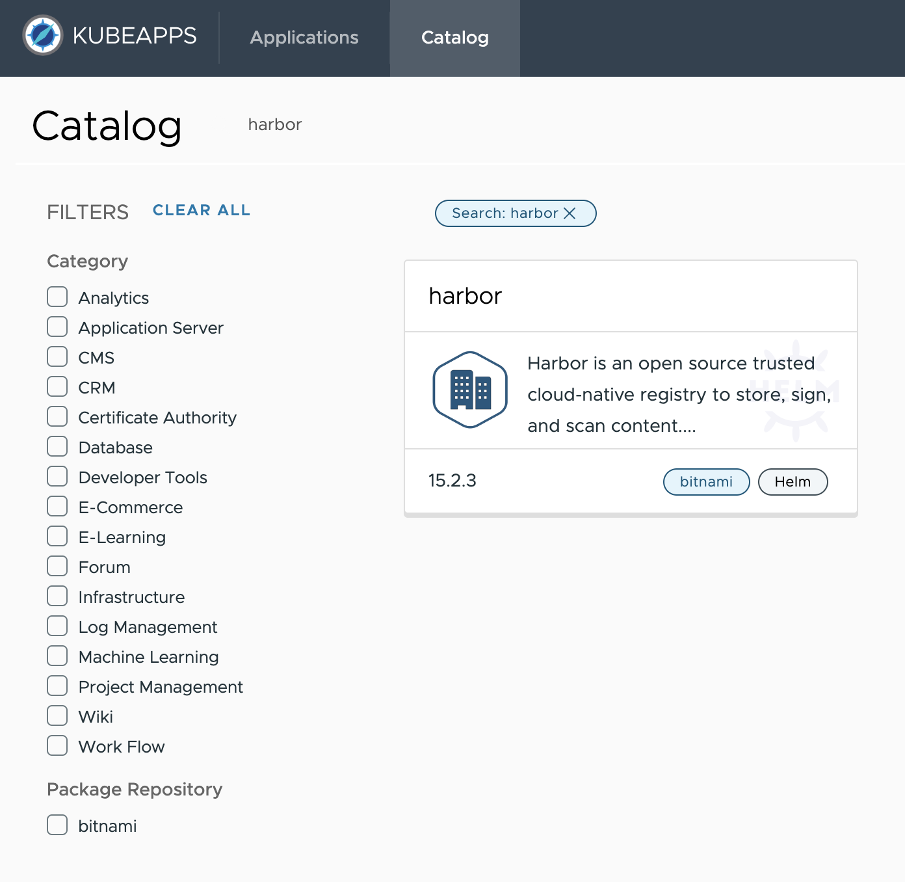

2. Update the following parameter in the deployment values:

   - `service.tls.enabled`: Set to `false` to deactivate the TLS settings. Alternatively, you can provide a valid TSL certificate (check [Bitnami Harbor Helm chart documentation](https://github.com/bitnami/charts/tree/main/bitnami/harbor#parameters) for more information).

   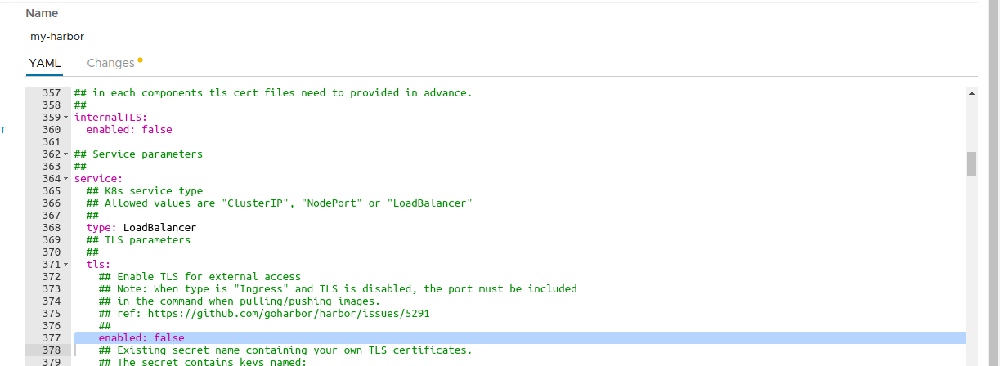

3. Deploy the chart and wait for it to be ready.

   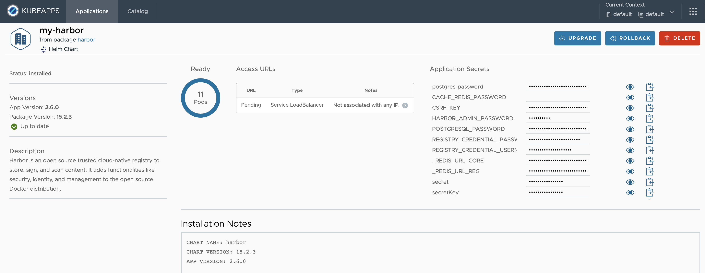

   > **Note**: By default, Harbor deploys ChartMuseum to store charts. If you deactivate it, you can still use the Harbor OCI registry to upload charts. Check out the [OCI](#oci-registry) section for more information.

### Harbor: Add a package (Helm chart)

> **NOTE**: This section can safely be skipped if you already have a Harbor registry accessible from your cluster with packages stored.

1. First, create a Helm chart package:

   ```console
   $ helm package /path/to/my/chart
   Successfully packaged chart and saved it to: /path/to/my/chart/my-chart-1.0.0.tgz
   ```

2. Second, login into Harbor admin portal following the instructions in the chart notes:

   ```console
   1. Get the Harbor URL:

     echo "Harbor URL: https://127.0.0.1:8080/"
     kubectl port-forward --namespace default svc/my-harbor 8080:80 &

   2. Login with the following credentials to see your Harbor application

     echo Username: "admin"
     echo Password: $(kubectl get secret --namespace default my-harbor-core-envvars -o jsonpath="{.data.HARBOR_ADMIN_PASSWORD}" | base64 --decode)
   ```

3. Create a new Project named **my-helm-repo**. Each project will serve as a Package repository (in this example, a Helm chart repository).

   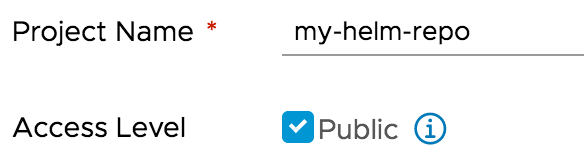

   - It is possible to configure Harbor to use HTTP basic authentication if you set the `Access Level` of the project to `non public`. This enforces authentication to access the packages in the repository from an external client (Helm CLI, Kubeapps or any other).

4. Click the project name to view the project details page, then click **Helm Charts** tab to list all helm charts.

   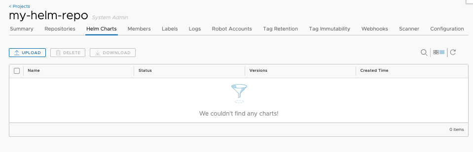

5. Click **Upload** button to upload the Helm chart you previously created. You can also use the `helm` command to upload the chart too.

   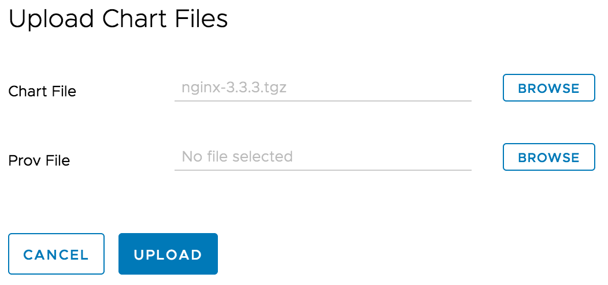

   > Please refer to ['Manage Helm Charts in Harbor'](https://goharbor.io/docs/2.6.0/working-with-projects/working-with-images/managing-helm-charts) for more details.

### Harbor: Configure the repository in Kubeapps

To add Harbor as a private chart repository in Kubeapps:

1. Select the Kubernetes namespace to which you want to add the repository (or "All Namespaces" if you want it available to users in all namespaces).

2. Next, go to **Configuration > Package Repositories** and click on **Add Package Repository**.

3. Complete the configuration form displayed:

- `Name`: Repository name in Kubeapps.
- `URL`: Harbor repository URL (in this example: `http://harbor.default.svc.cluster.local/chartrepo/my-helm-repo`).
- `Description`: Info displayed in Kubeapps for details about the repository.
- `Packaging format`: Select the format of packages in the repository (Helm, Helm via Flux, Carvel)
- `Scope`: may be either **global** (cluster﹣wide) or **namespace﹣scoped**, in which case only users with access to that namespace will have access to the repository.
- `Package storage type`: Helm repository or OCI registry.

For private repositories, the Authentication method must be provided. In this case select:

- `Basic Auth` (for `Repository Authorization` field under the `Authorization` tab) and specify the username and password for Harbor.

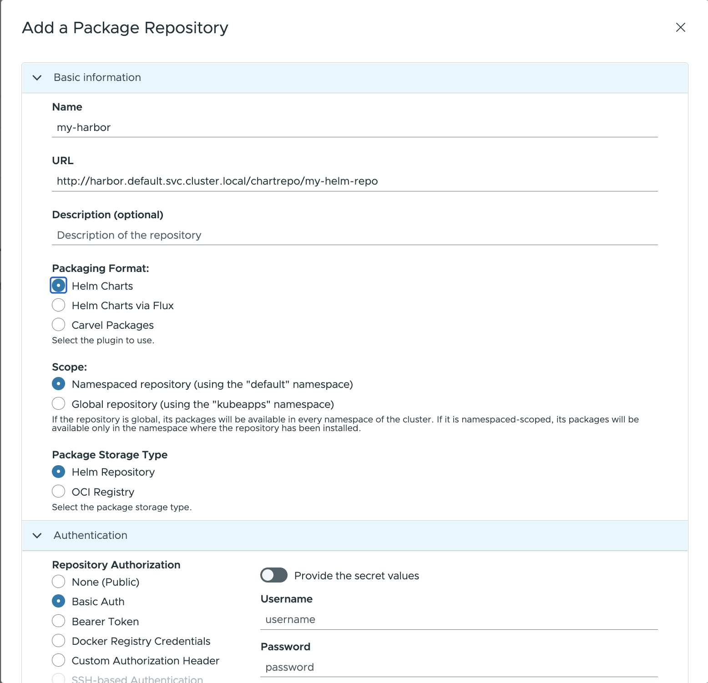

Once configured, you will be able to browse and deploy your own applications from the private Harbor registry by using Kubeapps (and see the chart you uploaded in the previous step).

## OCI Registry

It is also possible to use an [OCI compliant registry](https://github.com/opencontainers/distribution-spec) to store packages.

Cloud Providers like [Amazon ECR](https://aws.amazon.com/blogs/containers/oci-artifact-support-in-amazon-ecr/), [Google Artifact Registry](https://cloud.google.com/artifact-registry/docs/supported-formats) or [Azure ACR](https://docs.microsoft.com/en-us/azure/container-registry/container-registry-image-formats) have also added support for OCI artifacts.

You can add an OCI registry like any other repository. For example, for a [Harbor registry](https://goharbor.io/docs/2.5.0/working-with-projects/working-with-images/managing-helm-charts/#manage-helm-charts-with-the-oci-compatible-registry-of-harbor):

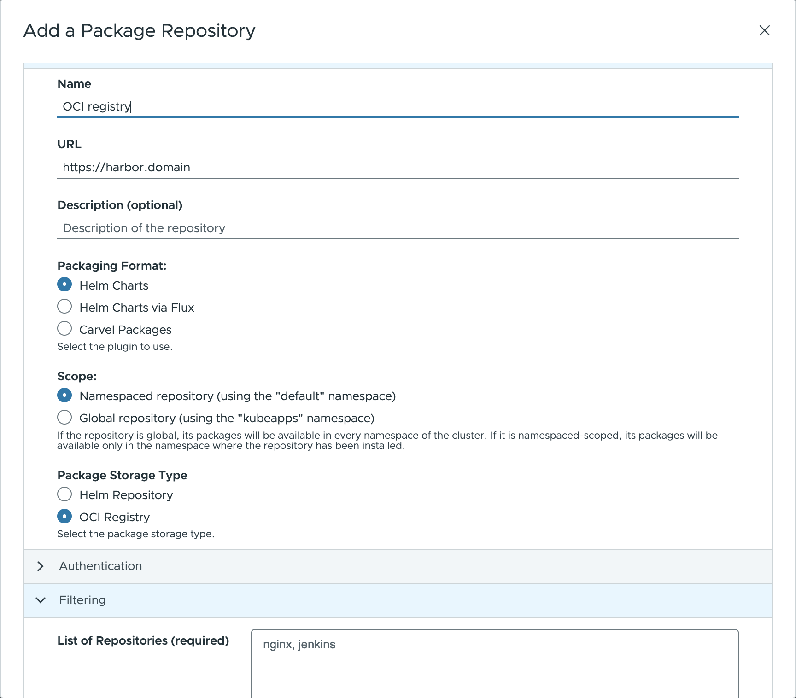

**NOTE:** There is one caveat though. It is necessary to specify the list of applications (repositories) that the registry contains. This is because the OCI specification doesn't have an endpoint to discover artifacts (unlike the index.yaml file of a Helm repository).

In any case, it's possible to use the registry provider API to retrieve this list. For example, for Harbor, it's possible to query its API to retrieve the list:

```console
curl -X GET "https://harbor.domain/api/v2.0/projects/my-oci-registry/repositories" -H "accept: application/json" | jq 'map(.name) | join(", ")'
```

> **Note**: Substitute the domain `harbor.domain` and the project name `my-oci-registry` with your own.
> Also, if the repository is not public, you can use `-u username:password` to retrieve the same list.

## ChartMuseum

[ChartMuseum](https://chartmuseum.com) is an open-source Helm chart repository written in Go (Golang), with support for cloud storage backends, including Google Cloud Storage, Amazon S3, Microsoft Azure Blob Storage, Alibaba Cloud OSS Storage and OpenStack Object Storage.

This guide covers the installation of ChartMuseum in the cluster, the addition of packages to the registry and the configuration as a private repository in Kubeapps.

1. [Installation](#chartmuseum-installation)
2. [Upload a chart](#chartmuseum-upload-a-chart)
3. [Authentication/Authorization](#chartmuseum-authenticationauthorization)
4. [Configuration in Kubeapps](#chartmuseum-configure-the-repository-in-kubeapps)

### ChartMuseum: Installation

> **NOTE**: This section can safely be skipped if you already have ChartMuseum installed and accessible from your cluster.

To use ChartMuseum with Kubeapps:

1. First configure a public repo in Kubeapps to deploy its Helm chart from the `stable` repository:

   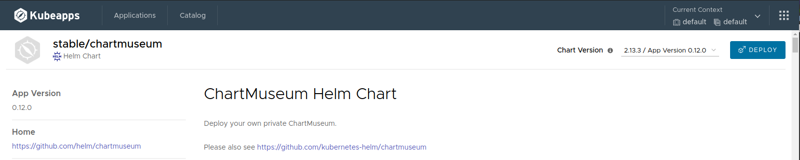

2. Deploy last version by using Kubeapps. Update the following parameters in the deployment values:

   - `env.open.DISABLE_API`: Set to `false` to use the ChartMuseum API to push new charts.
   - `persistence.enabled`: Set to `true` to enable persistence for the stored charts.

   > Note that this will create a [Kubernetes Persistent Volume Claim](https://kubernetes.io/docs/concepts/storage/persistent-volumes/#lifecycle-of-a-volume-and-claim) so depending on your Kubernetes provider you may need to manually allocate the required Persistent Volume to satisfy the claim. Some Kubernetes providers will automatically create PVs for you so setting this value to `true` will be enough.

   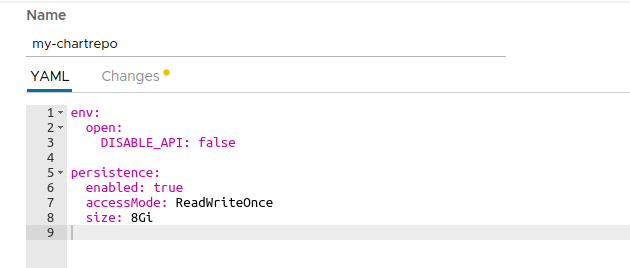

### ChartMuseum: Upload a chart

> **NOTE**: This section can safely be skipped if you already have a ChartMuseum instance accessible from your cluster with charts stored.

Once ChartMuseum is deployed you will be able to upload a chart.

1. In one terminal open a port-forward tunnel to the application:

   ```console
   $ export POD_NAME=$(kubectl get pods --namespace default -l "app=chartmuseum" -l "release=my-chartrepo" -o jsonpath="{.items[0].metadata.name}")
   $ kubectl port-forward $POD_NAME 8080:8080 --namespace default
   Forwarding from 127.0.0.1:8080 -> 8080
   Forwarding from [::1]:8080 -> 8080
   ```

2. In a different terminal you can push your chart:

   ```console
   $ helm package /path/to/my/chart
   Successfully packaged chart and saved it to: /path/to/my/chart/my-chart-1.0.0.tgz
   curl --data-binary "@my-chart-1.0.0.tgz" http://localhost:8080/api/charts
   {"saved":true}
   ```

### ChartMuseum: Authentication/Authorization

It is possible to configure ChartMuseum to use authentication with two different mechanisms:

- Using HTTP [basic authentication](https://chartmuseum.com/docs/#basic-auth) (user/password). To use this feature, it is needed to:
  - Specify the parameters `secret.AUTH_USER` and `secret.AUTH_PASS` when deploying the ChartMuseum.
  - Select `Basic Auth` when adding the repository to Kubeapps specifying that user and password.
- Using a [JWT token](https://github.com/chartmuseum/auth-server-example). Once you obtain a valid token you can select `Bearer Token` in the form and add the token in the dedicated field.

### ChartMuseum: Configure the repository in Kubeapps

To add ChartMuseum as a private chart repository in Kubeapps:

1. Select the Kubernetes namespace to which you want to add the repository (or "All Namespaces" if you want it available to users in all namespaces).

2. Next, go to **Configuration > Package Repositories** and click on **Add Package Repository**.

3. Complete the configuration form displayed by using the following parameters:

- `Name`: Repository name in Kubeapps.
- `URL`: Add your repository using the Kubernetes DNS name for the ChartMuseum service. This will be `http://<release_name>-chartmuseum.<namespace>:8080`.
- `Description`: Displayed in Kubeapps for details about the repository.
- `Packaging format`: Select the format of packages in the repository (Helm or Helm via Flux)
- `Scope`: may be either **global** (cluster﹣wide) or **namespace﹣scoped**, in which case only users with access to that namespace will have access to the repository.
- `Package storage type`: Helm repository.

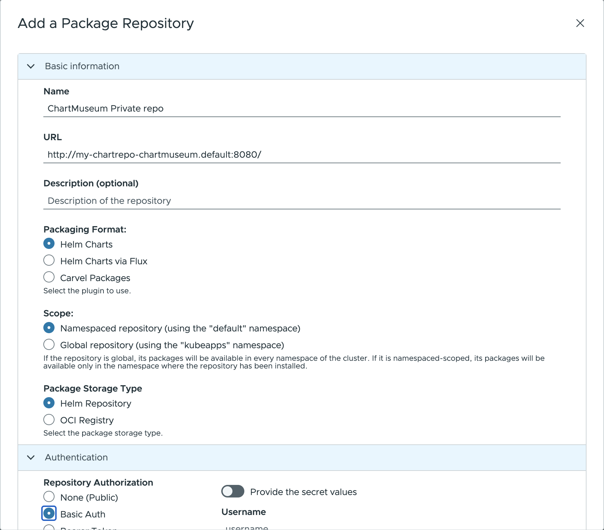

Once configured, you will be able to browse and deploy your own applications from the private ChartMuseum registry by using Kubeapps (and see the chart you uploaded in the previous step).

## Artifactory

JFrog Artifactory is a Repository Manager supporting all major packaging formats, build tools and CI servers.

> **Note**: In order to use the Helm repository feature, it is necessary to use an Artifactory Pro account.

This guide covers the installation of Artifactiory in the cluster, the addition of packages to the registry and the configuration as a private repository in Kubeapps.

1. [Installation](#artifactory-installation)
2. [Upload a chart](#artifactory-upload-a-chart)
3. [Authentication/Authorization](#artifactory-authenticationauthorization)
4. [Configuration in Kubeapps](#artifactory-configure-the-repository-in-kubeapps)

### Artifactory: Installation

> **NOTE**: This section can safely be skipped if you already have an Artifactory registry accessible from your cluster.

To install Artifactory by using Kubeapps first add the JFrog public repository to Kubeapps. Go to **Configuration > Package Repositories** and add their repository:

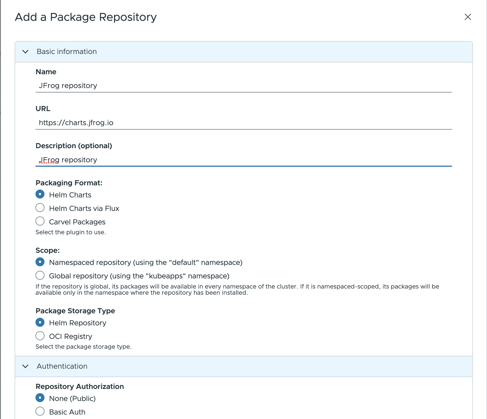

Then browse the JFrog repository in Kubeapps and deploy Artifactory. For detailed installation instructions, check its [README](https://github.com/jfrog/charts/tree/master/stable/artifactory). If you don't have any further requirements, the default values will work.

When deployed, in the setup wizard, select "Helm" to initialize a repository:

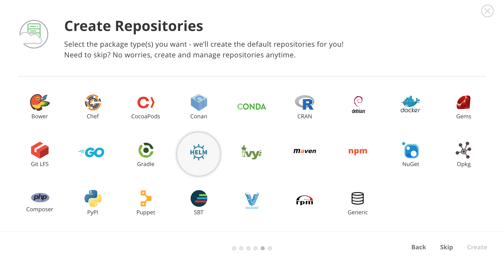

By default, Artifactory creates a chart repository called `helm`. That is the one you can use to store your applications.

### Artifactory: Upload a chart

> **NOTE**: This section can safely be skipped if you already have an Artifactory registry accessible from your cluster with available packages.

First, you will need to obtain the user and password of the Helm repository. To do so, click on the **helm** repository and in the **Set Me Up** menu enter your password. After that you will be able to see the repository user and password.

Once you have done that, you will be able to upload a chart:

```bash
curl -u{USER}:{PASSWORD} -T /path/to/chart.tgz "http://{REPO_URL}/artifactory/helm/"
```

### Artifactory: Authentication/Authorization

To be able to access private charts with Kubeapps first you need to generate a token. You can do that with the Artifactory API:

```bash
curl -u{USER}:{PASSWORD} -XPOST "http://{REPO_URL}/artifactory/api/security/token?expires_in=0" -d "username=kubeapps" -d "scope=member-of-groups:readers"
{
  "scope" : "member-of-groups:readers api:*",
  "access_token" : "TOKEN CONTENT",
  "token_type" : "Bearer"
}
```

The above command creates a token with read-only permissions.

### Artifactory: Configure the repository in Kubeapps

To add Artifactory as a private chart repository in Kubeapps:

1. Select the Kubernetes namespace to which you want to add the repository (or "All Namespaces" if you want it available to users in all namespaces).

2. Next, go to **Configuration > Package Repositories** and click on **Add Package Repository**.

3. Complete the configuration form displayed by using the following parameters:

- `Name`: Repository name in Kubeapps.
- `URL`: Add your repository using the Kubernetes DNS name for the ChartMuseum service. This will be `http://<REPO-URL>/artifactory/helm`.
- `Description`: Displayed in Kubeapps for details about the repository.
- `Packaging format`: Select the format of packages in the repository (Helm or Helm via Flux)
- `Scope`: may be either **global** (cluster﹣wide) or **namespace﹣scoped**, in which case only users with access to that namespace will have access to the repository.
- `Package storage type`: Helm repository.

For private repositories, the Authentication method must be provided. In this case select:

- `Bearer Token` (for `Repository Authorization` field under the `Authorization` tab) and specify the token previously created.

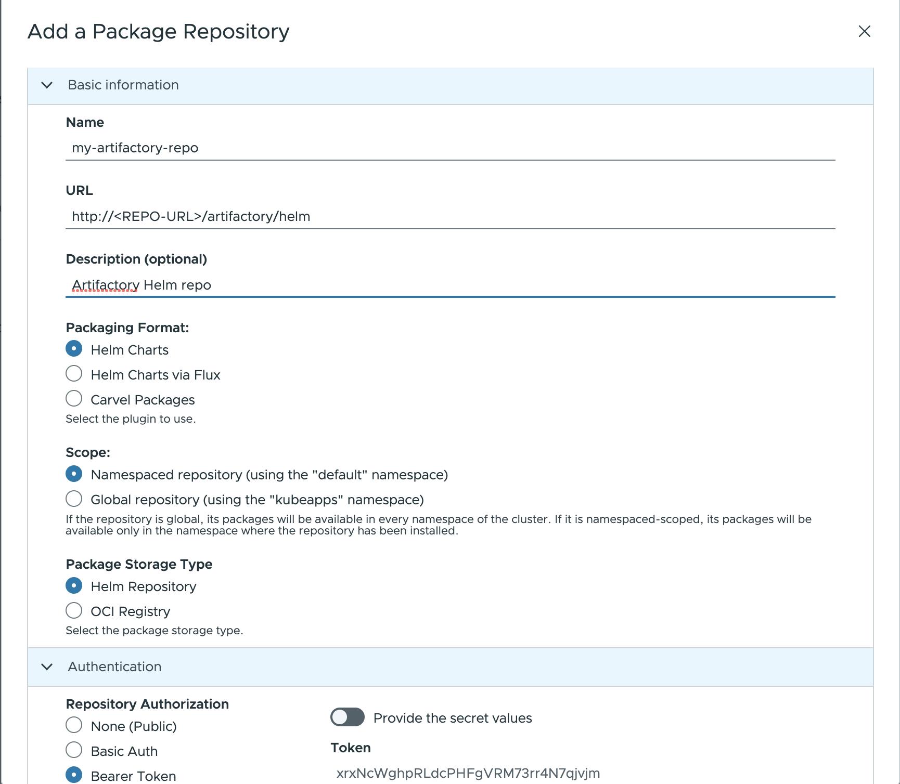

Once configured, you will be able to browse and deploy your own applications from the private Artifactory registry by using Kubeapps (and see the chart you uploaded in the previous step).
