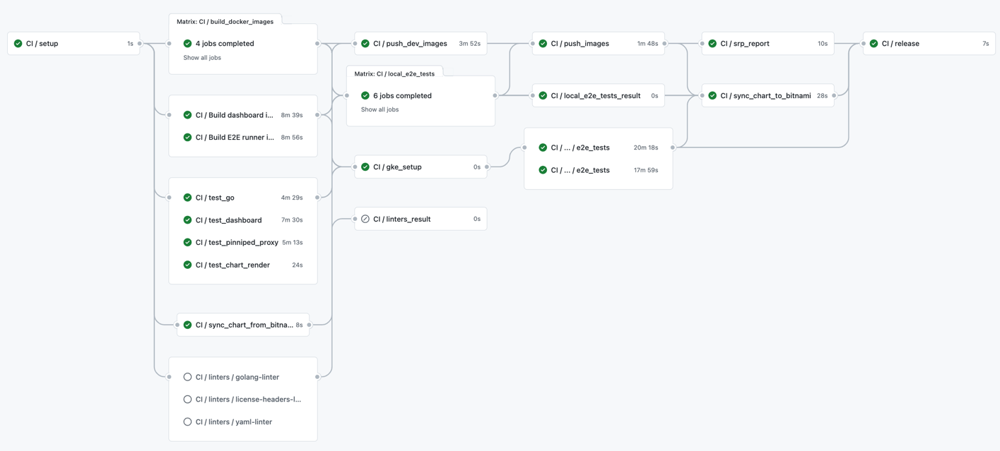

# Kubeapps Releases Developer Guide

The purpose of this document is to guide you through the process of releasing a new version of Kubeapps.

## 0 - Ensure all 3rd-party dependencies are up to date

This step aims at decreasing the number of outdated dependencies so that we can get the latest patches with bug and security fixes.
It consists of four main stages: update the development images, update the CI, update the chart and, finally, update the dependencies.

### 0.1 - Development images

For building the [development container images](https://hub.docker.com/u/kubeapps), a number of base images are used in the build stage. Specifically:

- The [dashboard/Dockerfile](https://github.com/vmware-tanzu/kubeapps/blob/main/dashboard/Dockerfile) uses:
  - [bitnami/node](https://hub.docker.com/r/bitnami/node/tags) for building the static files for production.
  - [bitnami/nginx](https://hub.docker.com/r/bitnami/nginx/tags) for serving the HTML and JS files as a simple web server.
- Those services written in Golang use the same [bitnami/golang](https://hub.docker.com/r/bitnami/golang/tags) image for building the binary, but then a [scratch](https://hub.docker.com/_/scratch) image is used for actually running it. These Dockerfiles are:
  - [apprepository-controller/Dockerfile](https://github.com/vmware-tanzu/kubeapps/blob/main/cmd/apprepository-controller/Dockerfile).
  - [asset-syncer/Dockerfile](https://github.com/vmware-tanzu/kubeapps/blob/main/cmd/asset-syncer/Dockerfile).
  - [kubeapps-apis/Dockerfile](https://github.com/vmware-tanzu/kubeapps/blob/main/cmd/kubeapps-apis/Dockerfile).
- Those services written in Rust use the same [\_/rust](https://hub.docker.com/_/rust/tags) image for building the binary, but then a [bitnami/minideb](https://hub.docker.com/r/bitnami/minideb) image is used for actually running it. These Dockerfiles are:
  - [pinniped-proxy/Dockerfile](https://github.com/vmware-tanzu/kubeapps/blob/main/cmd/pinniped-proxy/Dockerfile)
  - [oci-catalog/Dockerfile](https://github.com/vmware-tanzu/kubeapps/blob/main/cmd/oci-catalog/Dockerfile)

In some images, some build-time linters or tools are used (e.g., `buf` linter, `gosec` or `golangci-lint` checkers,`grpc-health-probe`, etc.).
When updating the base container image, these tools (like `BUF_VERSION`, `GOLANGCILINT_VERSION`, `GRPC_HEALTH_PROBE_VERSION`) _should_ be updated to the latest minor/patch version.

> As part of this release process, these image tags _must_ be updated to the latest minor/patch version. In case of a major version, the change _should_ be tracked in a separate PR.
> **Note**: as the official container images are those being created by Bitnami, we _should_ ensure that we are using the same major version as they are using.

### 0.2 - CI configuration and images

In order to be in sync with the container images while running the different CI jobs, it is necessary to also update the CI image versions.
Find further information in the [CI configuration](../testing/ci.md) and the [e2e tests documentation](../testing/end-to-end-tests.md).

#### 0.2.1 - CI configuration

In the [GitHub Actions Kubeapps General Workflow definition](https://github.com/vmware-tanzu/kubeapps/blob/main/.github/workflows/kubeapps-general.yaml)
we have an initial declaration of the variables used along with the file.
The versions used there _must_ match the ones used for building the container images. Consequently, these variables _must_ be changed accordingly:

- `GOLANG_VERSION` _must_ match the versions used by our services written in Golang, for instance, [kubeapps-apis](https://github.com/vmware-tanzu/kubeapps/blob/main/cmd/kubeapps-apis/Dockerfile).
- `NODE_VERSION` _must_ match the **major** version used by the [dashboard](https://github.com/vmware-tanzu/kubeapps/blob/main/dashboard/Dockerfile).
- `RUST_VERSION` _must_ match the version used by the [pinniped-proxy](https://github.com/vmware-tanzu/kubeapps/blob/main/dashboard/Dockerfile).
- `DOCKER_REGISTRY_VERSION` can be updated to the [latest tag provided by Docker](https://hub.docker.com/_/registry).
- `HELM_VERSION_MIN` _must_ match the one listed in the [Bitnami Application Catalog prerequisites](https://github.com/bitnami/charts#prerequisites).
- `HELM_VERSION_STABLE` should be updated with the [latest stable version from the Helm releases](https://github.com/helm/helm/releases).
- `OLM_VERSION` should be updated with the [latest stable version from the OLM releases](https://github.com/operator-framework/operator-lifecycle-manager/releases).
- `CHARTMUSEUM_VERSION` should be updated with the [latest stable version from the chartmuseum/charts releases](https://github.com/chartmuseum/charts/releases).
- `KAPP_CONTROLLER_VERSION` should be updated with the [latest stable version from the Kapp Controller releases](https://github.com/vmware-tanzu/carvel-kapp-controller/releases).
- `MKCERT_VERSION` should be updated with the [latest stable version from the mkcert releases](https://github.com/FiloSottile/mkcert/releases).
- `KUBECTL_VERSION` _should_ match the Kubernetes minor version (or minor version +1) used in `GKE_REGULAR_VERSION_XX` and listed in the [Kubernetes releases page](https://kubernetes.io/releases/).
- `GITHUB_VERSION` should be updated with the [latest stable version from the GitHub CLI releases](https://github.com/cli/cli/releases).
- `SEMVER_VERSION` should be updated with the [latest stable version from the semver releases](https://github.com/fsaintjacques/semver-tool/releases/).
- `KIND_VERSION` should be updated with the [latest stable version from the kind releases](https://github.com/kubernetes-sigs/kind/releases).
- `K8S_KIND_VERSION` _must_ match the Kubernetes minor version used in `GKE_REGULAR_VERSION_XX` and should be updated with one of the available image tags for a given [Kind release](https://github.com/kubernetes-sigs/kind/releases).
- `POSTGRESQL_VERSION` _must_ match the version used by the [Bitnami PostgreSQL chart](https://github.com/bitnami/charts/blob/main/bitnami/postgresql/Chart.yaml).
- `FLUX_VERSION` should be updated with the [latest stable version from the Flux releases](https://github.com/fluxcd/flux2/releases).
- `HUGO_VERSION` should be updated with the [latest stable version from the Hugo releases](https://github.com/gohugoio/hugo/releases).

Besides, the `GKE_STABLE_VERSION` and the `GKE_REGULAR_VERSION` might have to be updated if the _Stable_ and _Regular_ Kubernetes versions in GKE have changed. Check this information on [this GKE release notes website](https://cloud.google.com/kubernetes-engine/docs/release-notes).
Note that, if `ALLOW_GKE_VERSION_FALLBACK` is set, when no matching versions are found GKE, it will fall back to the current default one.

When updating the `GOLANG_VERSION`, the Go version used in the [CodeQL Github Action](https://github.com/vmware-tanzu/kubeapps/blob/main/.github/workflows/codeql-analysis.yml) might be updated as well.

> As part of this release process, these variables _must_ be updated accordingly. Other variable changes _should_ be tracked in a separate PR.

#### 0.2.2 - CI integration image and dependencies

We use a separate integration image for running the e2e tests consisting of a simple Node image with a set of dependencies. Therefore, upgrading it includes:

- The [integration dependencies](https://github.com/vmware-tanzu/kubeapps/blob/main/integration/package.json) can be updated by running:

```bash
cd integration
yarn upgrade
```

- The [integration/Dockerfile](https://github.com/vmware-tanzu/kubeapps/blob/main/integration/Dockerfile) uses a [mcr.microsoft.com/playwright](https://mcr.microsoft.com/v2/playwright/tags/list) image for running the e2e tests.

> As part of this release process, this Node image tag _may_ be updated to the latest minor/patch version. In case of a major version, the change _should_ be tracked in a separate PR. Analogously, its dependencies _may_ also be updated, but in case of a major change, it _should_ be tracked in a separate PR.

### 0.3 - Protobuf dependencies and autogenerated code

As per the introduction of the new Kubeapps APIs service, it is based upon automatic code generation for both the frontend code and backend code. Given that generation rules can evolve to improve or reduce possible bugs, it is important to perform a periodic update.

- To upgrade the `buf`-related dependencies, just run:

```bash
# You need to have the latest buf binary installed, if not, go to https://docs.buf.build/installation/
make buf-mod-update
```

- Next, the autogenerated code ought to be regenerated.

```bash
# You need to have the latest buf binary installed, if not, go to https://docs.buf.build/installation/
make buf-generate
```

As part of this process, the [autogenerated API documentation](https://github.com/vmware-tanzu/kubeapps/blob/main/cmd/kubeapps-apis/docs/kubeapps-apis.swagger.json)
may have changed. If so, it _must_ be updated in the [API docs we bundle in the dashboard](https://github.com/vmware-tanzu/kubeapps/blob/main/dashboard/public/openapi.yaml).
To do so, the autogenerated file should be first converted to OpenAPI 3 (using, for instance, some of the tools mentioned in [this post](https://dev.to/derberg/convert-swagger-2-0-to-openapi-3-0-3joj)). Then, just copy the
`paths` and `components` sections from the generated file to the dashboard's `openapi.yaml` file. Finally, note that all the paths in the `openapi.yaml` file _must_ be prefixed
with `/apis/`, so that the interactive API docs work properly.

> As part of this release process, the buf.lock dependencies _must_ be updated to the latest versions. In case of a major version, the change _should_ be tracked in a separate PR.

### 0.4 - Upgrading the code dependencies

Currently, we have three types of dependencies: the [dashboard dependencies](https://github.com/vmware-tanzu/kubeapps/blob/main/dashboard/package.json),
the [golang dependencies](https://github.com/vmware-tanzu/kubeapps/blob/maingo.mod), and the [rust dependencies](https://github.com/vmware-tanzu/kubeapps/blob/main/cmd/pinniped-proxy/Cargo.toml).
They _must_ be upgraded to the latest minor/patch version to get the latest bug and security fixes.

#### Dashboard dependencies

Upgrade the [dashboard dependencies](https://github.com/vmware-tanzu/kubeapps/blob/main/dashboard/package.json) by running:

```bash
cd dashboard
yarn upgrade
```

Note: If there are certain dependencies which cannot be updated currently, `yarn upgrade-interactive` allows selecting just certain items for upgrade.

#### Golang dependencies

Check the outdated [golang dependencies](https://github.com/vmware-tanzu/kubeapps/blob/main/go.mod) by running the following (from
[How to upgrade and downgrade dependencies](https://github.com/golang/go/wiki/Modules#how-to-upgrade-and-downgrade-dependencies)):

```bash
go mod tidy
go list -u -f '{{if (and (not (or .Main .Indirect)) .Update)}}{{.Path}}: {{.Version}} -> {{.Update.Version}}{{end}}' -m all 2> /dev/null
```

Then, try updating to the latest version for all direct and indirect dependencies of the current module running this command:

```bash
go get -u ./...
```

> In case this above command fails (for example, due to an issue with transitive dependencies), you can manually upgrade those versions.
> A useful tool for doing so is [go-mod-upgrade](https://github.com/oligot/go-mod-upgrade).

#### Rust dependencies

Upgrade the [rust dependencies](https://github.com/vmware-tanzu/kubeapps/blob/main/cmd/pinniped-proxy/Cargo.toml) by running:

```bash
cd cmd/pinniped-proxy/
cargo update
```

and

```bash
cd cmd/oci-catalog/
cargo update
```

#### Security and chart sync PRs

Finally, look at the [pull requests](https://github.com/vmware-tanzu/kubeapps/pulls) and ensure there is no PR open by Snyk
or `kubeapps-bot` fixing a security issue or bringing upstream chart changes. If so, discuss it with another Kubeapps maintainer
and come to a decision on it, trying not to release with a high/medium severity issue.

> As part of this release process, the dashboard deps _must_ be updated, the golang deps _should_ be updated, the rust deps _should_ be updated and the security check _must_ be performed.

#### Send a PR with the upgrades

Now create a Pull Request containing all these changes (only if no major versions have been bumped up) and wait until for
another Kubeapps maintainer to review and accept so you can merge it.

### 0.5 - Update the website engine

The Kubeapps website is built using [Hugo](https://gohugo.io/). Hugo is a static site generator written in Go. It is used to generate the Kubeapps website from Markdown files and HTML templates.
The Kubeapps website is hosted on [Netlify](https://www.netlify.com/). Netlify is a cloud-based platform that automatically builds and deploys websites when new code is pushed to a Git repository.

To update the website engine, you need to Update the `HUGO_VERSION` variable in the [netlify.toml](https://github.com/vmware-tanzu/kubeapps/blob/main/site/netlify.toml)
to the latest [Hugo release](https://github.com/gohugoio/hugo/releases/).

## 1 - Select the commit to be tagged and perform some tests

Once the dependencies have been updated and the chart changes merged, the next step is to choose the proper commit so that we can base the release on it.
It is, usually, the latest commit in the main branch. Then, some manual and automated tests should be performed to ensure the stability and reliability of the release.

## 1.1 - Trigger the `Full Integration Pipeline` workflow (former `prerelease` flow in `CircleCI`)

The `Full Integration Pipeline` workflow in GitHub Actions is a manual workflow that runs the full pipeline, including those end-to-end tests
that are run on external k8s clusters, usually managed by a cloud provider (currently only GKE). To trigger this workflow you have to follow
the following steps:

1. Go to the [Actions section](https://github.com/vmware-tanzu/kubeapps/actions) in the Kubeapps GitHub repository.
2. Click on `Full Integration Pipeline` in the list of workflows on the left side of the screen.
3. Click on the `Run Workflow` dropdown selector at the right-top of the list of workflow runs.
4. Select `main` (the default one) in the list of branches.
5. Click the `Run workflow` button.
6. You can then interact with and watch the workflow run that has just been created.

## 1.2 - Perform a manual test

Even though we have a thorough test suite in our repository, we still _must_ perform a manual review of the application as it is in the selected commit. To do so, follow these instructions:

- Perform a checkout of the chosen commit.
- Install Kubeapps using the development chart: `helm install kubeapps ./chart/kubeapps/ -n kubeapps`
  - Note that if you are not using the latest commit in the main branch, you may have to locally build the container images so that the cluster uses the proper images.
- Ensure the core functionality is working:
  - Add a repository
  - Install an application from the catalog
  - Upgrade this application
  - Delete this application
  - Deploy an application in an additional cluster

## 2 - Create a git tag

Next, create a tag for the aforementioned commit and push it to the remote repository. Please note that the tag name will be used as the release name.

> When a new tag is detected, Bitnami will automatically build a set of container images based on the tagged commit. They later will be published in [the Bitnami Dockerhub image registry](https://hub.docker.com/search?q=bitnami%2Fkubeapps&type=image).
> Please note that this workflow is run outside the control of the Kubeapps release process.
> Please note also that the Bitnami Catalog will publish a version of the chart whenever one (single) image is published, which means that we need to be careful if any Kubeapps component updates are interdependent, perhaps requesting the Kubeapps chart publishing be paused until all images are published.

For doing so, run the following commands:

```bash
export VERSION_NAME="v1.0.0-beta.1" # edit it accordingly

git tag ${VERSION_NAME} -m ${VERSION_NAME}
git push origin ${VERSION_NAME} # replace `origin` by your remote name
```

> You can retrieve the `VERSION_NAME` using the [semver tool](https://github.com/fsaintjacques/semver-tool) for properly increasing the version from the latest pushed tag:
>
> ```bash
> export VERSION_NAME="v$(semver bump <major|minor|patch> $(git fetch --tags && git describe --tags $(git rev-list --tags --max-count=1)))"
> ```

A new tag pushed to the repository will trigger, apart from the usual test and build steps, the [_Release Pipeline_](https://github.com/vmware-tanzu/kubeapps/actions/workflows/kubeapps-release.yml) as described in the [CI documentation](../testing/ci.md).
An example of the triggered workflow is depicted below:



## 3 - Complete the GitHub release notes

Once the release job is finished, you will have a pre-populated [draft GitHub release](https://github.com/vmware-tanzu/kubeapps/releases).

You still _must_ add a high-level description with the release highlights. Please take apart those commits just bumping
dependencies up; it may prevent important commits from being clearly identified by our users.

Then, save the draft and **do not publish it yet** and get these notes reviewed by another Kubeapps maintainer.

## 4 - Manually review the PR created in the bitnami/charts repository

Since the chart that we host in the Kubeapps repository is only intended for development purposes, we need to synchronize it
with the official one in the [bitnami/charts repository](https://github.com/bitnami/charts/tree/main/bitnami/kubeapps).

To this end, our CI system will automatically (in the `sync_chart_to_bitnami` job, as described in the [CI documentation](../testing/ci.md).)
send a PR with the current development changes to [their repository](https://github.com/bitnami/charts/pulls) whenever a new release is triggered.
Once the PR has been created, have a look at it (eg. remove any development changes that should not be released) and wait
for someone from the Bitnami team to review and accept it.

> Some issues can arise here, so please check the app versions are being properly updated at once and ensure you have the latest
> changes in the PR branch. Note that the [bitnami-bot](https://github.com/bitnami-bot) usually performs some automated commits
> to the main branch that might collide with the changes in our PR. In particular, it will release a new version of the chart with the updated images.

## 5 - Check Dockerfiles and notify the proper teams

Eventually, as the Kubeapps code continues to evolve, some changes are often introduced in our own [development container images](https://hub.docker.com/u/kubeapps).
However, those changes won't get released in the official Bitnami repository unless we manually notify the proper team to also include those changes in their building system.

> As part of this release process, each Kubeapps component's Dockerfile _must_ be compared against the one in the previous release.
> If they functionally differ each other, the Bitnami Content team _must_ be notified.

## 6 - Check released version is in Bitnami repository

Make sure the version is now publicly available in Bitnami repository.
The correct app and chart versions should appear when performing a search:

```bash
helm repo update && helm search repo kubeapps
```

## 7 - Publish the GitHub release

Once the new version of the [Kubeapps official chart](https://github.com/bitnami/charts/tree/main/bitnami/kubeapps) has been published and the release notes reviewed,
you are ready to publish the release by clicking on the _publish_ button in the [GitHub releases page](https://github.com/vmware-tanzu/kubeapps/releases).

> Take into account that the chart version will be eventually published as part of the usual Bitnami release cycle. So expect this step to take a certain amount of time.

## 8 - Promote the release

Tell the community about the new release by using our Kubernetes slack [#kubeapps channel](https://kubernetes.slack.com/messages/kubeapps).
If it includes major features, you might consider promoting it on social media.
