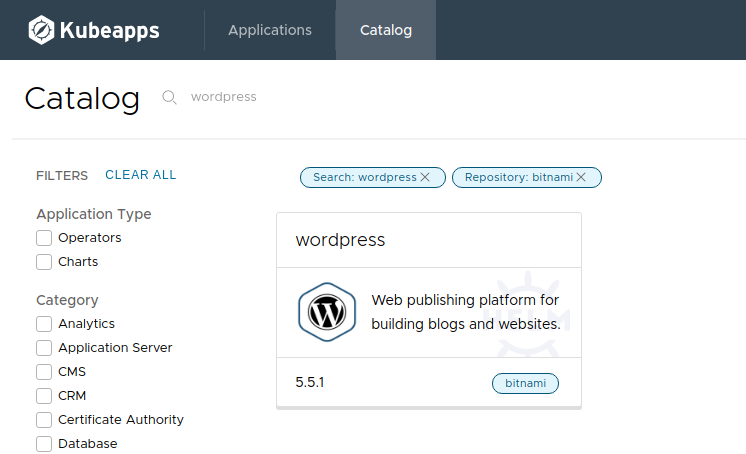
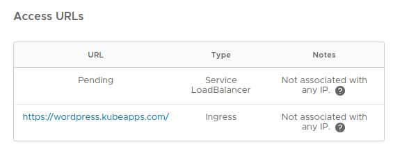
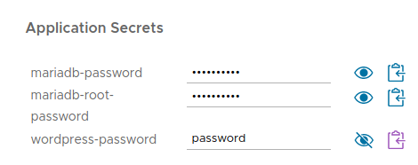

# Get Started with Kubeapps

## Table of Contents

1. [Introduction](#introduction)
2. [Pre-requisites](#pre-requisites)
3. [Step 1: Install Kubeapps](#step-1-install-kubeapps)
4. [Step 2: Create a demo credential with which to access Kubeapps and Kubernetes](#step-2-create-a-demo-credential-with-which-to-access-kubeapps-and-kubernetes)
5. [Step 3: Start the Kubeapps Dashboard](#step-3-start-the-kubeapps-dashboard)
6. [Step 4: Deploy applications: WordPress](#step-4-deploy-applications-wordpress)
7. [Step 5: Uninstall/Delete WordPress](#optional-step-5-uninstalldelete-wordpress)
8. [Next steps](#next-steps)

## Introduction

[Kubeapps](https://kubeapps.dev/) provides a cloud native solution to browse, deploy and manage the lifecycle of applications on a Kubernetes cluster. It is a one-time install that gives you a number of important benefits, including the ability to:

- browse and deploy packaged applications from public or private repositories
- customize deployments through an intuitive user interface
- upgrade, manage and delete the applications that are deployed in your Kubernetes cluster
- expose an API to manage your package repositories and your applications

This guide walks you through the process of deploying Kubeapps for your cluster and installing an example application.

## Pre-requisites

- Kubeapps assumes a working Kubernetes cluster (v1.21+), as well as the [`helm`](https://helm.sh/docs/intro/install/) (v3.2.0+) and [`kubectl`](https://kubernetes.io/docs/tasks/tools/#kubectl) command-line interfaces installed and configured to talk to your Kubernetes cluster.

- Kubeapps has been tested with Azure Kubernetes Service (AKS), Google Kubernetes Engine (GKE), kind, minikube and Docker for Desktop Kubernetes.

- Kubeapps works on RBAC-enabled clusters and this configuration is encouraged for a more secure install.

  > On GKE, you must either be an "Owner" or have the "Container Engine Admin" role in order to install Kubeapps.

## Step 1: Install Kubeapps

Use the official [Bitnami Kubeapps chart](https://github.com/bitnami/charts/tree/main/bitnami/kubeapps) to install the latest version of Kubeapps:

```bash
helm repo add bitnami https://charts.bitnami.com/bitnami
kubectl create namespace kubeapps
helm install kubeapps --namespace kubeapps bitnami/kubeapps
```

For detailed information on installing, configuring and upgrading Kubeapps, checkout the [chart README](https://github.com/vmware-tanzu/kubeapps/blob/main/chart/kubeapps/README.md).

The above commands deploys Kubeapps into the `kubeapps` namespace in your cluster. It may take a few minutes to run. Once it has been deployed and the Kubeapps pods are running, continue to step 2.

## Step 2: Create a demo credential with which to access Kubeapps and Kubernetes

For any user-facing installation you should [configure an OAuth2/OIDC provider](./using-an-OIDC-provider.md) to enable secure user authentication with Kubeapps and the cluster, but this is quite an overhead to simply try out Kubeapps. Instead, for a simpler way to try out Kubeapps for personal learning, we can create a Kubernetes service account and use that API token to authenticate with the Kubernetes API server via Kubeapps:

> **NOTE** It's not recommended to assign users the `cluster-admin` role for Kubeapps production usage. Please refer to the [Access Control](../howto/access-control.md) documentation to configure fine-grained access control for users.

### On Linux/macOS

```bash
kubectl create --namespace default serviceaccount kubeapps-operator
kubectl create clusterrolebinding kubeapps-operator --clusterrole=cluster-admin --serviceaccount=default:kubeapps-operator
cat <<EOF | kubectl apply -f -
apiVersion: v1
kind: Secret
metadata:
  name: kubeapps-operator-token
  namespace: default
  annotations:
    kubernetes.io/service-account.name: kubeapps-operator
type: kubernetes.io/service-account-token
EOF
```

### On Windows

```powershell
kubectl create --namespace default serviceaccount kubeapps-operator
kubectl create clusterrolebinding kubeapps-operator --clusterrole=cluster-admin --serviceaccount=default:kubeapps-operator
@"
apiVersion: v1
kind: Secret
metadata:
  name: kubeapps-operator-token
  namespace: default
  annotations:
    kubernetes.io/service-account.name: kubeapps-operator
type: kubernetes.io/service-account-token
"@ | kubectl apply -f -
```

Next, to retrieve the token,

### On Linux/macOS

```bash
kubectl get --namespace default secret kubeapps-operator-token -o go-template='{{.data.token | base64decode}}'
```

### On Windows

#### Using Powershell

Open a Powershell terminal and run:

```powershell
[Text.Encoding]::UTF8.GetString([System.Convert]::FromBase64String($(kubectl get --namespace default secret kubeapps-operator-token -o jsonpath='{.data.token}')))
```

#### Using CMD

Create a file called `GetDashToken.cmd` with the following lines in it:

```bat
@ECHO OFF
REM Get the Base64 encoded token
kubectl get --namespace default secret kubeapps-operator-token -o jsonpath={.data.token} > b64.txt

REM Decode The Token
DEL token.txt
certutil -decode b64.txt token.txt
```

Open a command prompt and run the `GetDashToken.cmd` Your token can be found in the `token.txt` file.

## Step 3: Start the Kubeapps Dashboard

Once Kubeapps is installed, securely access the Kubeapps Dashboard from your system by running:

```bash
kubectl port-forward -n kubeapps svc/kubeapps 8080:80
```

This starts an HTTP proxy for secure access to the Kubeapps Dashboard. Visit <http://127.0.0.1:8080/> in your preferred web browser to open the Dashboard. Here's what you should see:


Paste the token generated in the previous step to authenticate and access the Kubeapps dashboard for Kubernetes.


**_Note:_** If you are setting up Kubeapps for other people to access, you should use a different service type or setup Ingress rather than using the above `kubectl port-forward`. For detailed information on installing, configuring and upgrading Kubeapps, checkout the [chart README](https://github.com/vmware-tanzu/kubeapps/blob/main/chart/kubeapps/README.md)

## Step 4: Deploy applications: WordPress

Once you have the Kubeapps Dashboard up and running, you can start deploying applications into your cluster.

- Use the **Deploy** button or click on the **Catalog** page in the Dashboard to select an application from the list of packages in any of the configured repositories. This example assumes you want to deploy WordPress.

  

- Click the **Deploy** button.

  

- Kubeapps prompts for the release name and values for the application. The form is populated by the values (**YAML**), which you can see in the adjacent tab.

  

- Click the **Deploy** button to deploy the application. You can track the new deployment directly from the browser. The status is shown at the top, including the `access URL` and any `secret` included with the app. You can also look at the individual resources lower in the page. It also shows the number of ready pods. If you run your cursor over the **status**, you can see the workloads and number of ready and total pods within them.

  

To access your new WordPress site, you can run the commands in the **Notes** section to get the URLs or simply click a URL (HTTP and HTTPS) shown.

**_Note:_** Depending on your cloud provider of choice, it may take some time for an access URL to be available for the application and the Service will stay in a "Pending" state until a URL is assigned. If using Minikube, you need to run `minikube tunnel` in your terminal in order for an IP address to be assigned to your application.



To get the credentials for logging into your WordPress account, refer to the **Notes** section. You can also get the WordPress password by clicking on the eye next to **wordpress-password**.



## [Optional] Step 5: Uninstall/Delete WordPress

If you want to uninstall/delete your WordPress application, you can do so by clicking the "Delete" button.


## Next Steps

Learn more about Kubeapps with the links below:

- [Kubeapps documentation](https://github.com/vmware-tanzu/kubeapps/tree/main/docs)
- [Kubeapps website](https://kubeapps.dev/)
- [Roadmap](https://github.com/vmware-tanzu/kubeapps/milestones)
- [Project board](https://github.com/orgs/vmware-tanzu/projects/38/views/2)
