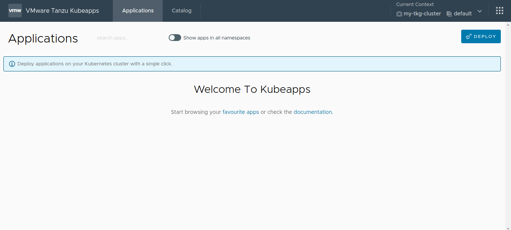
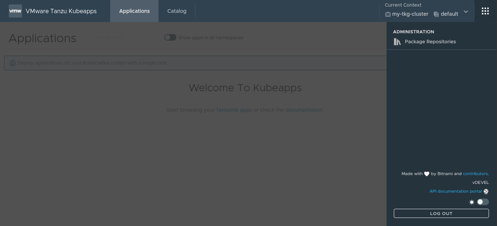
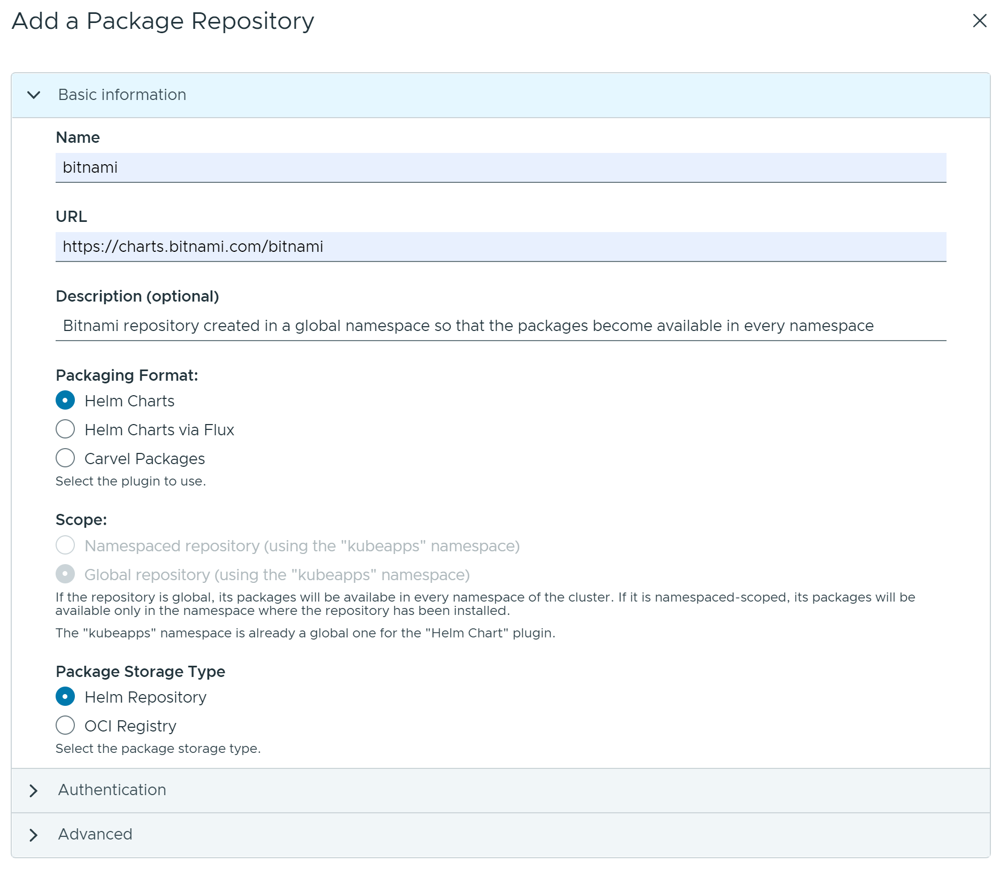
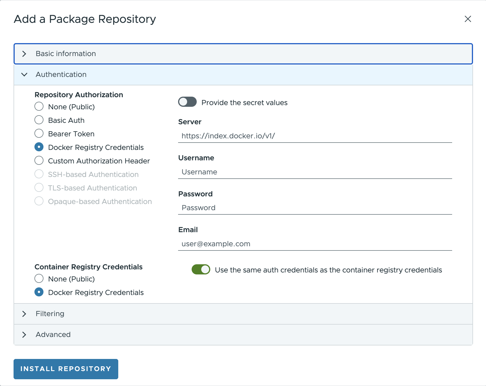
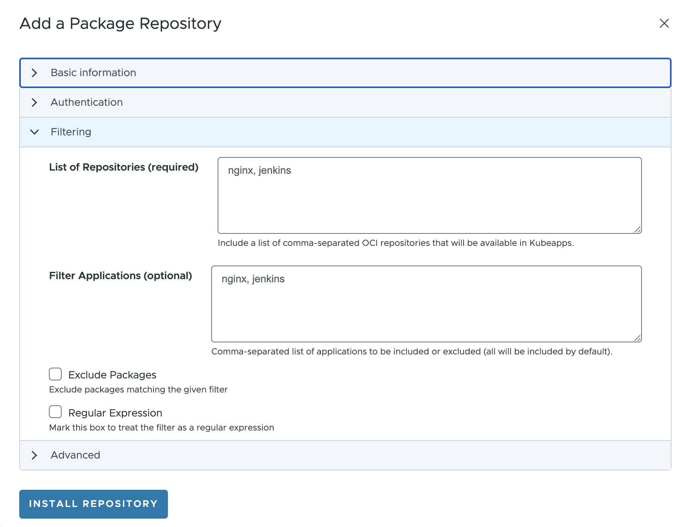
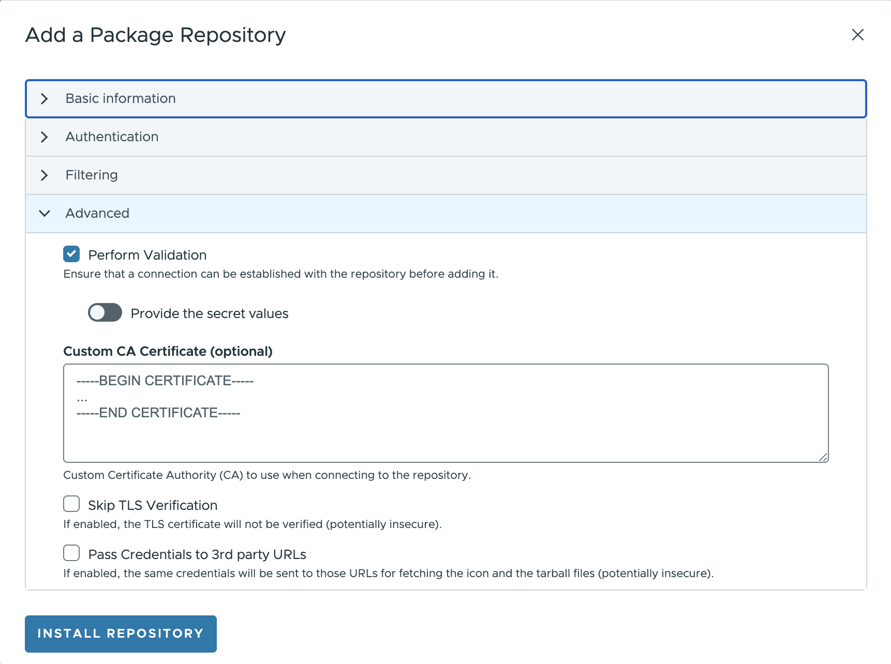
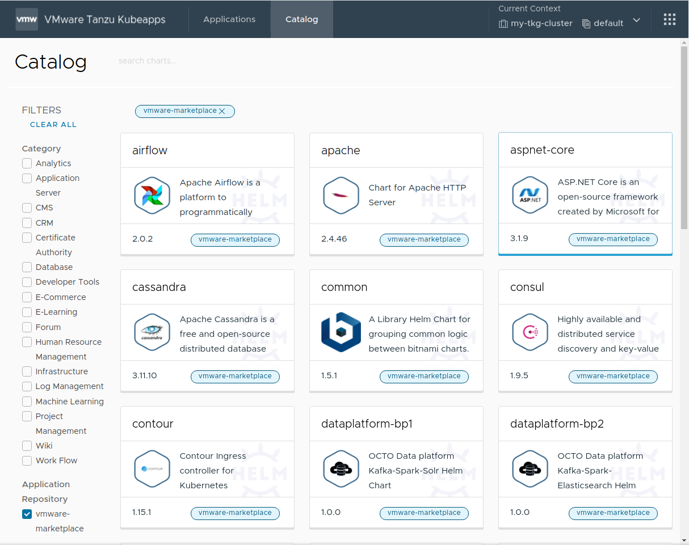
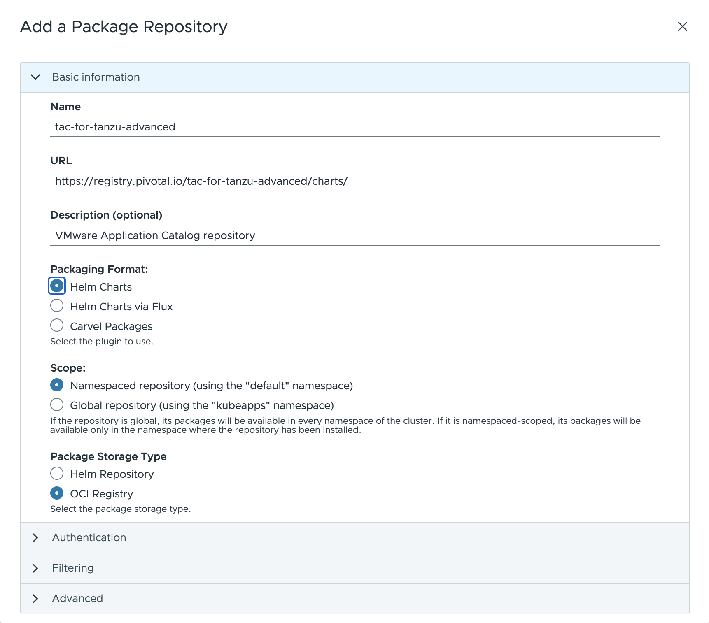
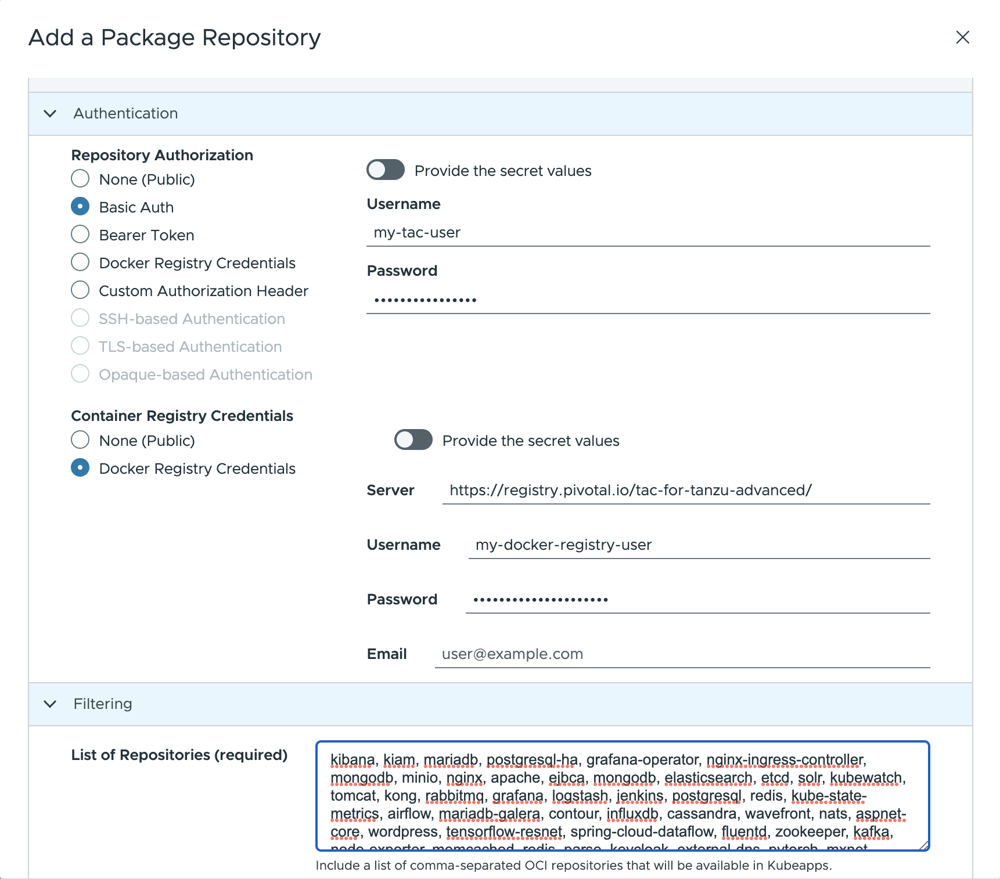
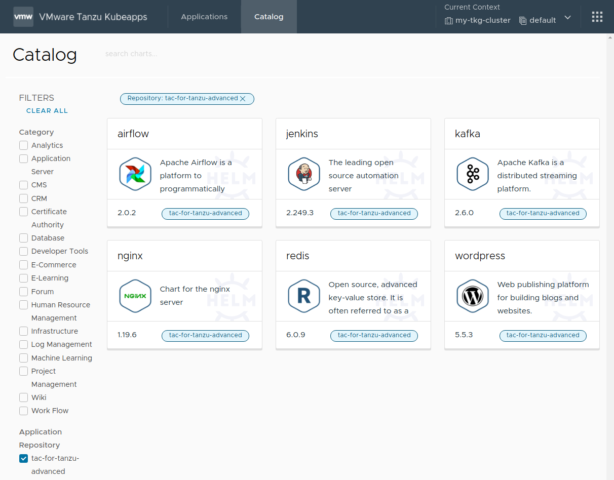

## Step 3: Add Application Repositories to Kubeapps

Once Kubeapps is up and running on the VMware Tanzu™ Kubernetes Grid™ cluster, the next step is to add application repositories to it. This could include public repositories, private repositories or both.

The general procedure to add any repository is described below:

1. Log in to Kubeapps as described in the previous step.
2. Click the **right menu** button in the top right corner (dotted square).

   

3. Click the **Package Repositories** option in the right menu to navigate to the `Package Repositories` page.

   

4. Add a new repository by clicking the **Add Package Repository** button.

   > **NOTE**: If no repositories were specified in the `initialRepos` chart parameter during the Kubeapps installation, no repositories are displayed on the `Package Repositories` page.

5. Fill the _Add a Package Repository_ form using the guidelines below:

- `Name` field is a friendly display name for the repository.
- `URL` field specifies the endpoint of the repository. This endpoint might require different forms of authentication, such as `None`, `Basic Auth` (username and password), `Bearer Token` (a token) or another `Custom` mechanism.
- `Description` field (optional) is a brief summary for the repository.
- `Packaging format` field specifies the format of the packages available in the repository.
- `Scope` field specifies where the packages from the repository could be installed in the cluster (globally on any namespace or limited to an specific namespace in the cluster).
- `Package Storage Type` field specifies the type of repository. Currently, Kubeapps supports both Helm repositories and OCI registries.

  

- `Repository Authorization` field provides additional credentials for pulling the container images from a registry. When selecting the `Docker Registry` as the `Repository Authorization`, this field is required.
Whereas this value usually is the same as the one used in the `Docker Registry, it is possible to create a fresh secret or choose an existing one.

  

- For OCI registries, when using the Helm plugin, it is necessary to also manually specify the list of OCI artifacts to fetch in the **List of Repositories** field (as there is no standard index yet). 
Additionally, artifacts can be excluded using regular expressions if required.

  

- `Synchronization Interval` field specifies the synchronization template to use when periodically pulling the latest changes from the application repository.
- `Custom CA Certificate` field specifies a CA certificate to use (with an option to skip the TLS verification if required).

  

6. Click the **Install Repository** button to finish the process and add the repository to Kubeapps.

Retrieving the catalog from the repository takes a few minutes. Once complete, the contents of the repository become available in Kubeapps.

The following sections demonstrate the process of filling the **Add a Package Repository** form for two specific examples: VMware Marketplace™ and VMware Tanzu™ Application Catalog™ for Tanzu™ Advanced.

### Add the VMware Marketplace™

> **NOTE**: This repository is currently under heavy development. Therefore, the URL used below is subject to change.

The public content from the VMware Marketplace™ repository can be retrieved at `https://charts.market.csp.vmware.com/bitnami`. Since this is a public repository, it is only necessary to configure the following values in the _Add a Package Repository_ form:

- `Name`: Add a descriptive name, such as `vmware-marketplace`.
- `URL`: Use the endpoint URL `https://charts.market.csp.vmware.com/bitnami`.
- `Packaging format`: use `Helm Charts`.
- `Repository Authorization`: leave by default as `None`.
- Leave the rest of the fields as set by default.

Once completed, the public catalog is available in Kubeapps, as shown below:



### Add the VMware Tanzu™ Application Catalog™ for Tanzu™ Advanced

The private content from the VMware Tanzu™ Application Catalog™ for Tanzu™ Advanced repository can be retrieved at `https://registry.pivotal.io/tac-for-tanzu-advanced/charts/`. Since this is a private OCI registry, there are two key differences to note in the process:

- It is necessary to specify repository authentication credentials using the `Basic Auth` option and defining the correct username and password. If you do not have these credentials, please reach out to your [VMware sales representative](https://www.vmware.com/company/contact_sales.html).
- As this is an OCI registry, it is necessary to manually add the list of artifacts to be retrieved in the `List of Repositories` field.

Configure the following values in the **Add Package Repository** form:

- `Name`: Add a descriptive name, such as `tac-for-tanzu-advanced`.
- `URL`: Use the endpoint URL `https://registry.pivotal.io/tac-for-tanzu-advanced/charts/`.
- `Packaging format`: use `Helm Charts`.
- `Repository Type` Set the value to `OCI Registry`.



- `Repository Authorization`: Set the value to `Basic Auth` and enter your VMware Tanzu™ Application Catalog™ for Tanzu™ Advanced username and token in the `Username` and `Password` fields respectively.
- `Container Registry Credentials`: Set the value to `Docker Registry Credentials`and provide the following info (optionally you can use an existing secret):

  - _Server_: Set the value to `https://registry.pivotal.io/tac-for-tanzu-advanced/`.
  - _Username_: Set the value to your VMware Tanzu™ Application Catalog™ for Tanzu™ Advanced username.
  - _Password_: Set the value to your VMware Tanzu™ Application Catalog™ for Tanzu™ Advanced token.

- `List of Repositories`: Set the value to `kibana, kiam, mariadb, postgresql-ha, grafana-operator, nginx-ingress-controller, mongodb, minio, nginx, apache, ejbca, mongodb, elasticsearch, etcd, solr, kubewatch, tomcat, kong, rabbitmq, grafana, logstash, jenkins, postgresql, redis, kube-state-metrics, airflow, mariadb-galera, contour, influxdb, cassandra, wavefront, nats, aspnet-core, wordpress, tensorflow-resnet, spring-cloud-dataflow, fluentd, zookeeper, kafka, node-exporter, memcached, redis, parse, keycloak, external-dns, pytorch, mxnet, harbor, thanos, spark, consul, kubeapps, mysql, wildfly, metrics-server`.



> **NOTE**: To obtain the most current list of repositories, log in to the registry using the `oras` tool and run the command below:
>
> ```bash
> oras pull registry.pivotal.io/tac-for-tanzu-advanced/index:latest -a && cat asset-index.json | jq -r '.charts | map(.name) | join(",")'
> ```

Once complete, the private catalog is available in Kubeapps, as shown below:



At the end of this step, the Kubeapps installation is configured with one or more application repositories. The next step is to [start using Kubeapps](./step-4.md).

## Tutorial index

1. [Step 1: Configure an Identity Management Provider in the Cluster](./step-1.md)
2. [Step 2: Configure and Install Kubeapps](./step-2.md)
3. [Step 3: Add Application Repositories to Kubeapps](./step-3.md)
4. [Step 4: Deploy and Manage Applications with Kubeapps](./step-4.md)

## Appendix: Role-Based Access Control (RBAC) in Application Repositories

A Kubeapps application repository can be created by anyone with the required RBAC privileges for that namespace.

Users with cluster-wide RBAC privileges for creating application repositories can still create an application repository whose charts are available to users in all namespaces by selecting `All Namespaces` when creating the repository.

To grant a user permission to create `AppRepository` objects in a specific namespace, create `RoleBinding` objects associating `apprepositories-read` and `apprepositories-write` roles with that user, as shown below. Replace the `USERNAME` and `CUSTOM-NAMESPACE` placeholders with the corresponding username and namespace name.

> **TIP**: If users only require permissions to deploy charts from application repositories in a specific namespace, it is sufficient to create only the `apprepositories-read` `RoleBinding` object.

```bash
# Grant the user USERNAME read apprepositories permissions on the CUSTOM-NAMESPACE namespace
kubectl -n CUSTOM-NAMESPACE create rolebinding USERNAME-apprepositories-read \
    --user USERNAME
    --clusterrole kubeapps:$KUBEAPPS_NAMESPACE:apprepositories-read
```

```bash
# Grant the user USERNAME write apprepositories permissions on the CUSTOM-NAMESPACE namespace
kubectl -n CUSTOM-NAMESPACE create rolebinding USERNAME-apprepositories-write \
    --user USERNAME \
    --clusterrole kubeapps:$KUBEAPPS_NAMESPACE:apprepositories-write
```
