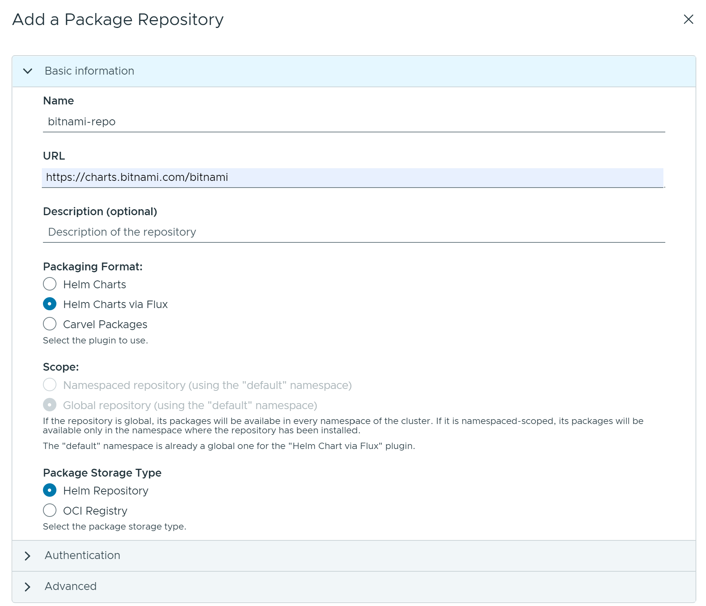
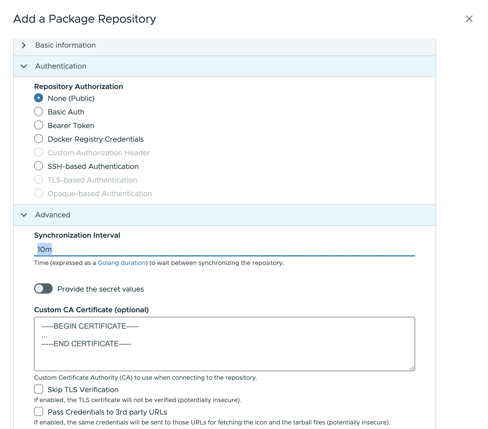
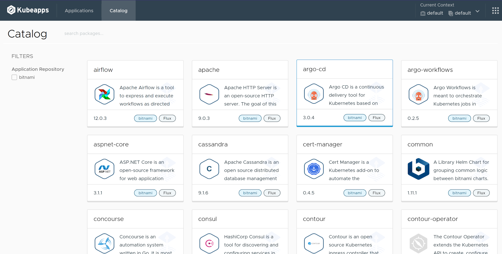
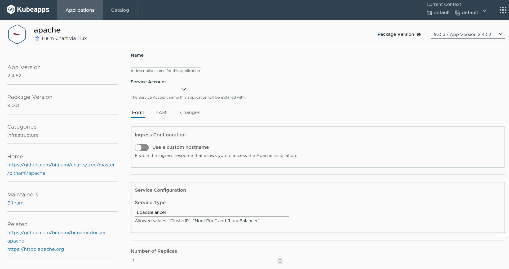
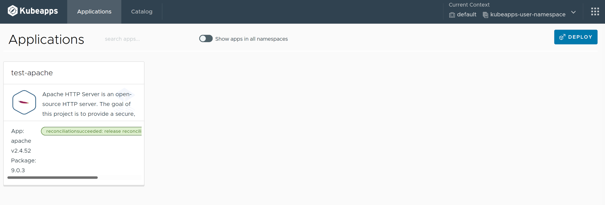
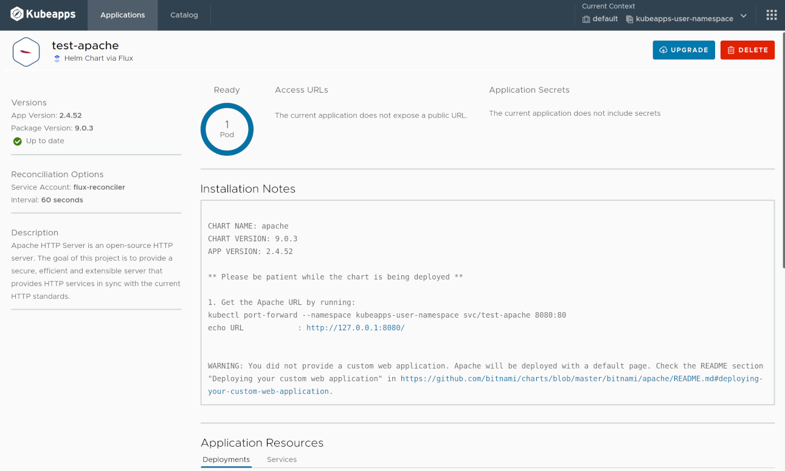

# Managing Flux V2 Packages with Kubeapps

## Table of Contents

1. [Introduction](#introduction)
2. [Installing Flux in your Cluster](#installing-the-flux-controllers-in-your-cluster)
   1. [Quick overview of the Flux CRs](#quick-overview-of-the-relevant-flux-custom-resources)
3. [Using Kubeapps for Managing Flux Packages](#using-kubeapps-to-manage-flux-helm-releases)
   1. [Configuring Kubeapps to Support Flux Packages](#configuring-kubeapps-to-support-flux-helm-releases)
   2. [Installing a Package Repository](#installing-a-helm-repository)
   3. [Installing a Package](#installing-a-package)
   4. [Viewing the Installed Applications](#viewing-the-installed-packages)
4. [Conclusions](#conclusions)

---

## Introduction

Historically, Kubeapps was initially developed to solely manage [Helm Charts](https://helm.sh) on your Kubernetes clusters. However, it has evolved to support multiple packaging formats, such as [Carvel Packages](https://carvel.dev/kapp-controller/docs/latest/packaging/#package) and [Helm chart releases via Fluxv2](https://fluxcd.io/docs/guides/helmreleases/).

> **TIP**: Find more information about the architectural evolution at [this video](https://www.youtube.com/watch?v=rS2AhcIPQEs) and [this technical documentation](../reference/developer/kubeapps-apis.md).

[Flux](https://fluxcd.io/) is a set of continuous and progressive delivery solutions for Kubernetes that are open and extensible. In particular, the Flux helm-controller allows you to manage [Helm chart releases](https://fluxcd.io/docs/guides/helmreleases/) declaratively with Kubernetes manifests. Similarly, the [Flux HelmRepository](https://fluxcd.io/docs/guides/helmreleases/#helm-repository) can be used to manage Helm repositories declaratively.

This guide walks you through the process of using Kubeapps for configuring and deploying Helm charts via Flux.

## Installing the Flux controllers in your Cluster

> **NOTE**: This section can safely be skipped if you already have Flux installed in your cluster.

In order to manage Helm releases with Flux in Kubeapps, first of all, you need to install the Flux controllers in your cluster.

In most situations, people use Flux to declare all their resources in a Git branch which Flux then reconciles on the cluster, but Flux also supports `HelmRelease` and `HelmRepository` custom resources. Refer to the [Flux installation instructions](https://fluxcd.io/docs/installation/) for general installation instructions. If you simply want to test the Kubeapps Flux support, you can install the flux components without any Git branch or even the Flux CLI with a [dev install](https://fluxcd.io/docs/installation/#dev-install):

```bash
kubectl apply -f https://github.com/fluxcd/flux2/releases/latest/download/install.yaml
```

After running this command, you should have everything you need to try out Kubeapps' Flux support. You can check on the progress of the Flux installation with:

```bash
kubectl --namespace flux-system get pod
```

### Quick overview of the relevant Flux Custom Resources

The two custom resources that are relevant for our Kubeapps integration are:

- [HelmRepository](https://fluxcd.io/docs/guides/helmreleases/#helm-repository) stores a reference to a traditional Helm repository and fetches the repository index on an interval, similar to Kubeapps' built-in `AppRepository` resource.
- [HelmRelease](https://fluxcd.io/docs/guides/helmreleases/#define-a-helm-release) defines the intended state of a Helm release, supporting a multitude of features, the most important of which for our purposes is a semver version option, so that the Flux reconciliation process always ensure that the latest matching version is installed.

## Using Kubeapps to manage Helm Charts with Flux

### Configuring Kubeapps to support Flux Helm releases

As with any other packaging format, the support for Helm Charts with Flux is enabled in Kubeapps by means of a plugin.

To enable the declarative Helm Chart support with Flux, in the [values.yaml](https://github.com/vmware-tanzu/kubeapps/blob/main/chart/kubeapps/values.yaml) file, edit the `packaging` option as follows:

```yaml
packaging:
  helm:
    enabled: false
  flux:
    enabled: true
```

> **TIP**: Please refer to the [getting started documentation](./getting-started.md) for more information on how to install Kubeapps and pass custom configuration values.

> **NOTE**: You cannot run Kubeapps currently with both the Helm (imperative) and Helm with Flux (declarative) packaging support, since they both operate on Helm releases.

### Installing a Helm Repository

Kubeapps allows you to install Helm Chart Repositories to be managed declaratively with Flux directly from the UI.

First, you need to find a Helm Chart Repository already published. This tutorial uses the [Bitnami Application Catalog](https://charts.bitnami.com/bitnami) Helm Chart Repository.

- To start with the installation, expand the right menu and click on the **Package Repositories** option.

  

- Kubeapps navigates to the **Package Repositories** page displaying a list of installed repositories (both Global and Namespaced repositories).

  

  - **Global repositories** are available cluster-wide to deploy applications from those repositories to any namespace.

  - **Namespace repositories** are available only in specific namespaces (to be aligned with the Kubernetes RBAC model where an account can have roles in specific namespaces).

  > A Kubeapps Package Repository can be installed by anyone with the required RBAC for that namespace.

- Click the **Add Package Repository** button that displays a pop-up (structured in collapsible sections) to configure the parameters for the new Package Repository.

  

  > The image above shows the parameters to configure the `Bitnami Application Catalog` Helm Chart package repository to be managed declaratively with Flux as a Global repository in Kubeapps.

- Additionally, there are two sections to provide authorization and advanced data to configure the Package Repository. Default values in these sections are enough to install the `Bitnami Application Catalog` repository.

  

- Finally, click the **Install Repository** button to launch the installation process, adding the new repository to Kubeapps.

  > This creates the Flux `HelmRepository` in the `default` namespace that syncs the Bitnami chart index every ten minutes. Any user who can read `HelmRepository` resources in the default namespace is able to create `HelmRelease` resources referring to charts in this repository in any namespace to which they have sufficient RBAC.

### Creating a service account

Since the Flux system reconciles a `HelmRelease` in the background, you need to create a service account to use when creating a Helm release via Flux. This service account is created in the namespace where you intend to install the package (specifically, where the `HelmRelease` resource will be created).

```bash
cat > kubeapps-user-service-account.yaml << EOF
---
apiVersion: v1
kind: ServiceAccount
metadata:
  name: flux-reconciler
  namespace: kubeapps-user-namespace
automountServiceAccountToken: false
---
apiVersion: rbac.authorization.k8s.io/v1
kind: RoleBinding
metadata:
  name: flux-reconciler
  namespace: default
subjects:
- kind: ServiceAccount
  name: flux-reconciler
  namespace: kubeapps-user-namespace
roleRef:
  kind: ClusterRole
  name: admin
  apiGroup: rbac.authorization.k8s.io
EOF

kubectl apply -f kubeapps-user-service-account.yaml
```

Note that this service account has `admin` access to the namespace only and so is able to read/write most resources in the namespace, including adding other roles and rolebindings. If your package includes cluster-wide resources such as CRDs or ClusterRoles, you need to update the above to use a ClusterRoleBinding with a different cluster role, such as cluster-admin. See [Kubernetes user-facing roles](https://kubernetes.io/docs/reference/access-authn-authz/rbac/#user-facing-roles) for more info about the roles.

### Installing a Package

Installing a Helm Chart to be managed declaratively with Flux in Kubeapps is very similar to installing any other package (such as a traditional Helm Chart directly managed with Helm) in Kubeapps.

> **TIP**: Please refer to the [user documentation](../howto/dashboard.md) for more information on how to use Kubeapps as a user.

Assuming that a Flux `HelmRepository`, such as the Bitnami repository above, is already installed in the cluster, you can simply go to the **Catalog** tab and select the package you want to install.

The following image depicts the catalog page with a set of packages from the above Bitnami `HelmRepository`.



Next, select any package you want to install, for example, `Apache`, then click Deploy to see the install form as depicted below:



A big difference with respect to other packaging formats is that **you must select a `ServiceAccount` to be used for installing the package**. This is because Flux, similar to [Carvel](managing-carvel-packages.md), carries out the installation as well as upgrades in the background and so cannot rely on doing so as the user. See [Creating a service account](#creating-a-service-account) above.

In Kubeapps, a dropdown allows you to select which `ServiceAccount` you want to use, such as the `flux-reconciler` service account created above.

> **NOTE**: As a consequence, the user logged in Kubeapps needs RBAC permissions to perform a `list` operation on `ServiceAccount` objects.

> **TIP**: For the Apache package, ensure that the ServiceType is set to an option supported by your cluster. For instance, for a local Kind cluster, you should choose `ClusterIP` rather than `LoadBalancer`.

Finally, after clicking the **Install** button, the Flux `HelmRelease` is installed in the cluster. At this moment, Flux performs the required actions to deploy the related Helm chart and its related resources. This process is known as _reconciliation_. You can check the CLI for more details about the reconciliation:

```bash
kubectl -n kubeapps-user-namespace get helmrelease
NAME          READY     STATUS                       AGE
test-apache   Unknown   Reconciliation in progress   8s
```

### Viewing the Installed Packages

Viewing the Helm Charts installed with Flux in Kubeapps is the same experience as viewing any other installed package (such as a Helm Chart installed with Helm) in Kubeapps.

> **TIP**: Please refer to the [user documentation](../howto/dashboard.md) for more information on how to use Kubeapps as a user.

Go to the **Applications** tab to see every Application that has been installed in the cluster. Click on _show apps in all namespaces_ to view the ones currently installed in every namespace of the cluster.

The following example shows an example of the Applications page with Apache installed as a Helm Chart with Flux:



Since the reconciliation process can eventually fail for several reasons, this page shows the current reconciliation status of each application.

Next, click on the application you want to view, for example, `test-apache` to go to the details page, as depicted in the following image:



As in any other packaging format, this page displays those Kubernetes resources that have been created as a result of the Package installation.
Besides, the current values are shown at the end of the page.

Next, you can click on the **Delete** button to uninstall the application or the **Upgrade** button to edit the values of the application or update it to another version.

> **NOTE**: as opposed to Helm Charts managed with Helm, Helm Charts managed with Flux cannot be rolled back, hence there is no **Rollback** button.

Finally, note that every Helm Chart installed through Kubeapps by using Flux, can also be managed by `kubectl` or the [flux](https://fluxcd.io/docs/cmd/) CLI using the `flux get helmrelease` command (as well as every Helm Chart installed in the cluster directly from Flux can also be managed by Kubeapps). For example:

```bash
flux get -n kubeapps-user-namespace helmrelease test-apache
NAME            READY   MESSAGE                                 REVISION        SUSPENDED
test-apache     True    Release reconciliation succeeded        9.0.3           False
```

## Conclusions

This guide covers how to manage Helm Charts with Flux in Kubeapps, starting from [how to configure Kubeapps itself](#configuring-kubeapps-to-support-flux-helm-releases), then how to [add Helm Package Repositories](#installing-a-helm-repository) for Flux, next [how to browse and install Helm Charts declaratively with Flux](#installing-a-package), and finally [how to view the installed packages](#viewing-the-installed-packages).

Some additional resources and references include:

- [Getting Started with Flux](https://fluxcd.io/docs/get-started/)
