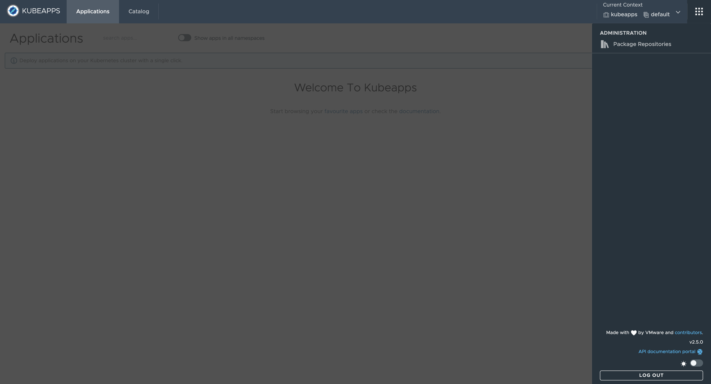
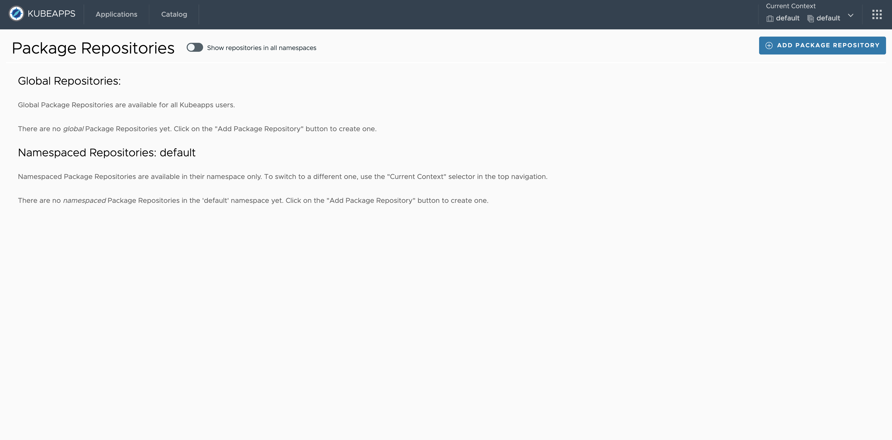
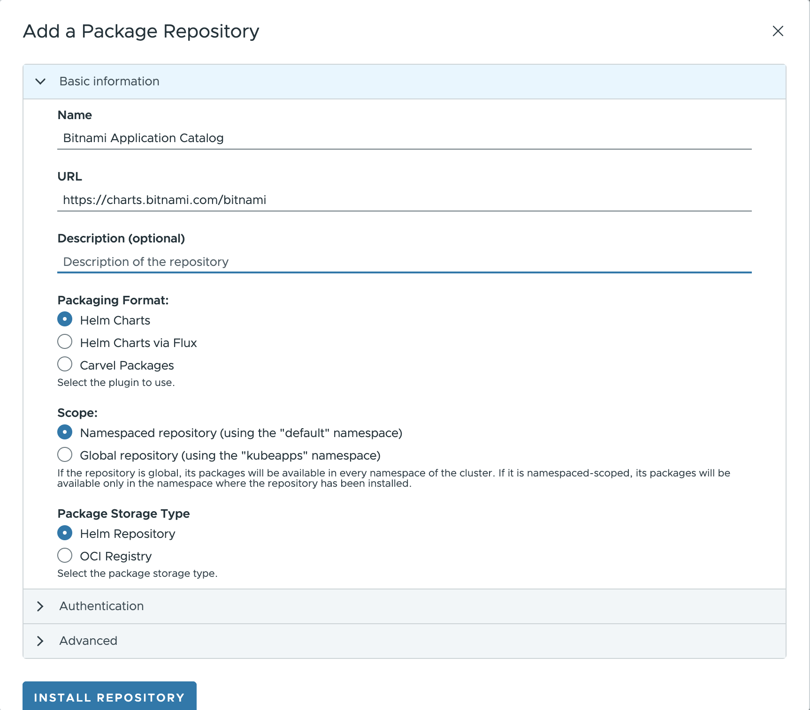
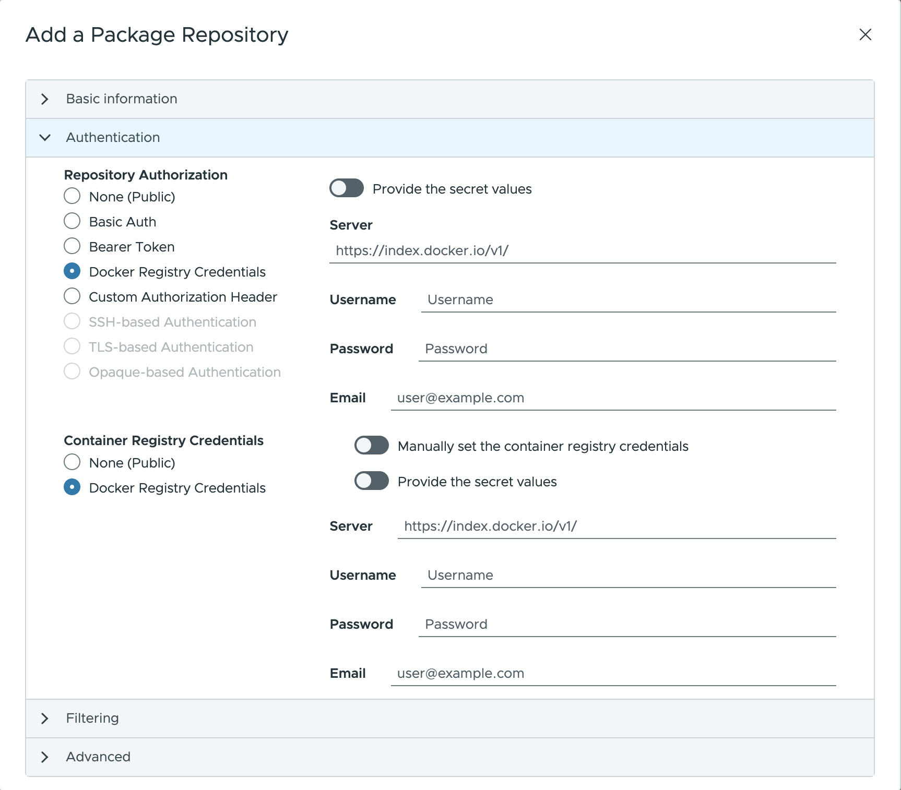
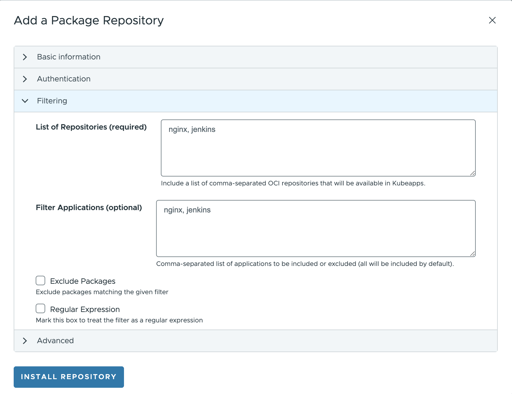
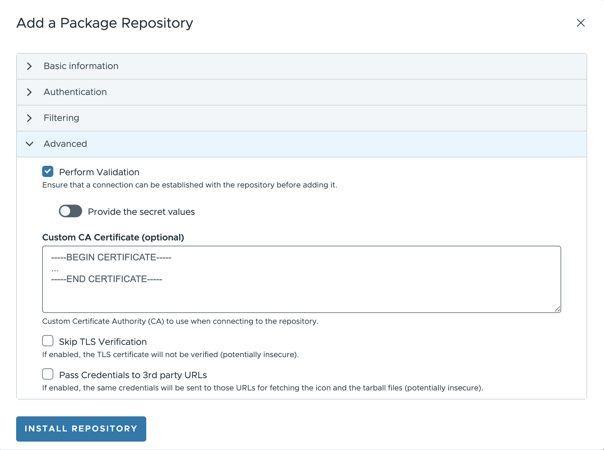
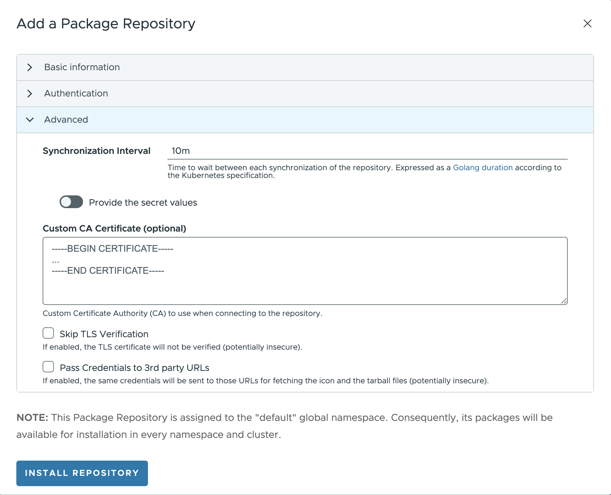
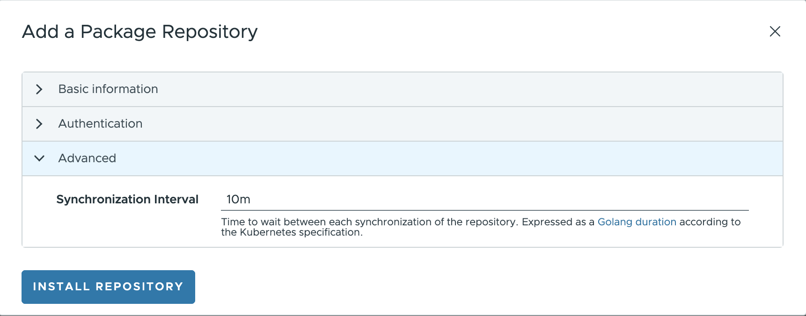
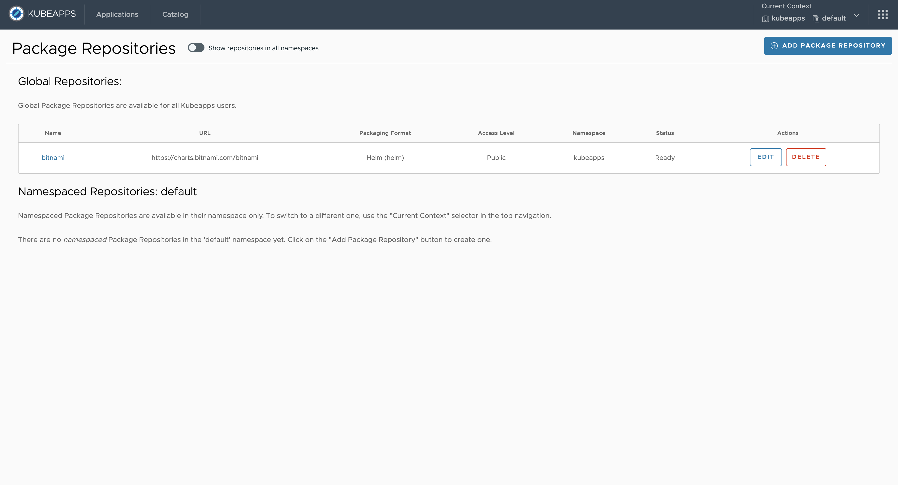

# Managing Package Repositories with Kubeapps

## Table of Contents

1. [Introduction](#introduction)
2. [Pre-requisites](#pre-requisites)
3. [Add a package repository](#add-a-package-repository)
   1. [Packaging format](#packaging-format)
   2. [Scope: Namespace/Global](#scope-namespaceglobal)
   3. [Storage type](#storage-type)
   4. [Authentication](#authentication)
   5. [Filter Applications](#filter-applications)
   6. [Advanced options](#advanced-options)
4. [Install, Update and Delete](#install-update-and-delete)
5. [Conclusions](#conclusions)
6. [Appendix](#appendix)
   1. [Modifying the synchronization job](#modifying-the-synchronization-job)
   2. [Running the synchronization jobs behind a proxy](#running-the-synchronization-jobs-behind-a-proxy)

---

## Introduction

[Kubeapps](https://kubeapps.dev/) provides a cloud native solution to browse, deploy and manage the lifecycle of applications on a Kubernetes cluster. It is a one-time install that gives you a number of important benefits, including the ability to:

- browse and deploy packaged applications from public or private repositories
- customize deployments through an intuitive user interface
- upgrade, manage and delete the applications that are deployed in your Kubernetes cluster
- expose an API to manage your package repositories and your applications

This guide walks you through the process of configuring the [Bitnami Application Catalog](https://bitnami.com/application-catalog) as a Public Package repository in Kubeapps.

## Pre-requisites

- Kubeapps up and running (see [Get Started with Kubeapps](./getting-started.md))
- Repository accessible from Kubeapps installation (the [Bitnami Application Catalog](https://bitnami.com/application-catalog) is used for this tutorial)
- Repository including packaging formats compatible with Kubeapps (Helm or Carvel)

## Add a package repository

To start with the installation, expand the right menu in Kubeapps and click on the **Package Repositories** option.



Kubeapps navigates to the **Package Repositories** page displaying a list of installed repositories (both Global and Namespaced).



Click the **Add Package Repository** button that displays a pop-up (structured in collapsible sections) to configure the parameters for the new Package Repository.

Introduce the following data to add basic information about the repository:

- `Name`: Repository name in Kubeapps.
- `URL`: Repository URL ([https://charts.bitnami.com/bitnami](https://charts.bitnami.com/bitnami) to configure the Bitnami Application catalog).
- `Description` (optional): Info to be displayed in Kubeapps to provide some details about the repository.



### Packaging format

Next option to select is the **Packaging format** for the applications available in the repo. Kubeapps supports multiple packaging formats:

- [Helm Charts](https://helm.sh)
- [Helm chart releases via Fluxv2](https://fluxcd.io/docs/guides/helmreleases/)
- [Carvel Packages](https://carvel.dev/kapp-controller/docs/latest/packaging/#package)

To configure the Bitnami Application Catalog, select **Helm Charts**.

**NOTE**: The support for each packaging format is enabled in Kubeapps by means of a plugin. Kubeapps UI shows as selectable only those packaging formats configured in Kubeapps.

> **TIP**: Please refer to the [getting started documentation](./getting-started.md) for more information on how to install Kubeapps and pass custom configuration values.

### Scope: Namespace/Global

According to the visibility of the packages being fetched from a Package Repository, in Kubeapps there exist two different scopes:

- **Namespaced**: in specific namespaces, aligned with the Kubernetes RBAC model where an account can have roles in specific namespaces.
- **Global**: available cluster-wide to all Kubeapps users.

To configure the Bitnami Application Catalog as a cluster-wide repository, select **Global**.

A Kubeapps Package Repository can be created by anyone with the required RBAC for that namespace. If you have cluster-wide RBAC for creating Package Repositories, you can still create a Package Repository whose packages are available to users in all namespaces by selecting `Global` when creating the repository.

To give a specific user `USERNAME` the ability to create Package Repositories in a specific namespace named `custom-namespace`, grant them both read and write RBAC for `AppRepositories` in that namespace:

```bash
kubectl -n custom-namespace create rolebinding username-apprepositories-read --user $USERNAME --clusterrole kubeapps:$KUBEAPPS_NAMESPACE:apprepositories-read
kubectl -n custom-namespace create rolebinding username-apprepositories-write --user $USERNAME --clusterrole kubeapps:$KUBEAPPS_NAMESPACE:apprepositories-write
```

or to allow other users the ability to deploy packages from Package Repositories in a specific namespace, grant the read access only.

### Storage type

Once selected the packaging format and scope, it is time to set the **storage type** of the repo. The available storage types may vary depending on the packaging format:

- For **Helm Charts** (both directly with Helm, or via Flux):
  - `Helm Repository`: a Helm chart repository is an HTTP server that houses an `index.yaml` file and optionally some packaged charts.
  - `OCI Registry`: The [Open Container Initiative](https://opencontainers.org/) (OCI) defines the specifications and standards for container technologies. This includes the API for working with container registries, known formally as the [OCI Distribution Specification](https://github.com/opencontainers/distribution-spec/blob/main/spec.md). Beginning in Helm 3, you can use container registries with OCI support to store and share Helm chart packages.
- For **Carvel**: `imgpkg` packages your files into OCI images per OCI image specification, allowing the image to be pushed to any registry. Carvel supports multiple source for fetching configuration and OCI images to give developers flexibility.
  - `Imgpkg Bundle`: download [imgpkg bundle](https://carvel.dev/imgpkg/docs/latest/resources/#bundle) from registry.
  - `Image`: download Docker image from registry.
  - `Inline` (deactivated): specify one or more files within resource
  - `HTTP`: download file at URL
  - `Git`: clone Git repository

Select **Helm repository** to configure Bitnami Application Catalog as a Helm Chart repository.

### Authentication

Once all basic information for the repository has been provided, it is time for the data to authorize Kubeapps to authenticate and fetch packages from the repository.

- **Public repositories** do not need any kind of authentication.
- **Private repositories** need to authorize Kubeapps to access the repository.

Open the **Authorization** tab that displays the following authorization options:

- `None`: select to configure the Bitnami Application Catalog (or any other public repo accessible without authentication).
- `Basic Auth`: specify the username and password for the repository.
- `Bearer Token`: specify a token (previously created) to authenticate within the repository.
- `Docker Registry Credentials`: specify the server, username, password and email to authorize access to the registry. It is possible to use the same auth credentials for the container registry (or manually set different credentials for the container registry).
- `Custom Authorization Header`: specify a raw authorization header to authorize access to the registry.
- `SSH based Authentication`: specify a raw SSH know host and private key to authorize access to the registry.
- `TLS-based Authentication`: specify a raw TLS cert and key to authorize access to the registry.
- `Opaque-based Authentication`: specify a raw opaque data (JSON) to authorize access to the registry.



**NOTE**: Any authorization method allows to use an existing secret by providing the secret values (`secret name`). This option needs to have Kubeapps configured to use secrets instead of values.

### Filter applications

> **NOTE**: Feature only available for Helm (not implemented for Helm via Flux or Carvel yet).

It is possible to limit the number of packages that Kubeapps exposes to the users of a Package Repository. For doing so, edit the information in the **Filtering** tab:

- `List of Repositories`: introduce the list of OCI repositories that will be available in Kubeapps.
- `Filter Applications`: introduce the list of applications to be included (by default) or excluded (if exclude packages selected).
- `Exclude Packages`: if marked, all the applications matching the given names will be excluded.
- `Regular Expression`: if marked, rather than treating the input as a comma-separated list of application names, it will be treated as a [PCRE regex](https://stedolan.github.io/jq/manual/#RegularexpressionsPCRE). This can be used when the name of the application is not known or when you want to filter different applications with the same name.



#### Advanced filtering

> **NOTE**: This advanced filtering is only available for Helm (not for Helm via Flux or Carvel), and it is not supported by the Kubeapps Dashboard.

In case you want to add a custom filter, based on a metadata field different than the name, it's possible to specify a [jq](https://stedolan.github.io/jq/) query to filter applications. This is only available when manually creating the AppRepository manifest. This example filters applications that contain "Bitnami" as one of the maintainers:

```yaml
apiVersion: kubeapps.com/v1alpha1
kind: AppRepository
metadata:
  name: my-repo
  namespace: kubeapps
spec:
  url: https://my.charts.com/
  filterRule:
    jq: .maintainers | any(.name == "Bitnami")
```

> **Caveat**: Only the latest version of the chart is evaluated.

### Advanced options

In the **Advanced** tab, there are a set of configurations options depending on the packaging format:

- **Helm**:

  - `Perform validation`: a validation to ensure that a connection can be established with the repository before adding it.
  - `Custom CA certificate`: Custom CA certificate to use when connecting to the repository.
  - `Skip TLS Verification`: If enabled, the TLS certificate will not be verified.
  - `Pass Credentials to 3rd party URLs`: If enabled, the same credentials will be sent to those URLs for fetching the icon and the tarball files.

  > It is not possible to configure the synchronization interval for Helm directly from the UI



- **Helm via Flux**:
  - `Synchronization Interval`: set the time to wait between each synchronization of the repository.
  - `Custom CA certificate`: Custom CA certificate to use when connecting to the repository.
  - `Skip TLS Verification`: If enabled, the TLS certificate will not be verified.
  - `Pass Credentials to 3rd party URLs`: If enabled, the same credentials will be sent to those URLs for fetching the icon and the tarball files.

> For Helm via Flux it is not implemented the validation to ensure that a connection can be established with the repository before adding it.



- **Carvel**:

  - `Synchronization Interval`: set the time to wait between each synchronization of the repository.

  > In the Carvel plugin, some features are not available yet; namely: the validation to ensure that a connection can be established with the repository before adding it; the usage of CA certificate, Skip TLS Verification and Pass Credentials to 3rd party URLs.



### Install, Update and Delete

Finally, click the **Install Repository** button to launch the installation process, adding the new repository to Kubeapps.



Once the repository is installed Kubeapps provides the following actions:

- **Update** the repository (edit the same form previously described for adding a new repository).
- **Delete** the repository.

## Conclusions

Kubeapps provides an easy way to configure a Package repository in Kubeapps directly from the user interface. In this tutorial, a public Helm chart repository like the Bitnami Application Catalog has been installed as a global repository in the cluster.

Some additional resources and references include:

- [Managing Flux V2 Packages with Kubeapps](./managing-flux-packages.md)
- [Managing Carvel Packages with Kubeapps](./managing-carvel-packages.md)
- [Using a Private Repository with Kubeapps](../howto/private-app-repository.md)

## Appendix

> **NOTE**: this configuration is only available for the Helm repositories (managed by Helm plugin).

### Modifying the synchronization job

When the Helm plugin is enabled, Kubeapps runs a periodic job (CronJob) to populate and synchronize the charts existing in each repository defined in the `AppRepository` CRD. This CronJob can be modified from the `syncJobPodTemplate` to suit your needs; for instance, this is useful if you need to run the Pod in a certain Kubernetes node, or set some environment variables. To do so you can edit (or create) an AppRepository and specify the `syncJobPodTemplate` field. For example:

```yaml
apiVersion: kubeapps.com/v1alpha1
kind: AppRepository
metadata:
  name: my-repo
  namespace: kubeapps
spec:
  syncJobPodTemplate:
    metadata:
      labels:
        my-repo: "isPrivate"
    spec:
      containers:
        - env:
            - name: FOO
              value: BAR
  url: https://my.charts.com/
```

The above generates a Pod with the label `my-repo: isPrivate` and the environment variable `FOO=BAR`.

### Running the synchronization jobs behind a proxy

If you are behind a proxy and need to run the sync jobs, you can specify the proxy URLs as environment variables of the sync job's pods; namely `https_proxy`, `http_proxy` and `no_proxy`. However, this configuration can be easily set by modifying the `apprepository.initialReposProxy` configuration object. For instance:

```yaml
apprepository:
  initialReposProxy:
    enabled: true
    httpProxy: "http://192.168.10.10:8080/"
    httpsProxy: "http://192.168.10.10:8080/"
    noProxy: "10.0.0.0/8,172.16.0.0/16,192.168.0.0/16,localhost,127.0.0.1.svc,.svc.cluster.local"
```

Please mind the `noProxy` section, otherwise, you might not be able to access the charts.

### Forcing an AppRepository deletion

When removing an AppRepository, the CR controller looks for any existing [finalizer](https://kubernetes.io/docs/concepts/overview/working-with-objects/finalizers/) before performing the actual removal. They are just keys that tell Kubernetes to wait until specific conditions are met before it fully deletes resources marked for deletion.

Each AppRepository has a `apprepositories.kubeapps.com/apprepo-cleanup-finalizer` finalizer that will trigger a clean-up Job before the actual removal. Usually, it should work without any issues and right after spinning up the clean-up Job, the finalizer should get automatically removed and, therefore, the AppRepository, deleted.
However, under certain conditions, the process might fail and the finalizer won't be removed. In this case, you can manually remove it by running:

```bash
# Replace YOUR_APPREPOSITORY_NAME with your AppRepository name
kubectl -n kubeapps patch AppRepository YOUR_APPREPOSITORY_NAME -p '{"metadata":{"finalizers":null}}' --type=merge
```

After running that command, the finalizer will get removed and the AppRepository object will be deleted automatically. However, the clean-up Job might have not get triggered, so you will need to manually create a Job as follows:

```bash
# Replace YOUR_APPREPOSITORY_NAME with your AppRepository name
# Also, replace "kubeapps" with the namespace on which you have Kubeapps installed
cat <<EOF | kubectl apply -f -
apiVersion: batch/v1
kind: Job
metadata:
  name: manual-cleanup-job
  namespace: kubeapps
spec:
  template:
    spec:
      restartPolicy: Never
      containers:
        - args:
            - delete
            - YOUR_APPREPOSITORY_NAME
            - --namespace=kubeapps
            - --database-url=kubeapps-postgresql:5432
            - --database-user=postgres
            - --database-name=assets
          command:
            - /asset-syncer
          env:
            - name: DB_PASSWORD
              valueFrom:
                secretKeyRef:
                  key: postgres-password
                  name: kubeapps-postgresql
          image: docker.io/kubeapps/asset-syncer:latest
          name: delete
EOF
```
